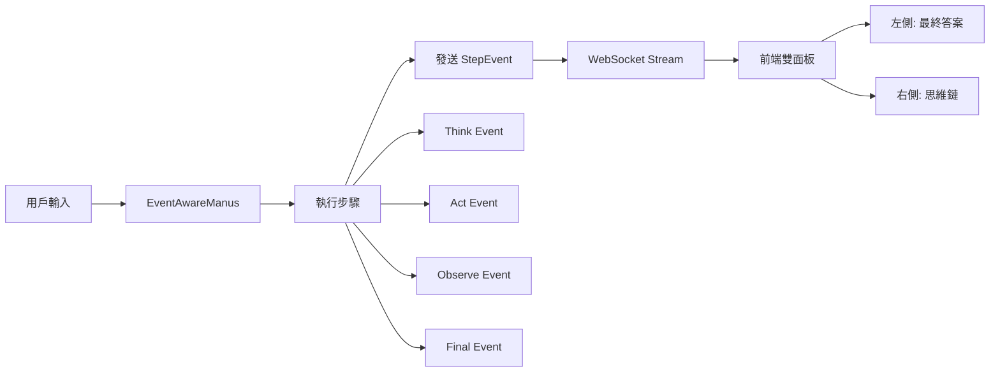

# OpenManus 整合架構說明

## 🚀 專案概覽

本專案成功整合 OpenManus AI Agent 框架與現代化的 Hacker UI，實現了完整的思維鏈可視化系統。

## 🏗️ 架構遷移成果

### 從 `/web` 到 `/Hacker_UI_Design` 的完整重構

成功將舊架構遷移並升級為事件驅動的現代化系統：

```
舊架構 (/web)                    →  新架構 (/Hacker_UI_Design)
├── 單體式輸出                    →  ├── 結構化事件系統 (StepEvent)
├── 混雜的文字流                  →  ├── 雙面板 UI (答案 + 思維鏈)
└── 無結構的日誌                  →  └── 完整的 Artifact 管理
```

## 📐 系統架構

### 核心組件

```
┌─────────────────────────────────────────────────────────────┐
│                         前端 (React + TypeScript)            │
├─────────────────────────────────────────────────────────────┤
│  Hacker_UI_Design/                                          │
│  ├── src/components/                                        │
│  │   ├── ChatInterface.tsx    # 主聊天介面（雙面板模式）     │
│  │   ├── StepEventPanel.tsx   # 思維鏈時間線顯示            │
│  │   ├── ThinkingPanel.tsx    # 思考狀態面板               │
│  │   └── ToolsPanel.tsx       # 工具執行狀態               │
│  └── src/hooks/                                             │
│      └── useManusChat.tsx     # WebSocket 連接管理          │
└─────────────────────────────────────────────────────────────┘
                              ↕ WebSocket
┌─────────────────────────────────────────────────────────────┐
│                      後端 (FastAPI + Python)                │
├─────────────────────────────────────────────────────────────┤
│  OpenManus/                                                 │
│  ├── app/events/                                            │
│  │   └── step_event.py        # 結構化事件系統              │
│  ├── app/agent/                                            │
│  │   ├── manus.py             # 原始 Manus Agent           │
│  │   └── event_aware_manus.py # 事件感知 Agent             │
│  └── web_server.py            # FastAPI 伺服器              │
└─────────────────────────────────────────────────────────────┘
```

## 🎯 核心改進

### 1. 結構化事件系統 (StepEvent)

```python
class StepEvent:
    phase: EventPhase      # think | act | observe | final | error
    role: EventRole        # system | agent | tool | user
    message: str           # 人類可讀描述
    tool: ToolInfo         # 工具執行細節
    artifacts: List[Artifact]  # 生成的文件/URL
```

### 2. 雙面板 UI 布局

- **左側面板 (60%)**：僅顯示最終答案和用戶對話
- **右側面板 (40%)**：完整的思維鏈時間線
  - Step-by-step 執行過程
  - 工具調用詳情
  - 錯誤追蹤
  - Artifact 預覽

### 3. Artifact 智能處理

系統自動偵測並分類：
- 📄 文件生成 (Markdown, Code, Text)
- 🔗 URL 連結
- 🖼️ 圖片資源
- 📊 資料輸出

所有 artifacts 在右側思維鏈中顯示，不污染主要對話流。

## 🔄 事件流架構



## 🛠️ 技術棧

### 後端
- **FastAPI**: 高性能 Web 框架
- **Pydantic**: 資料驗證與序列化
- **WebSocket**: 即時雙向通信
- **EventBus**: 事件發布訂閱系統

### 前端
- **React 18**: UI 框架
- **TypeScript**: 類型安全
- **Tailwind CSS**: 樣式系統
- **Vite**: 建置工具

## 📦 安裝與運行

### 環境需求
- Python 3.10+
- Node.js 18+
- npm 或 yarn

### 後端啟動

```bash
cd OpenManus
pip install -r requirements.txt
python web_server.py
```

伺服器運行於: `http://localhost:8000`

### 前端啟動

```bash
cd Hacker_UI_Design
npm install
npm run dev
```

開發伺服器: `http://localhost:5173` (若被佔用會自動遞增至 5174, 5175...)

## 🔌 API 端點

### WebSocket
- `/ws` - 主要 WebSocket 連接
  - 事件類型：
    - `step_event`: 執行步驟事件
    - `thinking_update`: 思考狀態更新
    - `tool_event`: 工具執行事件
    - `conversation`: 對話訊息

### HTTP
- `POST /api/chat` - 發送聊天請求（SSE 流式響應）
- `GET /api/status` - 系統狀態
- `GET /api/settings` - 用戶設定

## 🎨 UI 特色

### Hacker 風格設計
- 黑色背景 (#0a0a0a)
- 霓虹綠文字 (#00ff00)
- 文字發光效果 (text-glow)
- 終端機風格輸入 (manus>)

### 互動元素
- 可摺疊的思維鏈面板
- 工具執行即時狀態
- Artifact 預覽與下載
- 快捷命令按鈕

## 📊 資料流

```
1. 用戶輸入 → ChatInterface
2. WebSocket 發送 → Backend
3. EventAwareManus 處理
4. 每個步驟發送 StepEvent
5. 前端接收並分流：
   - Final answers → 左側面板
   - Step events → 右側思維鏈
6. UI 即時更新
```

## 🔧 擴展性

### 新增事件類型

```python
# 在 step_event.py 中
class EventPhase(Enum):
    THINK = "think"
    ACT = "act"
    OBSERVE = "observe"
    FINAL = "final"
    ERROR = "error"
    CUSTOM = "custom"  # 新增自定義類型
```

### 自定義工具整合

```python
# 在 EventAwareManus 中
def _extract_artifacts(self, result, tool_name):
    # 新增工具的 artifact 擷取邏輯
    if tool_name == "YourCustomTool":
        # 自定義處理
```

## 🐛 已知問題與解決

1. **白屏問題**:
   - 原因：CSS 背景色設定錯誤
   - 解決：修正 index.css 中 `--background: #0a0a0a`

2. **連接錯誤**:
   - 原因：API URL 設定錯誤
   - 解決：確保 .env 中 `VITE_API_URL=http://localhost:8000`

3. **Port 衝突**:
   - 解決：系統會自動尋找可用 port
   - 清理：`fuser -k 8000/tcp` 或 `fuser -k 5173/tcp`

## 🚀 未來改進方向

1. **效能優化**
   - [ ] 虛擬滾動處理大量事件
   - [ ] 事件批次處理
   - [ ] 快取機制

2. **功能擴充**
   - [ ] 事件搜尋與過濾
   - [ ] 思維鏈導出功能
   - [ ] 多會話管理

3. **視覺化增強**
   - [ ] 思維圖模式
   - [ ] 執行時間統計圖表
   - [ ] 3D 事件流視覺化

## 📝 檔案結構

```
core_agentic_brain/
├── OpenManus/                    # 後端核心
│   ├── app/
│   │   ├── agent/               # Agent 實作
│   │   │   ├── manus.py
│   │   │   └── event_aware_manus.py
│   │   ├── events/              # 事件系統
│   │   │   └── step_event.py
│   │   └── tool/                # 工具集
│   └── web_server.py            # FastAPI 伺服器
│
├── Hacker_UI_Design/            # 前端介面
│   ├── src/
│   │   ├── components/          # React 元件
│   │   │   ├── ChatInterface.tsx
│   │   │   └── StepEventPanel.tsx
│   │   ├── hooks/               # React Hooks
│   │   └── services/            # API 服務
│   └── package.json
│
└── README_INTEGRATION.md        # 本文件
```

## 🤝 貢獻指南

1. Fork 專案
2. 創建功能分支 (`git checkout -b feature/AmazingFeature`)
3. 提交更改 (`git commit -m 'Add some AmazingFeature'`)
4. 推送到分支 (`git push origin feature/AmazingFeature`)
5. 開啟 Pull Request

## 📄 授權

MIT License

## 🔗 相關資源

- [OpenManus 官方文檔](https://openmanus.github.io)
- [OpenManus 架構深度解析](https://dev.to/jamesli/openmanus-architecture-deep-dive-enterprise-ai-agent-development-with-real-world-case-studies-5hi4)
- [GitHub Repository](https://github.com/henryalps/OpenManus)
- [Foundation Agents](https://foundationagents.org/projects/openmanus/)
- [Manus.so](https://manus.so/p/openmanus-github)
- [Landscape of Thoughts](https://landscape-of-thoughts.github.io)

---

**Last Updated**: 2026-01-21
**Version**: 1.0.0
**Status**: Production Ready ✅