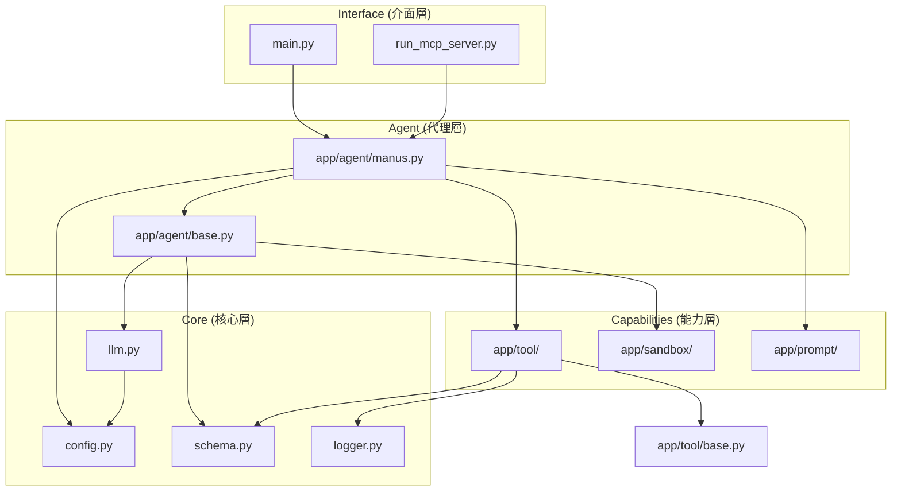

# 模組依賴關係分析 (Module Dependency Analysis) - OpenManus

---

**文件版本 (Document Version):** `v1.0`

**最後更新 (Last Updated):** `2025-10-14`

**主要作者 (Lead Author):** `OpenManus Team`

**審核者 (Reviewers):** `Community Contributors`

**狀態 (Status):** `已批准 (Approved)`

---

## 目錄 (Table of Contents)

1.  [概述 (Overview)](#1-概述-overview)
2.  [核心依賴原則 (Core Dependency Principles)](#2-核心依賴原則-core-dependency-principles)
3.  [高層級模組依賴 (High-Level Module Dependencies)](#3-高層級模組依賴-high-level-module-dependencies)
4.  [外部依賴管理 (External Dependency Management)](#4-外部依賴管理-external-dependency-management)

---

## 1. 概述 (Overview)

### 1.1 文檔目的 (Document Purpose)
*   本文檔分析 OpenManus 的內部模組與外部套件之間的依賴關係。
*   指導開發者理解代碼結構，避免循環依賴。

---

## 2. 核心依賴原則 (Core Dependency Principles)

*   **單向依賴**: `Agent` 依賴 `Tool` 和 `LLM`，`Tool` 不應反向依賴 `Agent`。
*   **配置獨立**: `config` 模組應被其他模組依賴，而不依賴業務邏輯模組。
*   **抽象依賴**: 具體工具應繼承自 `BaseTool`。

---

## 3. 高層級模組依賴 (High-Level Module Dependencies)

### 3.1 關鍵路徑說明
1.  **Main Entry**: `main.py` 初始化 `Manus` Agent。
2.  **Agent Logic**: `Manus` 繼承 `BaseAgent`，並組合了 `Tools` 和 `LLM`。
3.  **Tool Execution**: `Agent` 根據 `LLM` 的決策調用 `Tools`。
4.  **Sandbox**: 部分工具 (如 `PythonExecute`) 依賴 `Sandbox` 來安全執行代碼。

---

## 4. 外部依賴管理 (External Dependency Management)

### 4.1 關鍵外部依賴

| 外部依賴 | 用途 | 重要性 | 備註 |
| :--- | :--- | :--- | :--- |
| **openai** | LLM API Client | Critical | 核心智能來源 |
| **pydantic** | Data Validation | Critical | 數據模型定義 |
| **fastapi** | Web Framework | High | 用於 MCP Server 擴展 |
| **browser-use** | Browser Automation | High | 瀏覽器操作核心 |
| **mcp** | Model Context Protocol | High | 標準化工具介面 |

### 4.2 依賴風險
*   `browser-use`: 此套件更新頻繁，可能導致 API 變動，需鎖定版本。
*   `mcp`: 協議尚在發展中，需關注規範變更。
