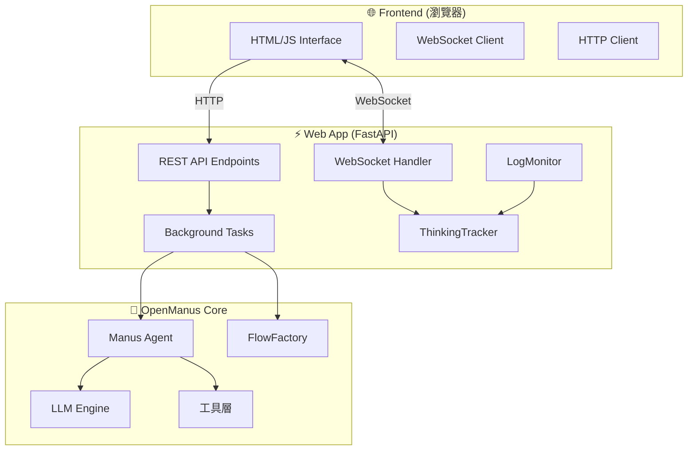

# Web App 與 OpenManus 核心整合架構分析

## 📊 當前架構總覽



## 🔌 整合點分析

### 1. **核心整合點** (`app.py:659`)
```python
# 直接實例化 OpenManus 核心
agent = Manus()
flow = FlowFactory.create_flow(
    flow_type=FlowType.PLANNING,
    agents=agent
)
```

### 2. **通訊架構**

#### HTTP API 層
- `POST /api/chat` - 創建會話，觸發背景任務
- `GET /api/chat/{session_id}` - 查詢處理結果
- `POST /api/chat/{session_id}/stop` - 中斷處理

#### WebSocket 實時通訊
- `/ws/{session_id}` - 雙向實時通訊通道
- 推送思考步驟、日誌、結果

### 3. **數據流架構**

```
用戶輸入
  ↓
[FastAPI] 創建 session_id
  ↓
[Background Task] process_prompt()
  ↓
[OpenManus Core]
  ├── Manus Agent 處理
  ├── FlowFactory 執行
  └── LLM 調用
  ↓
[結果返回]
  ├── HTTP Response
  └── WebSocket 實時推送
```

## 🏗️ 改進架構設計

### 問題分析
1. **緊密耦合**: Web App 直接導入和實例化 OpenManus 核心類
2. **缺乏抽象層**: 沒有統一的接口層
3. **狀態管理**: 使用全局字典管理會話狀態，不易擴展
4. **同步問題**: Token 優化等新功能未整合

### 建議的新架構

```python
# 1. 創建 OpenManus Service 抽象層
class OpenManusService:
    """OpenManus 核心服務抽象層"""

    def __init__(self):
        self.agent_pool = {}  # Agent 池化管理
        self.circuit_breaker = circuit_breaker_manager
        self.token_optimizer = TokenOptimizer()

    async def create_session(
        self,
        session_id: str,
        task_type: str = "general"
    ) -> ManusSession:
        """創建優化的會話"""

        # 創建優化版 Agent
        from app.agent.optimized_base import TokenAwareAgent

        agent = TokenAwareAgent()
        agent.set_task_type(task_type)
        agent.token_budget = self._get_token_budget(task_type)

        # 創建 Flow
        flow = FlowFactory.create_flow(
            flow_type=FlowType.PLANNING,
            agents=agent
        )

        # 包裝成 Session
        return ManusSession(
            id=session_id,
            agent=agent,
            flow=flow,
            workspace=self._create_workspace(session_id)
        )

    async def execute_task(
        self,
        session: ManusSession,
        prompt: str,
        cancel_event: asyncio.Event = None
    ) -> Dict:
        """執行任務並返回結果"""

        # 檢查熔斷器
        if not self.circuit_breaker.should_use_tool("browser_use"):
            return {
                "status": "error",
                "message": "Browser tool is temporarily disabled",
                "fallback": True
            }

        # Token 優化
        optimized_prompt = self.token_optimizer.optimize_prompt(prompt)

        try:
            # 執行
            result = await session.flow.execute(
                optimized_prompt,
                session.workspace.name,
                cancel_event
            )

            # 記錄成功
            self.circuit_breaker.record_tool_success("browser_use")

            # 返回結果和統計
            return {
                "status": "success",
                "result": result,
                "token_stats": session.agent.get_token_usage_report(),
                "workspace": session.workspace
            }

        except Exception as e:
            # 記錄失敗
            self.circuit_breaker.record_tool_failure("browser_use", str(e))

            return {
                "status": "error",
                "error": str(e),
                "token_stats": session.agent.get_token_usage_report()
            }
```

## 📡 增強的 WebSocket 協議

```typescript
// Frontend WebSocket Manager
class EnhancedWebSocketManager {
    constructor(sessionId: string) {
        this.ws = new WebSocket(`/ws/${sessionId}`);
        this.setupEventHandlers();
    }

    setupEventHandlers() {
        this.ws.onmessage = (event) => {
            const data = JSON.parse(event.data);

            switch(data.type) {
                case 'thinking_step':
                    this.updateThinkingPanel(data.step);
                    break;

                case 'token_usage':
                    this.updateTokenMeter(data.stats);
                    break;

                case 'tool_status':
                    this.updateToolStatus(data.tool, data.status);
                    break;

                case 'file_created':
                    this.updateWorkspace(data.file);
                    break;

                case 'error':
                    this.handleError(data.error);
                    break;
            }
        };
    }

    // 發送優化提示
    sendOptimizedMessage(message: string, taskType: string = 'general') {
        this.ws.send(JSON.stringify({
            type: 'message',
            content: message,
            task_type: taskType,
            optimization_hints: {
                expected_tokens: this.estimateTokens(message),
                priority: 'normal'
            }
        }));
    }
}
```

## 🔄 整合計劃

### Phase 1: 解耦核心 (1-2 天)
```python
# 1. 創建服務層
OpenManus/app/service/
├── manus_service.py      # 核心服務抽象
├── session_manager.py    # 會話管理
├── workspace_manager.py  # 工作區管理
└── __init__.py

# 2. 修改 web_app/app.py
- 移除直接導入 Manus
+ 導入 ManusService
```

### Phase 2: 整合優化功能 (2-3 天)
```python
# 1. 整合 Token 優化器
web_app/app.py:
+ from app.memory_optimizer import SmartContextManager

# 2. 整合熔斷器
web_app/app.py:
+ from app.tool.circuit_breaker import circuit_breaker_manager

# 3. 增強 WebSocket 訊息
- 添加 token_usage 事件
- 添加 tool_status 事件
- 添加優化統計
```

### Phase 3: UI 增強 (3-4 天)
```javascript
// 1. 添加 Token 使用儀表板
static/components/TokenMeter.js

// 2. 添加工具狀態指示器
static/components/ToolStatus.js

// 3. 添加任務類型選擇器
static/components/TaskTypeSelector.js
```

## 📊 監控與觀測

### 新增監控端點
```python
@app.get("/api/metrics")
async def get_metrics():
    """獲取系統指標"""
    return {
        "sessions": {
            "active": len(active_sessions),
            "total": total_sessions_count
        },
        "token_usage": {
            "total_input": sum_input_tokens,
            "total_output": sum_output_tokens,
            "cost_estimate": calculate_cost()
        },
        "circuit_breakers": circuit_breaker_manager.get_status(),
        "performance": {
            "avg_response_time": avg_time,
            "p95_response_time": p95_time
        }
    }

@app.get("/api/health")
async def health_check():
    """健康檢查"""
    return {
        "status": "healthy",
        "components": {
            "web_app": "ok",
            "manus_core": check_manus_health(),
            "browser_tool": check_browser_health(),
            "token_optimizer": "ok"
        }
    }
```

## 🚀 實施優先級

### 立即實施 (Critical)
1. **熔斷器整合** - 防止 Browser 工具重複失敗
2. **Token 監控** - 在 UI 顯示 Token 使用量

### 短期改進 (Important)
1. **服務抽象層** - 解耦 Web App 和 OpenManus
2. **Token 優化整合** - 自動優化上下文

### 長期優化 (Nice to Have)
1. **Agent 池化** - 重用 Agent 實例
2. **分散式架構** - 支援多節點部署
3. **持久化存儲** - Redis/PostgreSQL 狀態管理

## 💡 關鍵整合點程式碼

### 1. 修改 process_prompt 整合優化器
```python
# web_app/app.py:579
async def process_prompt(session_id: str, prompt: str):
    # ... existing code ...

    # 創建優化版 Agent
    from app.agent.optimized_base import TokenAwareAgent

    agent = TokenAwareAgent()
    agent.set_task_type(classify_task_type(prompt))
    agent.enable_optimization = True

    # 包裝 LLM 添加監控
    if hasattr(agent, "llm"):
        # ... existing wrapper code ...

        # 添加 Token 使用回調
        def on_token_usage(stats):
            ThinkingTracker.add_token_stats(session_id, stats)
            # 通過 WebSocket 實時推送
            if session_id in active_sessions:
                asyncio.create_task(
                    send_ws_message(session_id, {
                        "type": "token_usage",
                        "stats": stats
                    })
                )

        wrapped_llm.register_callback("token_usage", on_token_usage)
```

### 2. 添加熔斷器檢查
```python
# web_app/app.py:650
# 在執行前檢查工具狀態
from app.tool.circuit_breaker import circuit_breaker_manager

if not circuit_breaker_manager.should_use_tool("browser_use"):
    # 使用備用方案
    ThinkingTracker.add_thinking_step(
        session_id,
        "Browser tool temporarily disabled, using alternative approach"
    )
    # 切換到 python_execute 或其他工具
```

### 3. 增強前端顯示
```javascript
// static/connected_interface.js
class TokenUsageDisplay {
    constructor(container) {
        this.container = container;
        this.initDisplay();
    }

    initDisplay() {
        this.container.innerHTML = `
            <div class="token-meter">
                <div class="token-bar">
                    <div class="token-used" style="width: 0%"></div>
                </div>
                <div class="token-stats">
                    <span class="used">0</span> /
                    <span class="budget">4000</span> tokens
                    <span class="cost">($0.00)</span>
                </div>
            </div>
        `;
    }

    update(stats) {
        const percentage = (stats.used / stats.budget) * 100;
        this.container.querySelector('.token-used').style.width = `${percentage}%`;
        this.container.querySelector('.used').textContent = stats.used;
        this.container.querySelector('.budget').textContent = stats.budget;
        this.container.querySelector('.cost').textContent = `($${stats.cost.toFixed(3)})`;

        // 變色警告
        if (percentage > 80) {
            this.container.classList.add('warning');
        }
    }
}
```

## 🎯 結論

當前架構已有基本整合，但存在以下改進空間：

1. **解耦**: 創建服務層隔離 Web App 和 OpenManus
2. **優化**: 整合 Token 優化和熔斷器機制
3. **監控**: 添加實時指標和健康檢查
4. **UI**: 增強前端顯示 Token 使用和工具狀態

建議按優先級逐步實施，首先解決 A 類（Browser 初始化）和 C 類（Token 優化）問題的整合。