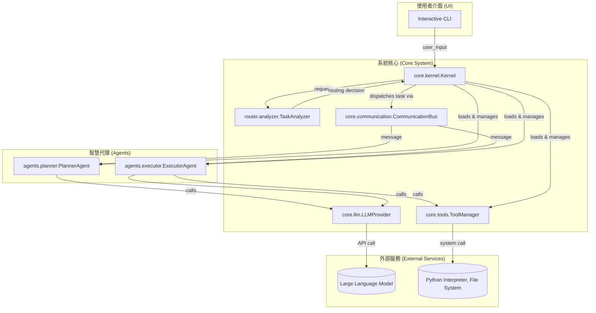

# 整合性架構與設計文件 (Unified Architecture & Design Document) - Core Agentic Brain

---

**文件版本 (Document Version):** `v1.0`
**最後更新 (Last Updated):** `2026-01-29`
**主要作者 (Lead Author):** `Gemini AI Assistant`
**審核者 (Reviewers):** `Core Development Team`
**狀態 (Status):** `草稿 (Draft)`

---

## 目錄 (Table of Contents)

- [1. 需求摘要 (Requirements Summary)](#1-需求摘要-requirements-summary)
- [2. 高層次架構設計 (High-Level Architectural Design)](#2-高層次架構設計-high-level-architectural-design)
- [3. 技術選型詳述 (Technology Stack Details)](#3-技術選型詳述-technology-stack-details)
- [4. 數據架構 (Data Architecture)](#4-數據架構-data-architecture)
- [5. 跨領域考量 (Cross-Cutting Concerns)](#5-跨領域考量-cross-cutting-concerns)

---

## 1. 需求摘要 (Requirements Summary)

### 1.1 功能性需求摘要 (Functional Requirements Summary)
*   **FR-1:** 系統必須能夠理解並回應自然語言形式的任務或問題。
*   **FR-2:** 系統必須能夠將複雜任務分解為一系列可執行的步驟 (Planning)。
*   **FR-3:** 系統必須能夠執行具體的任務，並在需要時呼叫外部工具 (Execution)。
*   **FR-4:** 系統支援可插拔的工具集，例如執行 Python 程式碼、讀寫檔案。
*   **FR-5:** 系統支援透過更換模型配置來接入不同的 LLM (如 OpenAI, Anthropic)。

### 1.2 非功能性需求 (Non-Functional Requirements - NFRs)
| NFR 分類 | 具體需求描述 | 衡量指標/目標值 |
| :--- | :--- | :--- |
| **可擴展性 (Scalability)** | 能夠輕易增加新的 Agent 類型和工具。 | 新增工具不需修改 Kernel 程式碼。 |
| **可維護性 (Maintainability)** | 核心元件之間應低耦合，職責清晰。 | 各元件（Kernel, Agent, Tool）可獨立測試。 |
| **可用性 (Availability)** | 核心服務在互動模式下應保持響應。 | 互動模式下的單次請求處理時間 < 30s。 |
| **安全性 (Security)** | API Keys 等敏感資訊不能硬編碼在程式碼中。 | 透過環境變數或 `.env` 檔案載入。 |

---

## 2. 高層次架構設計 (High-Level Architectural Design)

### 2.1 選定的架構模式 (Chosen Architectural Pattern)
*   **模式:** **核心化代理架構 (Kernel-based Agentic Architecture)**
*   **選擇理由:** 此架構模式將系統的**調度中心 (Kernel)** 與**功能單元 (Agents, Tools)** 明確分離。Kernel 像一個微型作業系統，負責資源管理（載入 Agents/Tools）和任務分發，而不關心具體業務邏輯。Agents 則是專注於特定任務（如規劃、執行）的專家。這種設計帶來了極高的**模組化**和**可擴展性**，新增功能只需實現新的 Agent 或 Tool，並在配置中啟用即可，無需修改 Kernel。它完美符合專案的非功能性需求。

### 2.2 系統組件圖 (System Component Diagram)

### 2.3 主要組件/服務職責 (Key Components/Services Responsibilities)
| 組件/服務名稱 | 核心職責 | 主要技術/框架 | 依賴 |
| :--- | :--- | :--- | :--- |
| `main.py` | **應用入口**。提供互動式 CLI，並初始化 Kernel。 | Python | `core.kernel` |
| `core.kernel.Kernel` | **中央調度器**。管理系統生命週期，載入組件，分發任務。 | Python | `core.config`, `core.llm`, `agents`, `tools` |
| `router.analyzer.TaskAnalyzer`| **任務分析器**。分析使用者輸入，為 Kernel 提供路由決策依據。 | Python, LLM | `core.types` |
| `agents.planner.PlannerAgent` | **規劃者**。將複雜任務分解為具體的、可執行的步驟。 | Python, LLM | `core.types`, `core.prompts` |
| `agents.executor.ExecutorAgent` | **執行者**。執行單一步驟，並在需要時呼叫工具。 | Python, LLM | `core.types`, `core.tools` |
| `core.llm.LLMProvider` | **LLM 抽象層**。提供統一介面與多種 LLM (OpenAI, Anthropic) 溝通。 | `openai`, `anthropic` | - |
| `core.tools.ToolManager` | **工具管理器**。動態載入設定檔中啟用的工具並執行。 | `importlib` | - |
| `core.communication.CommunicationBus` | **通訊匯流排**。實現元件之間的訊息傳遞，進一步解耦。| Pub/Sub Pattern | - |

### 2.4 關鍵用戶旅程與組件交互 (Key User Journeys and Component Interactions)
*   **場景: 使用者輸入一個複雜任務 (例如："寫一個 python 函式來計算斐波那契數列並存檔")**
    1.  **CLI (`main.py`)** 接收輸入，並呼叫 `kernel.execute(task)`。
    2.  **Kernel** 建立一個 `TaskContext`，並呼叫 **TaskAnalyzer** 進行分析。
    3.  **TaskAnalyzer** 判斷這是一個需要規劃的任務，返回一個包含 `strategy: "orchestrated"` 的路由決策。
    4.  **Kernel** 根據策略，首先建立或取得 **PlannerAgent**。
    5.  **Kernel** 透過 **CommunicationBus** 向 `agent.planner` 發送一個 `PROMPT` 訊息。
    6.  **PlannerAgent** 接收訊息，呼叫 **LLMProvider** 生成一個步驟化的計劃。
    7.  計劃結果透過 Bus 返回給 **Kernel**。
    8.  **Kernel** 遍歷計劃的每一步，為每一步建立或取得 **ExecutorAgent**。
    9.  **Kernel** 透過 **Bus** 向 `agent.executor` 發送包含單一步驟的 `PROMPT` 訊息。
    10. **ExecutorAgent** 接收訊息，呼叫 **LLMProvider** 決定是直接回答還是呼叫工具 (例如 `python` 工具來寫程式碼，`files` 工具來存檔)。
    11. 如果需要工具，**ExecutorAgent** 透過 **Kernel** 的 `call_tool` 介面 (內部使用 **ToolManager**) 執行工具。
    12. 所有步驟執行完畢後，**Kernel** 匯總結果並返回給 **CLI** 顯示。

---

## 3. 技術選型詳述 (Technology Stack Details)

| 分類 | 選用技術 | 選擇理由 (Justification) |
| :--- | :--- | :--- |
| **語言** | `Python 3.10+` | 生態豐富，尤其在 AI/ML 領域是事實標準，開發效率高。 |
| **核心框架** | `(無特定框架)` | 系統核心為純 Python 實現，不依賴特定 Web 框架，保持了最大的靈活性和可移植性。 |
| **配置管理** | `PyYAML` | 使用 YAML 格式進行配置和 Prompt 管理，可讀性強，結構清晰。 |
| **環境管理** | `python-dotenv` | 從 `.env` 檔案載入環境變數，將敏感資料與程式碼分離。 |
| **LLM 客戶端** | `openai`, `anthropic` | 官方 SDK，穩定可靠。`LLMProvider` 封裝了其複雜性。 |
| **CI/CD** | `(未定，建議 GitHub Actions)` | 與程式碼倉庫無縫整合，配置簡單。 |

---

## 4. 數據架構 (Data Architecture)

### 4.1 數據模型 (Data Models)
*   系統的核心數據模型定義在 `core/types.py` 中。
*   **`TaskContext`**: 傳遞任務上下文的關鍵物件，包含 `prompt`, `metadata`, `tools` 等。
*   **`ExecutionResult`**: Agent 執行後返回的標準化結果，包含 `success`, `response`, `error` 和 `metadata`。
*   **`Message`**: 在 `CommunicationBus` 中傳遞的訊息物件，定義了來源、目標、類型和內容。

### 4.2 數據流圖 (Data Flow Diagrams - DFDs)
*   數據流動遵循上述「關鍵用戶旅程」部分描述的路徑。核心數據（如 `TaskContext`）在 Kernel 的協調下，在不同 Agent 之間傳遞和充實。

---

## 5. 跨領域考量 (Cross-Cutting Concerns)

### 5.1 可觀測性 (Observability)
*   **日誌 (Logging):** 使用 `core/simple_logger.py` 提供一個簡單的結構化日誌記錄功能。所有關鍵操作（Agent 執行、工具呼叫、錯誤）都應被記錄。
*   **追蹤 (Tracing):** 目前尚未實現。未來可考慮在 `TaskContext` 中加入唯一的 `trace_id`，並在元件間傳遞，以便追蹤單個請求的完整生命週期。

### 5.2 安全性與隱私 (Security and Privacy)
*   **機密管理:** API Keys 透過 `core/config.py` 從環境變數載入，避免硬編碼。
*   **工具安全:** `python` 工具的執行存在潛在風險。在生產環境中，應考慮在沙箱 (Sandbox) 環境中執行，以隔離其對主機系統的影響。
