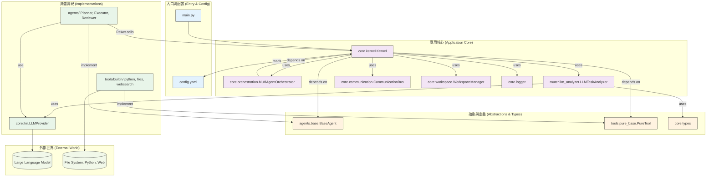

# 模組依賴關係分析 (Module Dependency Analysis) - Core Agentic Brain

---

**文件版本 (Document Version):** `v2.0`
**最後更新 (Last Updated):** `2026-01-30`
**主要作者 (Lead Author):** `Gemini AI Assistant`
**狀態 (Status):** `已批准 (Approved)`

---

## 1. 概述 (Overview)

### 1.1 文檔目的 (Document Purpose)
*   本文檔旨在分析和定義 **Core Agentic Brain** 的內部模組依賴關係。
*   其目的在於確保專案遵循健康的依賴結構，特別是**依賴倒置原則**，以提升代碼的可維護性、可測試性和可擴展性。
*   本文檔是程式碼審查 (Code Review) 和架構決策的重要參考依據。

## 2. 核心依賴原則 (Core Dependency Principles)

本專案嚴格遵循以下核心原則來管理依賴關係：

*   **依賴倒置原則 (Dependency Inversion Principle - DIP):**
    *   **實踐:** 高層模組（如 `core.kernel`）不直接依賴於低層實現（如 `tools.builtin.python`）。兩者都依賴於抽象（如 `tools.base.BaseTool`）。基礎設施層（`tools` 的具體實現）提供了對抽象介面的實作，從而實現了控制反轉。

*   **無循環依賴原則 (Acyclic Dependencies Principle - ADP):**
    *   **實踐:** 透過 `core.communication.CommunicationBus` 進行元件間通訊，避免了 `agents` 或 `tools` 需要反向導入 `core.kernel` 的情況，從而杜絕了循環依賴。依賴關係形成了一個清晰的單向流。

*   **穩定依賴原則 (Stable Dependencies Principle - SDP):**
    *   **實踐:** 核心業務邏輯和抽象（`core.types`, `agents.base`）是最穩定的，不依賴任何其他部分。經常變動的實作細節（如新工具的加入）位於最外層，不會影響核心穩定性。

## 3. 高層級模組依賴 (High-Level Module Dependencies)

### 3.1 架構分層依賴圖 (Layered Architecture Dependency Diagram)

此圖展示了系統的主要架構層級及其嚴格的單向依賴關係。

### 3.2 依賴規則說明 (Dependency Rule Explanation)
*   **單向性:** 依賴箭頭嚴格地從易變的外部流向穩定的核心。`main.py` 依賴 `Kernel`，`Kernel` 依賴抽象，而具體的 `Agents` 和 `Tools` 實現這些抽象。
*   **依賴倒置:** `Kernel` (高層模組) 不知道 `PlannerAgent` 或 `PythonTool` 的存在。它只與 `BaseAgent` 和 `BaseTool` 的抽象介面互動。是 `PlannerAgent` (低層模組) "依賴" 了 `BaseAgent` 的抽象定義，從而反轉了傳統的依賴方向。

## 4. 模組/層級職責定義 (Module/Layer Responsibility Definition)

| 層級/模組 | 主要職責 | 程式碼示例 (路徑) | 依賴方向 |
| :--- | :--- | :--- |:---|
| **入口與配置** | 處理應用程式啟動，載入設定。 | `main.py`, `config.yaml` | → 應用核心 |
| **應用核心** | 編排業務流程、協調各元件、管理工作區。 | `core/kernel.py`, `core/orchestration.py`, `core/workspace.py`, `router/llm_analyzer.py` | → 抽象與定義 |
| **抽象與定義** | 定義核心業務規則、實體、和元件介面。**此層最穩定，無對外依賴。** | `core/types.py`, `agents/base.py`, `tools/pure_base.py` | (無) |
| **具體實現** | 提供抽象介面的具體實現，處理與外部世界的互動。 | `agents/executor.py`, `tools/builtin/`, `core/llm.py` | → 抽象與定義 |
| **跨領域** | 日誌、追蹤、工作區隔離等橫切關注點。 | `core/logger.py`, `core/workspace.py` | → 應用核心 |

## 5. 關鍵依賴路徑分析 (Key Dependency Path Analysis)

本節分析一個典型業務流程中的依賴調用鏈，以確保其符合設計原則。

### 5.1 簡單任務路徑 (DIRECT 策略)
*   **場景:** `執行一個簡單問答任務`
*   **路徑:**
    1.  `main.py` (入口層) 呼叫 `kernel.execute()`。
    2.  `kernel` 建立 `run_id` 和 `workspace_path`。
    3.  `LLMTaskAnalyzer` 分析任務，判斷為 `simple` 複雜度，選擇 `DIRECT` 策略。
    4.  `kernel` 直接透過 `Bus` 將任務分派給 `ExecutorAgent`。
    5.  `ExecutorAgent` 呼叫 `LLMProvider` 生成回應。
    6.  結果返回給 `kernel`，封裝為 `ExecutionResult`。

### 5.2 複雜任務路徑 (ORCHESTRATED 策略)
*   **場景:** `執行一個需要多代理協作的任務`
*   **路徑:**
    1.  `main.py` (入口層) 呼叫 `kernel.execute()`。
    2.  `kernel` 建立 `run_id` 和 `workspace_path`。
    3.  `LLMTaskAnalyzer` 分析任務，判斷為 `moderate/complex`，選擇 `ORCHESTRATED` 策略。
    4.  `kernel` 呼叫 `MultiAgentOrchestrator.orchestrate()`。
    5.  `Orchestrator` 依序調用：`PlannerAgent` → `ExecutorAgent` → `ReviewerAgent`。
    6.  每個 Agent 透過 `Bus` 接收訊息，執行後返回結果。
    7.  `Orchestrator` 彙總結果，返回給 `kernel`。

### 5.3 ReAct 循環路徑
*   **場景:** `執行一個需要工具呼叫的任務`
*   **路徑:**
    1.  `ExecutorAgent` 進入 ReAct 循環。
    2.  **Think:** 呼叫 `LLMProvider` 決定下一步行動。
    3.  **Act:** 若需工具，透過 `self.kernel.call_tool()` 呼叫工具。
    4.  `kernel.call_tool()` 透過 `Bus` 發送訊息給對應的 `PureTool`。
    5.  `PureTool.handle()` (異步) 呼叫 `execute()`，傳遞 `context` (包含 `workspace_path`)。
    6.  **Observe:** 工具結果返回，加入對話歷史。
    7.  重複直到任務完成或達到迭代上限。

*   **結論:** 整個流程中，高層元件 (`Kernel`, `Orchestrator`) 始終透過抽象介面與低層元件互動，完全符合**依賴倒置原則**。`ExecutorAgent` 持有 `Kernel` 引用是為了支援 ReAct 工具呼叫，但依然透過 `call_tool()` 介面操作，保持了解耦。

## 6. 依賴風險與管理 (Dependency Risks and Management)

### 6.1 循環依賴 (Circular Dependencies)
*   **風險:** 目前設計的風險極低。
*   **檢測與解決:** 由於 `CommunicationBus` 的存在，元件之間無需直接 `import`，從根本上避免了循環依賴的可能。任何試圖從 `agents` 或 `tools` 目錄反向 `import core.kernel` 的行為都應在 Code Review 中被嚴格禁止。

### 6.2 不穩定依賴 (Unstable Dependencies)
*   **識別:** 專案中最不穩定的依賴是外部 LLM 服務的 API。
*   **管理策略 (隔離層):**
    *   **適配器模式 (Adapter Pattern):** `core.llm.LLMProvider` 完美地扮演了適配器的角色。它封裝了 `openai`, `anthropic` 等不同 SDK 的呼叫細節。如果未來 Google 的 API 發生變化，只需修改 `LLMProvider` 內部邏輯，而系統的其他部分（如 `agents`）完全不受影響。
