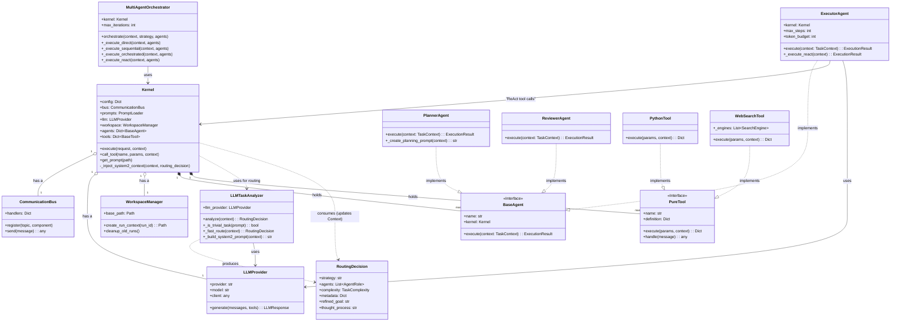

# 類別/組件關係文檔 (Class/Component Relationships Document) - Core Agentic Brain

---

**文件版本 (Document Version):** `v2.1`
**最後更新 (Last Updated):** `2026-01-30`
**主要作者 (Lead Author):** `Gemini AI Assistant`
**狀態 (Status):** `已批准 (Approved)`

---

## 1. 概述 (Overview)

### 1.1 文檔目的 (Document Purpose)
*   本文檔旨在通過 UML 類別圖和詳細描述，清晰地呈現 Core Agentic Brain 中主要類別、組件和接口之間的靜態結構關係。
*   它作為開發團隊理解和維護代碼庫結構的關鍵參考，並確保設計遵循良好的物件導向原則。

### 1.2 建模範圍 (Modeling Scope)
*   **包含範圍**: `Kernel`, `BaseAgent`, `PlannerAgent`, `ExecutorAgent`, `BaseTool`, `LLMProvider`, `CommunicationBus`, **`LLMTaskAnalyzer (Router)`**。
*   **抽象層級**: 專注於類別之間的關係和核心職責，特別是 System 1/2 路由與 Metadata 流動。

---

## 2. 核心類別圖 (Core Class Diagram)

*   **圖表說明:** 
    *   **Dual-Process Routing**: `LLMTaskAnalyzer` 現在顯式包含 `_is_trivial_task` (System 1) 和 `_build_system2_prompt` (System 2) 方法。
    *   **Data Flow**: `RoutingDecision` 結構增強，攜帶 `refined_goal` 和 `thought_process`。`Kernel` 在執行 `execute` 時會讀取這些 Metadata 並注入到 `TaskContext`。
    *   **Planner Logic**: `PlannerAgent` 依賴更新後的 Context 來生成計畫，確保與 System 2 的分析一致。

---

## 3. 主要類別/組件職責 (Key Class/Component Responsibilities)

| 類別/組件 (Class/Component) | 核心職責 (Core Responsibility) | 主要協作者 (Key Collaborators) |
| :--- | :--- | :--- |
| `Kernel` | **中央調度器**。組合所有系統元件，分派任務，管理工作區。**負責 System 2 Context 注入**。 | `CommunicationBus`, `LLMProvider`, `WorkspaceManager`, `LLMTaskAnalyzer` |
| `LLMTaskAnalyzer` | **雙模態路由器**。整合 System 1 (Fast) 與 System 2 (Slow) 分析邏輯，產出 RoutingDecision。 | `LLMProvider` |
| `PlannerAgent` | **規劃者**。根據 TaskContext (含 System 2 重塑後的目標) 生成步驟。 | `LLMProvider` |
| `MultiAgentOrchestrator` | **協調器**。實現多代理協作策略。 | `Kernel`, `BaseAgent` |
| `WorkspaceManager` | **工作區管理**。為每次執行建立隔離目錄結構。 | `pathlib` |
| `CommunicationBus` | **中介者**。解耦元件間的通訊。 | `Kernel`, `BaseAgent`, `PureTool` |
| `LLMProvider` | **外觀/適配器**。提供統一介面來呼叫不同的 LLM。 | `openai`, `anthropic` clients |
| `BaseAgent` (Interface) | **Agent 契約**。定義所有 Agent 必須實現的 `execute` 方法。 | `TaskContext`, `ExecutionResult`, `Kernel` |
| `ExecutorAgent` | **執行者**。執行任務，支援 ReAct 循環，可直接呼叫工具。 | `LLMProvider`, `Kernel` |
| `PureTool` (Interface) | **Tool 契約**。異步 `handle()`，同步/異步 `execute()`，workspace-aware。 | `TaskContext` |

---

## 4. 關係詳解 (Relationship Details)

### 4.1 System 2 Context Injection (New)
*   **Router -> Kernel -> Context -> Agent**: 這是 v2.1 架構最關鍵的數據流。
    1.  `LLMTaskAnalyzer` 產生帶有 `refined_goal` 的 `RoutingDecision`。
    2.  `Kernel` 檢測到此 Metadata，更新 `TaskContext.prompt` 並保留 `original_prompt`。
    3.  `PlannerAgent` (和其他 Agent) 讀取更新後的 Context，直接針對「重塑後」的目標進行工作。

### 4.2 繼承/實現 (Inheritance/Implementation)
*   **`{Planner/Executor}Agent` implements `BaseAgent`:** 策略模式。
*   **`{Python/Files}Tool` implements `BaseTool`:** 策略模式。

### 4.3 組合/聚合 (Composition/Aggregation)
*   **`Kernel` has a `LLMProvider` / `CommunicationBus`:** 組合關係。
*   **`Kernel` holds `BaseAgent` / `BaseTool`:** 聚合關係。

---

## 5. 設計模式應用 (Design Pattern Applications)

| 設計模式 (Design Pattern) | 應用場景/涉及類別 | 設計目的/解決的問題 |
| :--- | :--- | :--- |
| **Chain of Responsibility (System 1/2)** | `LLMTaskAnalyzer.analyze` | 先嘗試 System 1 (Fast)，失敗或複雜則轉入 System 2 (Slow)，優化效能與成本。 |
| **Decorator / Middleware (Context Injection)** | `Kernel.execute` | 在任務真正分發給 Agent 之前，Kernel 像 Middleware 一樣攔截並增強 Context。 |
| **Strategy** | `MultiAgentOrchestrator` | 四種執行策略 (DIRECT/SEQUENTIAL...)。 |
| **Facade** | `LLMProvider` | 封裝 LLM 複雜性。 |
| **Mediator** | `CommunicationBus` | 解耦元件通訊。 |
| **Dependency Injection** | `Kernel` -> `Agent` | 降低耦合。 |
| **ReAct** | `ExecutorAgent` | 迭代式問題解決。 |

---

## 6. SOLID 原則遵循情況 (SOLID Principles Adherence)

*   [✔] **S - 單一職責原則:** `LLMTaskAnalyzer` 專注於分析與路由，`Planner` 專注於生成計畫，職責邊界清晰。
*   [✔] **O - 開放/封閉原則:** 增加新的路由策略或 System 3 分析層無需修改現有 Agent 代碼。
*   [✔] **L - 里氏替換原則:** 所有 Agent 遵循 BaseAgent 契約。
*   [✔] **I - 介面隔離原則:** 介面精簡。
*   [✔] **D - 依賴反轉原則:** Kernel 依賴抽象。
