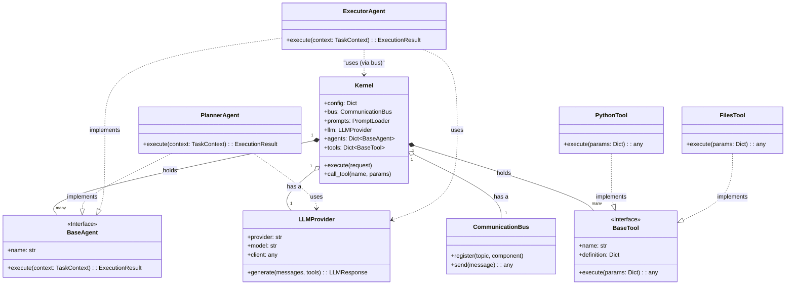

# 類別/組件關係文檔 (Class/Component Relationships Document) - Core Agentic Brain

---

**文件版本 (Document Version):** `v1.0`
**最後更新 (Last Updated):** `2026-01-29`
**主要作者 (Lead Author):** `Gemini AI Assistant`
**狀態 (Status):** `已批准 (Approved)`

---

## 1. 概述 (Overview)

### 1.1 文檔目的 (Document Purpose)
*   本文檔旨在通過 UML 類別圖和詳細描述，清晰地呈現 Core Agentic Brain 中主要類別、組件和接口之間的靜態結構關係。
*   它作為開發團隊理解和維護代碼庫結構的關鍵參考，並確保設計遵循良好的物件導向原則。

### 1.2 建模範圍 (Modeling Scope)
*   **包含範圍**: `Kernel`, `BaseAgent`, `PlannerAgent`, `ExecutorAgent`, `BaseTool`, `LLMProvider`, `CommunicationBus`。
*   **抽象層級**: 專注於類別之間的關係和核心職責，忽略具體方法的實現細節。

---

## 2. 核心類別圖 (Core Class Diagram)

*   **圖表說明:** 上圖展示了系統的核心設計。`Kernel` 是中心組合點，它擁有並管理 `CommunicationBus`, `LLMProvider` 以及所有 `Agent` 和 `Tool` 的實例。`Agent` 和 `Tool` 都遵循了基於介面（抽象基礎類別）的實現模式 (`PlannerAgent` 實現 `BaseAgent`)，這使得 `Kernel` 可以統一處理它們，而無需了解其具體類型。`Agent` 透過 `LLMProvider` 與外部 LLM 互動，並透過 `Kernel` (間接地透過 Bus) 的介面來呼叫工具，實現了完美的依賴倒置。

---

## 3. 主要類別/組件職責 (Key Class/Component Responsibilities)

| 類別/組件 (Class/Component) | 核心職責 (Core Responsibility) | 主要協作者 (Key Collaborators) |
| :--- | :--- | :--- |
| `Kernel` | **中央調度器**。組合所有系統元件，分派任務。 | `CommunicationBus`, `LLMProvider`, `BaseAgent`, `BaseTool` |
| `CommunicationBus` | **中介者**。解耦元件間的通訊。 | `Kernel`, `BaseAgent`, `BaseTool` |
| `LLMProvider` | **外觀/適配器**。提供統一介面來呼叫不同的 LLM。 | `openai`, `anthropic` clients |
| `BaseAgent` (Interface) | **Agent 契約**。定義所有 Agent 必須實現的 `execute` 方法。 | `TaskContext`, `ExecutionResult` |
| `PlannerAgent` / `ExecutorAgent` | **策略實現**。實現具體的業務邏輯（規劃/執行）。 | `LLMProvider` |
| `BaseTool` (Interface) | **Tool 契約**。定義所有工具的 `execute` 方法和 `definition`。 | - |
| `PythonTool` / `FilesTool` | **策略實現**。提供與外部世界互動的具體能力。 | `subprocess`, `pathlib` |

---

## 4. 關係詳解 (Relationship Details)

### 4.1 繼承/實現 (Inheritance/Implementation)
*   **`{Planner/Executor}Agent` implements `BaseAgent`:** 這是**策略模式**的體現。每個 Agent 都是一個可替換的策略，`Kernel` 可以在執行時根據需要選擇不同的 Agent 策略。
*   **`{Python/Files}Tool` implements `BaseTool`:** 同樣是策略模式。`Kernel` (透過 `ToolManager`) 可以執行任何遵循 `BaseTool` 契約的工具，而無需知道其內部細節。

### 4.2 組合/聚合 (Composition/Aggregation)
*   **`Kernel` has a `LLMProvider` / `CommunicationBus`:** `Kernel` 在其生命週期內擁有並管理這些核心服務的實例。這是**組合**關係。
*   **`Kernel` holds `BaseAgent` / `BaseTool`:** `Kernel` 儲存對動態載入的 Agents 和 Tools 的引用。這是**聚合**關係，因為這些元件的生命週期可以獨立於 Kernel。

### 4.3 依賴 (Dependency)
*   **`Agent` uses `LLMProvider`:** Agent 需要 LLM 的能力來完成其任務。
*   **`ExecutorAgent` uses `BaseTool` (via Kernel):** 執行者需要工具來與外部世界互動。這種依賴是間接的，透過 `Kernel` 的 `call_tool` 介面，實現了完全的解耦。

---

## 5. 設計模式應用 (Design Pattern Applications)

| 設計模式 (Design Pattern) | 應用場景/涉及類別 | 設計目的/解決的問題 |
| :--- | :--- | :--- |
| **策略模式 (Strategy)** | `Kernel` 使用 `BaseAgent` 和 `BaseTool` 接口。 | 將演算法（Agent 的邏輯，Tool 的功能）從使用者（Kernel）中分離出來，使它們可以獨立變化和互換。 |
| **外觀模式 (Facade) / 適配器模式 (Adapter)** | `LLMProvider` | 為一組複雜的、多變的 LLM SDK 提供一個簡單、統一的介面 (`generate`)，將客戶端 (`Agent`) 與具體實現解耦。 |
| **中介者模式 (Mediator)** | `CommunicationBus` | 減少元件之間的直接依賴。所有元件都只與 `Bus` 通訊，`Bus` 負責訊息的路由，使系統的通訊網路從「網狀」變為「星狀」。 |
| **依賴注入 (Dependency Injection)** | `Kernel` 在執行時為 `Agent` 提供所需的上下文（如提示詞、工具存取權）。 | 降低 `Agent` 與 `Kernel` 之間的耦合。`Agent` 不再需要自己去尋找資源，而是由 `Kernel` 在執行時提供。 |

---

## 6. SOLID 原則遵循情況 (SOLID Principles Adherence)

*   [✔] **S - 單一職責原則:** 遵循良好。`Kernel` 專注調度，`Agent` 專注決策，`Tool` 專注執行，`LLMProvider` 專注通訊。
*   [✔] **O - 開放/封閉原則:** 遵循極佳。系統對擴展開放（可以輕易增加新 Agent 和 Tool），對修改封閉（增加新功能無需修改 `Kernel` 的核心程式碼）。
*   [✔] **L - 里氏替換原則:** 遵循良好。任何 `BaseAgent` 的子類別都可以被 `Kernel` 同等對待和調度。
*   [✔] **I - 介面隔離原則:** 遵循良好。`BaseAgent` 和 `BaseTool` 的介面都非常小而專一，只定義了必要的 `execute` 方法。
*   [✔] **D - 依賴反轉原則:** 遵循極佳。高層模組 `Kernel` 完全不依賴低層實現，而是依賴 `BaseAgent` 和 `BaseTool` 等抽象。這是此架構最核心的優勢。
