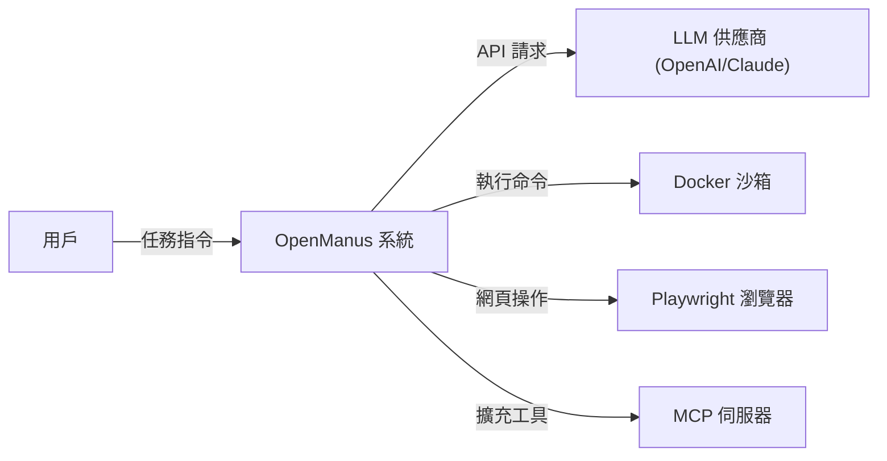
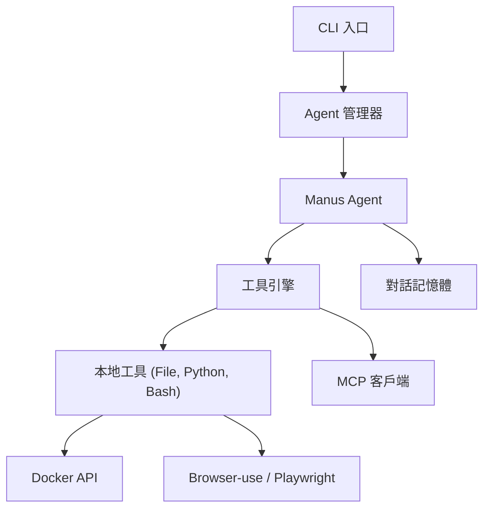

# 整合性架構與設計文件 (Unified Architecture & Design Document) - OpenManus

---

**文件版本 (Document Version):** `v1.0`

**最後更新 (Last Updated):** `2025-10-14`

**主要作者 (Lead Author):** `OpenManus Team`

**審核者 (Reviewers):** `Community Contributors`

**狀態 (Status):** `已批准 (Approved)`

---

## 目錄 (Table of Contents)

- [第 1 部分：架構總覽 (Architecture Overview)](#第-1-部分架構總覽-architecture-overview)
  - [1.1 C4 模型：視覺化架構](#11-c4-模型視覺化架構)
  - [1.2 核心設計原則](#12-核心設計原則)
  - [1.3 技術選型](#13-技術選型)
- [第 2 部分：詳細設計 (Detailed Design)](#第-2-部分詳細設計-detailed-design)
  - [2.1 Agent 執行流程 (ReAct Loop)](#21-agent-執行流程-react-loop)
  - [2.2 工具調用機制 (Tool Call Mechanism)](#22-工具調用機制-tool-call-mechanism)
  - [2.3 沙箱安全性 (Sandbox Safety)](#23-沙箱安全性-sandbox-safety)
  - [2.4 非功能性需求設計 (NFRs Design)](#24-非功能性需求設計-nfrs-design)

---

## 第 1 部分：架構總覽 (Architecture Overview)

### 1.1 C4 模型：視覺化架構

#### L1 - 系統情境圖 (System Context Diagram)

#### L2 - 容器圖 (Container Diagram)

### 1.2 核心設計原則

*   **Tool-Calling First**: 系統以工具調用為核心，LLM 負責決策使用何種工具。
*   **Safety by Isolation**: 所有不安全代碼（Python/Bash）必須在 Docker 沙箱中執行。
*   **Standardized Interactivity (MCP)**: 透過 Model Context Protocol (MCP) 實現工具的標準化接入，提升擴展性。
*   **Async Native**: 全系統基於 Python `asyncio` 構建，支持高併發工具調用。

### 1.3 技術選型

*   **語言**: Python 3.12+
*   **核心框架**: Pydantic v2 (數據驗證), Loguru (日誌)
*   **LLM 互動**: OpenAI SDK / Boto3 (AWS Bedrock)
*   **自動化**: Playwright / Browser-use
*   **沙箱**: Docker SDK
*   **通訊**: Model Context Protocol (MCP)

---

## 第 2 部分：詳細設計 (Detailed Design)

### 2.1 Agent 執行流程 (ReAct Loop)

OpenManus 遵循 `Think -> Act -> Observe` 的循環：
1.  **Think**: LLM 接收當前 `Memory` 與 `System Prompt`，生成 `Tool Call` 指令。
2.  **Act**: `ToolEngine` 解析指令並分發給對應工具。
3.  **Observe**: 工具回傳結果，寫回 `Memory` 並觸下一輪 `Think`。

### 2.2 工具調用機制 (Tool Call Mechanism)

*   **ToolCollection**: 管理所有可用工具。
*   **BaseTool**: 所有工具的基類，定義了 `to_param()` (用於 LLM 識別) 與 `execute()`。
*   **MCP Client**: 動態從外部 MCP Server 獲取工具定義並轉化為內部工具。

### 2.3 沙箱安全性 (Sandbox Safety)

*   **DockerManager**: 負責啟動與銷毀臨時 Docker 容器。
*   **Workspace Mapping**: 將本地 `workspace/` 目錄掛載至容器內 `/workspace`。
*   **Resource Limit**: 限制 CPU 與記憶體使用量，防止惡意指令消耗主機資源。

### 2.4 非功能性需求設計 (NFRs Design)

*   **性能 (Performance)**: 透過 `asyncio.gather` 平行初始化工具，最小化啟動延遲。
*   **可維護性 (Maintainability)**: 嚴格的分層架構 (Agent -> Flow -> Tool -> Sandbox)。
*   **可擴展性 (Scalability)**: 新增工具只需繼承 `BaseTool` 並實作 `execute` 即可。

---

## 第 3 部分：附錄 (Appendix)

*   **數據模型定義**: 參考 `app/schema.py`
*   **提示詞工程**: 參考 `app/prompt/` 模組
