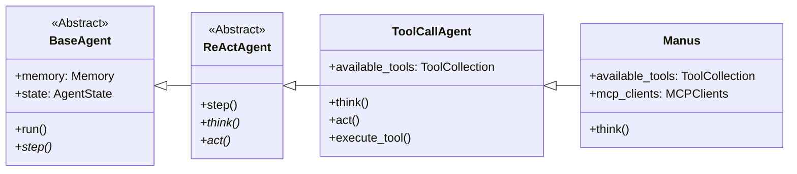
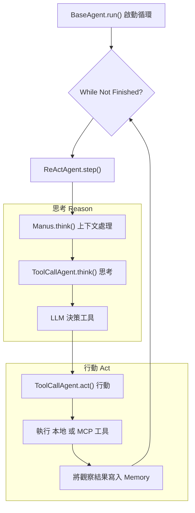

# OpenManus Agent 全盤解析：ReAct 循環與組件互動

**版本**: 1.0
**日期**: 2026-01-19
**分析員**: AI Architect

---

## 1. 總覽

本文件旨在深入解析 `OpenManus` 專案的核心—`Manus` Agent—及其與其他關鍵組件（`agent`, `mcp`, `prompt`, `tool`）的互動關係。本文將詳細闡述系統如何透過 **ReAct (Reason-Act)** 設計模式實現其核心的自主決策與執行循環。

## 2. 核心架構：三層繼承的 Agent 設計

`OpenManus` 的 Agent 架構採用了清晰的三層繼承模式，每一層都專注於不同的職責，共同構建出一個強大且可擴展的 ReAct 循環。

### 2.1 `BaseAgent` (`base.py`): 循環的驅動者

`BaseAgent` 是所有 Agent 的基石，它定義了最核心的**執行循環 (Execution Loop)**。

- **`run()` 方法**: 這是 Agent 的主入口點。它啟動一個 `while` 循環，該循環會持續執行，直到 Agent 達到最大步數 (`max_steps`) 或其狀態變為 `FINISHED`。
- **`step()` 抽象方法**: 在 `run()` 循環的每一步中，都會調用 `step()` 方法。`BaseAgent` 本身不實現 `step()`，而是將其定義為一個抽象方法，交由子類來實現具體的每一步行為。
- **職責**: `BaseAgent` 的核心職責是管理 Agent 的**狀態** (`IDLE`, `RUNNING`, `FINISHED`) 和**記憶** (`Memory`)，並提供一個持久的、狀態驅動的循環來推動 Agent 運作。

### 2.2 `ReActAgent` (`react.py`): ReAct 模式的定義者

`ReActAgent` 繼承自 `BaseAgent`，其唯一但關鍵的職責是**定義 ReAct 模式的結構**。

- **實現 `step()` 方法**: 它實現了父類的 `step()` 方法，並將一個步驟拆分為兩個核心階段：**思考 (Reason)** 和 **行動 (Act)**。
- **`think()` 和 `act()` 抽象方法**: `step()` 的實現非常簡潔，它依序調用 `await self.think()` 和 `await self.act()`。這兩個方法本身在 `ReActAgent` 中是抽象的，需要由子類提供具體實現。
- **職責**: `ReActAgent` 強制其所有子類都必須遵循「先思考，後行動」的 ReAct 範式。

### 2.3 `ToolCallAgent` (`toolcall.py`): ReAct 模式的實現者

`ToolCallAgent` 是 ReAct 模式的**核心實現**。它繼承自 `ReActAgent`，並為 `think()` 和 `act()` 方法提供了具體的、圍繞**工具調用 (Tool Calling)** 的邏輯。

#### **`think()` - 思考階段 (Reason)**
1.  **收集上下文**: 整合來自 `Memory` 的對話歷史。
2.  **注入提示**: 將 `next_step_prompt` 加入到上下文中，以指導 LLM 的下一步決策。
3.  **請求 LLM**: 調用 `self.llm.ask_tool()`，將完整的上下文和一個 `available_tools` 列表發送給大語言模型。
4.  **解析 LLM 回應**: LLM 的回應包含兩部分：
    - **思考 (Thought)**: 一段自然語言，解釋其決策過程。
    - **工具調用 (Tool Calls)**: 一個結構化的列表，包含它決定要執行的工具名稱和參數。
5.  **更新記憶**: `ToolCallAgent` 將 LLM 的完整回應（包含思考和意圖執行的工具）作為一條 `assistant` 訊息存入 `Memory`，並將意圖執行的工具暫存於 `self.tool_calls`。

#### **`act()` - 行動階段 (Act)**
1.  **遍歷工具**: 迭代 `think()` 階段儲存的 `self.tool_calls` 列表。
2.  **執行工具**: 對於每一個 `tool_call`，它會調用 `execute_tool()`。此方法會在 `available_tools` 集合中查找對應的工具並執行它。
3.  **記錄結果**: 工具執行的輸出（Observation）被包裝成一條 `tool` 訊息，並添加回 `Memory` 中。

這一完整的「思考 -> 行動 -> 觀察」循環，正是 ReAct 框架的精髓。當 `act()` 完成後，`BaseAgent` 的 `run()` 循環會帶著更新後的 `Memory`（現在包含了上一步的思考、行動和觀察結果）進入下一個 `think()` 階段。

## 3. `Manus` Agent: 頂層配置與上下文管理者

`Manus` Agent (`manus.py`) 是這個三層架構的頂層，它是一個高度特化的 `ToolCallAgent`，其核心職責是**配置、整合與動態上下文管理**。

### 3.1 互動與關聯

#### **與 `prompt` 的互動**
- `Manus` 負責設定其專屬的 `SYSTEM_PROMPT` 和 `NEXT_STEP_PROMPT`（來自 `prompt/manus.py`）。這些提示定義了 Agent 的身份、能力和行為準則，是 `think()` 階段 LLM 進行決策的基礎。

#### **與 `tool` 的互動**
- **本地工具**: `Manus` 在 `available_tools` 屬性中直接實例化並註冊了一組核心的本地工具，如 `PythonExecute`, `BrowserUseTool`, `StrReplaceEditor`, 和 `Terminate`。
- **遠程工具 (MCP)**: `Manus` 的一個關鍵特性是與 **MCP (Master Control Program)** 的整合。

#### **與 `mcp` 的互動**
- `Manus` 透過 `MCPClients` (`tool/mcp.py`) 對象來連接遠程的 MCP 伺服器。
- 在初始化時 (`initialize_mcp_servers`)，它會根據配置連接到一個或多個 MCP 伺服器。
- 連接成功後，遠程伺服器提供的工具會被 `MCPClientTool` 代理，並動態地添加到 `Manus` 的 `available_tools` 集合中。
- 在 ReAct 循環中，當 LLM 決定調用一個 MCP 工具時，`MCPClientTool` 的 `execute` 方法會將請求轉發到遠程伺服器執行，並將結果返回，實現了本地與遠程工具的無縫整合。

#### **與 `context` 的互動 (動態提示)**
- `Manus` 的 `think()` 方法完美地展示了其動態上下文管理能力。
- 在調用父類 (`ToolCallAgent`) 的 `think()` 方法之前，它會進行一次檢查，例如判斷 `BrowserUseTool` 是否正在被使用。
- 如果是，它會利用 `BrowserContextHelper` **即時獲取當前瀏覽器頁面的內容**，並將這些內容格式化後**動態地注入**到 `next_step_prompt` 中。
- 這個機制至關重要，它確保了 LLM 在「思考」下一步瀏覽操作時，能夠獲取到最新的網頁狀態，從而做出準確的決策。

## 4. 總結流程圖

