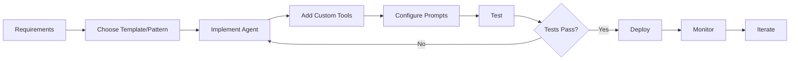

# OpenManus System Architecture Documentation

## 📚 Documentation Index

### Core Architecture Analysis
- **[Manus Agent Interaction Analysis](./Manus_Agent_Interaction_Analysis.md)**
  - Deep dive into ReAct loop implementation
  - Component interaction patterns
  - Three-layer inheritance architecture

### Developer Guides

#### 1. **[Agent Extension Developer Guide](./Agent_Extension_Developer_Guide.md)**
Comprehensive guide for creating custom agents, including:
- Architecture foundation
- Step-by-step agent creation
- Tool integration patterns
- Prompt engineering strategies
- Advanced patterns (state machines, multi-agent, learning agents)
- Testing strategies
- Best practices
- Troubleshooting

#### 2. **[Agent Templates Cookbook](./Agent_Templates_Cookbook.md)**
Ready-to-use agent templates for common use cases:
- Research Agent - Information gathering and analysis
- Code Development Agent - Software development tasks
- Data Analysis Agent - Data processing and visualization
- DevOps Agent - System administration and deployment
- QA Testing Agent - Quality assurance and testing
- Documentation Agent - Technical writing and documentation

### Related Documentation

- **[Context Engineering Refactoring](../CONTEXT_ENGINEERING_REFACTORING.md)**
  - Implementation of KV-Cache optimization
  - Tool masking system
  - Performance improvements

---

## 🚀 Quick Start for Developers

### Creating Your First Agent

1. **Understand the Architecture**
   - Read the [Manus Agent Interaction Analysis](./Manus_Agent_Interaction_Analysis.md)

2. **Choose Your Approach**
   - **From Scratch**: Follow the [Agent Extension Developer Guide](./Agent_Extension_Developer_Guide.md)
   - **From Template**: Pick a template from the [Agent Templates Cookbook](./Agent_Templates_Cookbook.md)

3. **Implement Your Agent**
   ```python
   from app.agent.toolcall import ToolCallAgent

   class MyAgent(ToolCallAgent):
       name = "my_agent"
       description = "My specialized agent"
       # Your implementation
   ```

4. **Test Your Agent**
   - Unit tests
   - Integration tests
   - Performance tests

5. **Deploy**
   - Configure environment
   - Set resource limits
   - Monitor performance

---

## 🏗️ Architecture Overview

```
BaseAgent (Abstract)
    ├── Execution Loop Management
    ├── State Management (IDLE/RUNNING/FINISHED)
    └── Memory Management
         ↓
ReActAgent (Abstract)
    ├── ReAct Pattern (Think → Act)
    └── Step Orchestration
         ↓
ToolCallAgent (Concrete)
    ├── LLM Integration
    ├── Tool Execution
    └── Observation Recording
         ↓
Custom Agents (Your Implementation)
    ├── Domain-Specific Logic
    ├── Custom Tools
    └── Specialized Prompts
```

---

## 🛠️ Key Design Principles

### 1. **ReAct Paradigm**
- **Reason**: Agent analyzes context and decides on actions
- **Act**: Agent executes selected tools
- **Observe**: Results are recorded for next iteration

### 2. **Tool-Driven Architecture**
- Agents accomplish tasks through tool execution
- Tools are modular and reusable
- Support for both local and remote (MCP) tools

### 3. **Context Management**
- Memory maintains conversation history
- Dynamic context injection for specialized scenarios
- Optimization through sliding window and summarization

### 4. **Extensibility**
- Clear inheritance hierarchy
- Override methods for custom behavior
- Pluggable tool system

---

## 📊 Agent Capabilities Matrix

| Agent Type | Research | Coding | Analysis | DevOps | Testing | Docs |
|------------|----------|---------|----------|---------|---------|------|
| **Manus** | ✅ | ✅ | ✅ | ✅ | ⚠️ | ⚠️ |
| **ResearchAgent** | ✅✅✅ | ❌ | ⚠️ | ❌ | ❌ | ⚠️ |
| **CodeDevelopmentAgent** | ⚠️ | ✅✅✅ | ⚠️ | ⚠️ | ✅ | ⚠️ |
| **DataAnalysisAgent** | ✅ | ✅ | ✅✅✅ | ❌ | ⚠️ | ⚠️ |
| **DevOpsAgent** | ❌ | ✅ | ⚠️ | ✅✅✅ | ✅ | ⚠️ |
| **QATestingAgent** | ⚠️ | ✅ | ⚠️ | ⚠️ | ✅✅✅ | ✅ |
| **DocumentationAgent** | ✅ | ⚠️ | ⚠️ | ❌ | ⚠️ | ✅✅✅ |

Legend: ❌ Not Supported | ⚠️ Basic | ✅ Good | ✅✅ Excellent | ✅✅✅ Specialized

---

## 🔧 Development Workflow



---

## 📝 Best Practices Summary

### Do's ✅
- Start with existing templates
- Test thoroughly with edge cases
- Implement proper error handling
- Use type hints consistently
- Document your agent's capabilities
- Monitor resource usage
- Version your agents

### Don'ts ❌
- Overload agents with too many tools
- Ignore memory limits
- Hardcode sensitive information
- Skip testing phases
- Create circular dependencies
- Forget about rate limits

---

## 🤝 Contributing

To contribute new agent templates or improvements:

1. Fork the repository
2. Create a feature branch
3. Implement your agent following the guidelines
4. Add comprehensive tests
5. Update documentation
6. Submit a pull request

---

## 📞 Support

- **GitHub Issues**: Report bugs or request features
- **Discussions**: Share ideas and get help
- **Documentation**: Check the guides for detailed information

---

## 🔗 Quick Links

- [Main Repository](https://github.com/openManus/openManus)
- [API Documentation](#)
- [Tool Development Guide](#)
- [MCP Integration Guide](#)

---

*Last Updated: 2026-01-20*
*Version: 1.0*