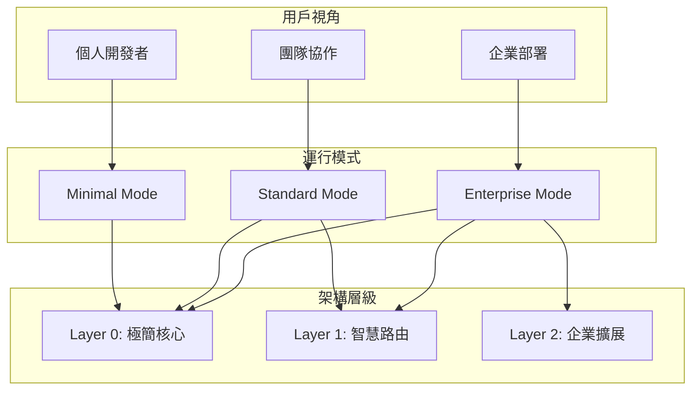
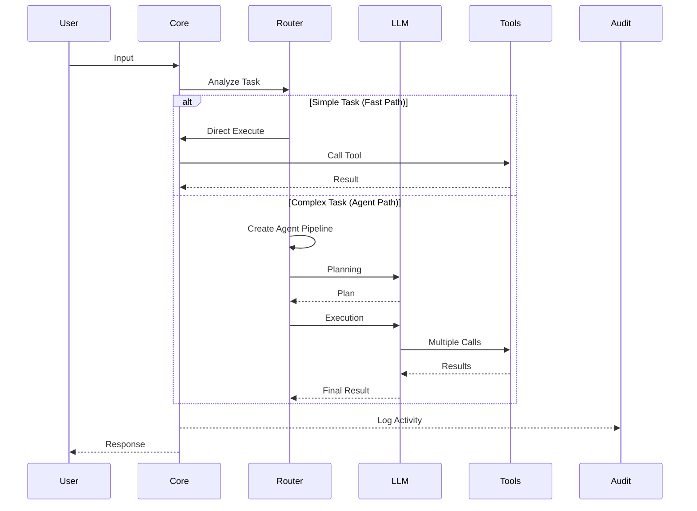
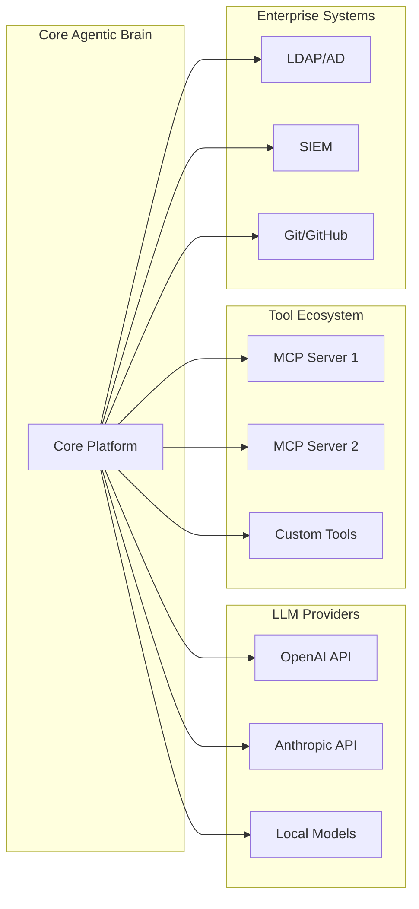
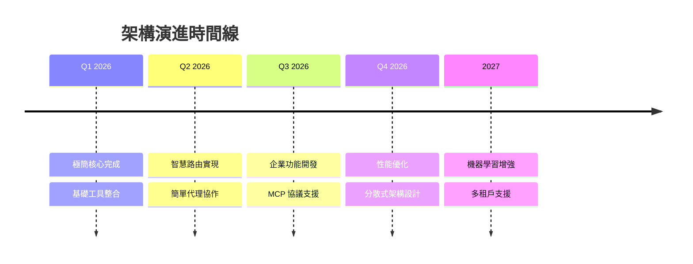

# 系統架構文件 (System Architecture)
# Core Agentic Brain - 通用 Agent 平台

**文件版本:** 1.0
**日期:** 2026-01-27
**專案名稱:** Core Agentic Brain
**架構模式:** 漸進式分層架構 (Progressive Layered Architecture)

---

## 執行摘要

Core Agentic Brain 是一個採用「極簡核心 + 漸進式擴展」理念的通用 AI Agent 平台。結合 Linus Torvalds 的極簡哲學與企業級需求，提供從個人到企業的完整解決方案。

### 核心價值主張
- **5 分鐘上手**: 極簡模式零配置啟動
- **無限擴展**: 企業級功能按需啟用
- **Claude Code 相容**: 完整支援既有工作流程
- **性能優先**: 快速路徑優化，< 1秒響應

---

## 1. 系統概覽

### 1.1 架構願景

```
「簡單的事情應該簡單，複雜的事情應該可能」
- Larry Wall (Perl 創造者)
```

本架構遵循此理念，提供三層漸進式設計：



### 1.2 設計原則

| 原則 | 描述 | 實踐要求 |
|-----|------|----------|
| **極簡優先** | 核心功能保持極簡 | 核心代碼 < 500 行 |
| **漸進複雜** | 複雜功能按需啟用 | 分層設計，獨立模組 |
| **零侵入** | 新功能不影響核心 | 嚴格介面隔離 |
| **快速路徑** | 簡單任務直接執行 | < 1秒響應時間 |
| **標準相容** | 支援業界標準 | Claude Code, MCP 協議 |

### 1.3 系統邊界

```yaml
系統範圍:
  包含:
    - AI 對話管理
    - 工具調用協調
    - 任務路由決策
    - 權限控制（可選）
    - 審計追蹤（可選）

  不包含:
    - LLM 模型訓練
    - 數據持久化層
    - 分散式部署
    - 即時通訊功能
```

---

## 2. 架構設計

### 2.1 分層架構圖

```
┌─────────────────────────────────────────────────────────────────┐
│                      Core Agentic Brain                          │
├─────────────────────────────────────────────────────────────────┤
│                                                                  │
│  ┌──────────────────────────────────────────────────────────┐  │
│  │                    Presentation Layer                     │  │
│  │  ┌──────────┐  ┌──────────┐  ┌──────────┐  ┌──────────┐│  │
│  │  │   CLI    │  │   TUI    │  │   Web    │  │   API    ││  │
│  │  └──────────┘  └──────────┘  └──────────┘  └──────────┘│  │
│  └──────────────────────────────────────────────────────────┘  │
│                              │                                   │
│  ┌──────────────────────────▼──────────────────────────────┐  │
│  │                  Application Layer                       │  │
│  │  ┌─────────────────────────────────────────────────┐    │  │
│  │  │            Layer 0: Minimal Core                │    │  │
│  │  │  ┌─────────┐  ┌─────────┐  ┌─────────┐       │    │  │
│  │  │  │  Agent  │  │   LLM   │  │  Tools  │       │    │  │
│  │  │  │  Core   │  │ Wrapper │  │  Basic  │       │    │  │
│  │  │  └─────────┘  └─────────┘  └─────────┘       │    │  │
│  │  └─────────────────────────────────────────────────┘    │  │
│  │                                                          │  │
│  │  ┌─────────────────────────────────────────────────┐    │  │
│  │  │          Layer 1: Smart Routing                 │    │  │
│  │  │  ┌─────────┐  ┌─────────┐  ┌─────────┐       │    │  │
│  │  │  │  Task   │  │  Route  │  │  Simple │       │    │  │
│  │  │  │Analyzer │  │ Engine  │  │  Agents │       │    │  │
│  │  │  └─────────┘  └─────────┘  └─────────┘       │    │  │
│  │  └─────────────────────────────────────────────────┘    │  │
│  │                                                          │  │
│  │  ┌─────────────────────────────────────────────────┐    │  │
│  │  │         Layer 2: Enterprise Features            │    │  │
│  │  │  ┌─────────┐  ┌─────────┐  ┌─────────┐       │    │  │
│  │  │  │Permiss. │  │  Audit  │  │   MCP   │       │    │  │
│  │  │  │ System  │  │  Logger │  │ Gateway │       │    │  │
│  │  │  └─────────┘  └─────────┘  └─────────┘       │    │  │
│  │  └─────────────────────────────────────────────────┘    │  │
│  └──────────────────────────────────────────────────────────┘  │
│                              │                                   │
│  ┌──────────────────────────▼──────────────────────────────┐  │
│  │                    Infrastructure Layer                  │  │
│  │  ┌──────────┐  ┌──────────┐  ┌──────────┐  ┌──────────┐│  │
│  │  │  Config  │  │  Logging │  │  Cache   │  │  Events  ││  │
│  │  │  Manager │  │  System  │  │  Layer   │  │   Bus    ││  │
│  │  └──────────┘  └──────────┘  └──────────┘  └──────────┘│  │
│  └──────────────────────────────────────────────────────────┘  │
│                                                                  │
└─────────────────────────────────────────────────────────────────┘
```

### 2.2 核心組件描述

#### Layer 0: 極簡核心（Minimal Core）
```python
# 核心組件規格
MinimalCore:
  Agent:
    責任: 處理用戶輸入，協調 LLM 和工具
    代碼限制: < 100 行
    依賴: 僅 LLM 和 Tools

  LLMWrapper:
    責任: 統一 LLM 接口
    支援: OpenAI, Anthropic, Local
    代碼限制: < 50 行

  BasicTools:
    責任: 基礎工具調用
    包含: Python, Browser, Files
    代碼限制: 每個工具 < 50 行
```

#### Layer 1: 智慧路由（Smart Routing）
```python
# 路由組件規格
SmartRouting:
  TaskAnalyzer:
    責任: 分析任務複雜度
    輸出: FastPath | AgentPath
    決策時間: < 100ms

  RouteEngine:
    責任: 執行路由決策
    策略: 基於規則 + 啟發式

  SimpleAgents:
    責任: 基礎代理協作
    類型: Planner, Executor, Reviewer
```

#### Layer 2: 企業功能（Enterprise Features）
```python
# 企業組件規格
EnterpriseFeatures:
  PermissionSystem:
    模型: RBAC (角色基礎存取控制)
    層級: Allow | Ask | Deny
    粒度: 工具級、動作級

  AuditLogger:
    記錄: 所有工具調用、決策、結果
    格式: JSON Lines
    保留: 可配置（預設 30 天）

  MCPGateway:
    協議: Model Context Protocol
    支援: Local & Remote servers
    沙箱: 資源隔離
```

### 2.3 數據流架構



---

## 3. 系統組件

### 3.1 組件清單

| 組件名稱 | 層級 | 職責 | 依賴關係 | 代碼規模 |
|---------|------|------|----------|----------|
| main.py | Entry | 統一入口 | Core | < 50 行 |
| core/agent.py | L0 | 核心邏輯 | LLM, Tools | < 100 行 |
| core/llm.py | L0 | LLM 封裝 | - | < 50 行 |
| core/tools.py | L0 | 工具管理 | - | < 50 行 |
| router/analyzer.py | L1 | 任務分析 | Core | < 100 行 |
| router/executor.py | L1 | 路由執行 | Core, Agents | < 100 行 |
| agents/*.py | L1 | 代理實現 | Core | < 100 行/each |
| enterprise/*.py | L2 | 企業功能 | Core | < 200 行/each |
| tools/*.py | Tools | 工具實現 | - | < 50 行/each |

### 3.2 組件交互矩陣

```
         │ Core │ Router │ Agents │ Tools │ Enterprise │
─────────┼──────┼────────┼────────┼───────┼────────────┤
Core     │  ✓   │   ✓    │   -    │   ✓   │     -      │
Router   │  ✓   │   ✓    │   ✓    │   -   │     -      │
Agents   │  ✓   │   ✓    │   ✓    │   ✓   │     -      │
Tools    │  -   │   -    │   -    │   ✓   │     -      │
Enterprise│  ✓   │   ✓    │   ✓    │   ✓   │     ✓      │
```

### 3.3 部署架構

```yaml
部署模式:
  單機部署:
    環境: Python 3.10+
    依賴: < 10 packages
    資源: 1 CPU, 1GB RAM

  容器部署:
    基礎映像: python:3.10-slim
    大小: < 200MB
    啟動時間: < 5s

  雲端部署:
    平台: AWS Lambda / GCP Functions
    冷啟動: < 2s
    並發: 1000+
```

---

## 4. 介面設計

### 4.1 核心介面定義

```python
# 核心介面
class IAgent:
    async def process(self, input: str) -> str:
        """處理用戶輸入並返回響應"""

class ITool:
    async def execute(self, params: dict) -> dict:
        """執行工具並返回結果"""

class IRouter:
    def analyze(self, task: str) -> ExecutionPath:
        """分析任務並決定執行路徑"""

class IPermission:
    def check(self, action: str, context: dict) -> PermissionLevel:
        """檢查操作權限"""
```

### 4.2 配置介面

```yaml
# config.yaml 結構
version: "1.0"
mode: minimal  # minimal | standard | enterprise

core:
  llm:
    provider: openai
    model: gpt-4
    temperature: 0.7

  tools:
    enabled:
      - python
      - browser
      - files

routing:
  enabled: false
  fast_path:
    max_tokens: 1000
    max_tools: 1

enterprise:
  permissions:
    enabled: false
    default: allow

  audit:
    enabled: false
    path: ./audit.log

  mcp:
    enabled: false
    servers: []
```

### 4.3 API 介面

```python
# REST API 端點
POST   /api/chat          # 發送訊息
GET    /api/status        # 系統狀態
GET    /api/tools         # 可用工具
POST   /api/tools/execute # 執行工具

# WebSocket 端點
WS     /ws/chat           # 即時對話
WS     /ws/events         # 事件串流
```

---

## 5. 性能規格

### 5.1 性能指標

| 指標 | 極簡模式 | 標準模式 | 企業模式 | 測量方法 |
|-----|---------|---------|---------|---------|
| 啟動時間 | < 2s | < 3s | < 5s | Cold start |
| 響應時間 | < 1s | < 1.5s | < 2s | P95 latency |
| 記憶體使用 | < 100MB | < 200MB | < 500MB | RSS |
| CPU 使用 | < 10% | < 20% | < 30% | Idle state |
| 並發處理 | 10 | 50 | 100+ | Concurrent users |

### 5.2 擴展性設計

```yaml
垂直擴展:
  CPU: 1-8 cores
  RAM: 1-16 GB
  效能提升: 線性

水平擴展:
  負載均衡: 支援
  狀態管理: Stateless
  Session: External store

快取策略:
  LLM響應: 5分鐘 TTL
  工具結果: 1分鐘 TTL
  配置: 熱重載
```

### 5.3 可靠性設計

```yaml
故障處理:
  LLM 超時: 30s timeout, 3 retries
  工具失敗: Graceful degradation
  網路中斷: Local fallback

監控指標:
  - 請求成功率
  - 平均響應時間
  - 錯誤率
  - 資源使用率

日誌級別:
  ERROR: 系統錯誤
  WARN: 性能問題
  INFO: 關鍵操作
  DEBUG: 詳細追蹤
```

---

## 6. 安全架構

### 6.1 安全層級

```yaml
Layer 0 - 基礎安全:
  - 輸入驗證
  - 輸出編碼
  - 基本速率限制

Layer 1 - 增強安全:
  - Token 驗證
  - Session 管理
  - 工具沙箱

Layer 2 - 企業安全:
  - RBAC 權限
  - 審計日誌
  - 加密存儲
  - 合規報告
```

### 6.2 威脅模型

| 威脅類型 | 風險等級 | 緩解措施 |
|---------|---------|---------|
| Prompt Injection | 高 | 輸入過濾、輸出驗證 |
| Tool Abuse | 中 | 權限控制、速率限制 |
| Data Leakage | 中 | 加密傳輸、訪問控制 |
| DoS Attack | 低 | 速率限制、資源配額 |

### 6.3 合規性支援

```yaml
支援標準:
  - GDPR: 數據保護
  - SOC 2: 安全控制
  - ISO 27001: 資訊安全

實施措施:
  - 數據最小化
  - 用戶同意
  - 審計追蹤
  - 數據刪除
```

---

## 7. 整合架構

### 7.1 外部系統整合



### 7.2 整合協議

| 系統類型 | 協議 | 認證方式 | 備註 |
|---------|------|---------|------|
| LLM | REST API | API Key | 支援多提供商 |
| MCP Tools | MCP Protocol | Token | 標準化工具接口 |
| Git | HTTPS/SSH | Token/Key | 版本控制整合 |
| LDAP | LDAP v3 | Bind DN | 企業用戶管理 |
| SIEM | Syslog/API | API Key | 安全事件管理 |

### 7.3 擴展點設計

```python
# 擴展點定義
ExtensionPoints:
  ToolProvider:
    位置: tools/
    接口: ITool
    註冊: 自動發現

  LLMProvider:
    位置: core/llm/providers/
    接口: ILLMProvider
    配置: config.yaml

  AuthProvider:
    位置: enterprise/auth/
    接口: IAuthProvider
    配置: 環境變量

  StorageProvider:
    位置: infrastructure/storage/
    接口: IStorage
    配置: config.yaml
```

---

## 8. 技術債務與演進

### 8.1 已知限制

| 限制 | 影響 | 計劃解決方案 | 優先級 |
|-----|------|------------|--------|
| 單機架構 | 擴展性受限 | 分散式支援 | P2 |
| 同步執行 | 並發性能 | 異步架構 | P1 |
| 記憶體存儲 | 數據持久性 | 外部存儲 | P2 |
| 簡單路由 | 決策準確性 | ML 路由器 | P3 |

### 8.2 演進路線圖



### 8.3 技術決策記錄 (ADR)

| ADR-ID | 決策 | 理由 | 結果 |
|--------|------|------|------|
| ADR-001 | 採用 Python | 生態豐富、開發效率高 | 接受 |
| ADR-002 | 漸進式架構 | 平衡簡單性與功能性 | 接受 |
| ADR-003 | MCP 協議 | 標準化工具接口 | 接受 |
| ADR-004 | 無資料庫 | 降低複雜度 | 接受* |

*註：企業模式可選外部存儲

---

## 9. 非功能性需求

### 9.1 可用性需求

```yaml
系統可用性:
  目標: 99.9% (每月停機 < 44 分鐘)

  實現策略:
    - 健康檢查端點
    - 優雅關閉
    - 自動重啟
    - 降級服務
```

### 9.2 可維護性需求

```yaml
代碼品質:
  測試覆蓋率: > 80%
  代碼複雜度: < 10 (Cyclomatic)
  文檔覆蓋率: 100% public API

維護工具:
  - 自動化測試
  - CI/CD pipeline
  - 性能監控
  - 日誌分析
```

### 9.3 可移植性需求

```yaml
平台支援:
  作業系統: Linux, macOS, Windows
  Python版本: 3.10+
  容器: Docker, Kubernetes

雲端平台:
  - AWS (Lambda, ECS)
  - GCP (Cloud Run, GKE)
  - Azure (Functions, AKS)
```

---

## 10. 架構決策影響分析

### 10.1 利益相關者影響

| 利益相關者 | 正面影響 | 負面影響 | 緩解措施 |
|-----------|---------|---------|---------|
| 個人開發者 | 簡單易用、快速上手 | 功能可能不足 | 提供擴展指南 |
| 企業用戶 | 完整功能、安全合規 | 部署複雜 | 提供部署模板 |
| 維護團隊 | 模組化設計、清晰架構 | 多層架構 | 完善文檔 |
| 營運團隊 | 監控完善、易於管理 | 配置複雜 | 自動化工具 |

### 10.2 成本影響分析

```yaml
開發成本:
  初始開發: 中等（5人月）
  維護成本: 低（模組化設計）

營運成本:
  基礎設施: 低（單機可運行）
  授權成本: 低（開源技術棧）

擴展成本:
  功能擴展: 低（插件架構）
  性能擴展: 中等（需要重構）
```

### 10.3 風險評估

| 風險 | 可能性 | 影響 | 風險值 | 緩解策略 |
|-----|--------|------|--------|----------|
| 架構過於複雜 | 中 | 高 | 6 | 默認極簡模式 |
| 性能瓶頸 | 低 | 中 | 2 | 快速路徑優化 |
| 安全漏洞 | 中 | 高 | 6 | 安全審計、更新 |
| 技術債務累積 | 高 | 中 | 6 | 定期重構 |

---

## 附錄 A: 術語表

| 術語 | 定義 |
|-----|------|
| Agent | 處理任務的智能實體 |
| Fast Path | 簡單任務的直接執行路徑 |
| Agent Path | 複雜任務的代理協作路徑 |
| MCP | Model Context Protocol，標準化工具協議 |
| Layer | 架構分層，提供不同級別功能 |
| Router | 任務路由器，決定執行策略 |
| Tool | 可調用的外部功能模組 |

---

## 附錄 B: 參考資料

1. Linus Torvalds - "Good Taste" in Programming
2. Larry Wall - "Three Virtues of a Programmer"
3. Claude Code Architecture Documentation
4. Model Context Protocol Specification
5. Clean Architecture by Robert C. Martin
6. Domain-Driven Design by Eric Evans

---

## 附錄 C: 變更記錄

| 版本 | 日期 | 變更內容 | 作者 |
|------|------|---------|------|
| 1.0 | 2026-01-27 | 初始版本 | 系統架構師 |

---

**文檔狀態:** 已批准
**下次審查日期:** 2026-04-27
**維護負責人:** 系統架構團隊