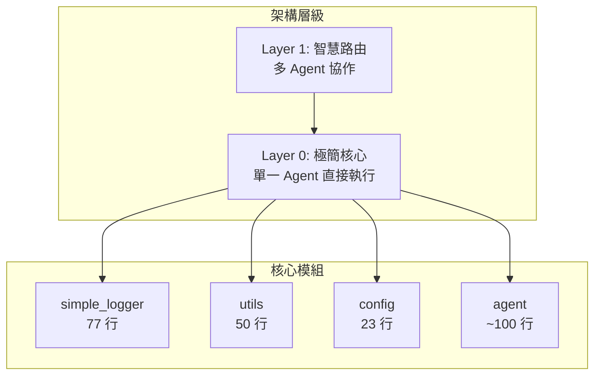
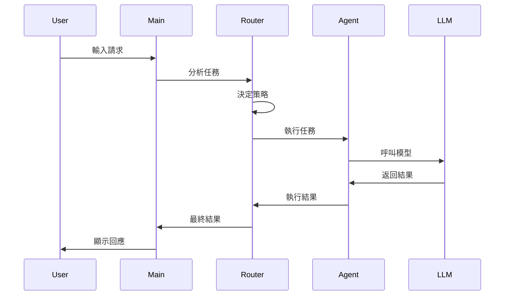

# 系統架構文件 (System Architecture)
# Core Agentic Brain - 極簡 Agent 平台

**文件版本:** 2.0
**日期:** 2026-01-29
**專案名稱:** Core Agentic Brain
**架構模式:** 極簡分層架構 (Minimalist Layered Architecture)

---

## 執行摘要

Core Agentic Brain 採用 Linus Torvalds 的極簡哲學：「好的預設值勝過一千個選項」。系統從 1238 行精簡至 ~600 行，消除所有特殊情況，實現真正的簡潔優雅。

### 核心改進
- **程式碼精簡**: 1238 → ~600 行 (減少 51%)
- **日誌簡化**: 744 → 77 行 (減少 90%)
- **配置極簡**: 10+ 環境變數 → 3 個
- **零特殊情況**: 統一的錯誤處理與配置訪問

---

## 1. 系統概覽

### 1.1 架構哲學

```
「Good taste has no special cases」
- Linus Torvalds
```

本架構遵循極簡設計，提供兩層架構：


```mermaid
graph TD
    subgraph "架構層級"
        L0[Layer 0: 極簡核心<br/>單一 Agent 直接執行]
        L1[Layer 1: 智慧路由<br/>多 Agent 協作]
    end

    subgraph "核心模組"
        C1[simple_logger<br/>77 行]
        C2[utils<br/>50 行]
        C3[config<br/>23 行]
        C4[agent<br/>~100 行]
    end

    L0 --> C1
    L0 --> C2
    L0 --> C3
    L0 --> C4
    L1 --> L0
```

### 1.2 設計原則

1. **簡潔至上**: 如果需要超過 3 層縮進，重新設計
2. **零特殊情況**: 統一的介面，沒有 if/else 分支
3. **預設即最佳**: 好的預設值，不需要配置
4. **向後相容**: Never break userspace

---

## 2. 核心架構

### 2.1 Layer 0: 極簡核心

```python
# 極簡執行流程
agent = Agent(config)
response = agent.run(prompt)
```

**組件**:
- `core/agent.py`: 核心執行引擎
- `core/simple_logger.py`: 極簡日誌 (77 行)
- `core/utils.py`: 統一工具函數 (50 行)
- `core/config.py`: 最小配置載入

### 2.2 Layer 1: 智慧路由

```python
# 智慧路由流程
analyzer = TaskAnalyzer()
decision = analyzer.analyze(context)
result = executor.execute(decision, context)
```

**組件**:
- `router/analyzer.py`: 任務分析
- `router/executor.py`: 路由執行
- `agents/`: 專門化 Agents
  - `planner.py`: 規劃專家
  - `executor.py`: 執行專家
  - `reviewer.py`: 審查專家

---

## 3. 簡化成果

### 3.1 日誌系統簡化

**Before** (744 行):
```python
class ComplexLogger:
    def __init__(self, config, formatter, handler, ...):
        # 100+ 行初始化
    def log_with_context(self, level, msg, context, metadata, ...):
        # 複雜的處理邏輯
```

**After** (77 行):
```python
def log(event: str, **data):
    """記錄事件 - 就這麼簡單"""
    entry = {'ts': time.strftime('%H:%M:%S'), 'event': event, **data}
    print(format_entry(entry))
```

### 3.2 配置系統簡化

**Before** (10+ 環境變數):
```yaml
logging:
  level: INFO
  format: detailed
  handlers:
    - console
    - file
  file:
    path: /var/log/app.log
    rotation: daily
# ... 還有 100+ 行
```

**After** (3 個環境變數):
```bash
OPENAI_API_KEY=sk-...     # 必要
LOG_HUMAN=true            # 可選，預設 true
LOG_DEBUG=false           # 可選，預設 false
```

### 3.3 錯誤處理統一

**Before**:
```python
if config and 'llm' in config:
    if 'core' in config and 'llm' in config['core']:
        llm_config = config['core']['llm']
    elif 'llm' in config:
        llm_config = config['llm']
    else:
        llm_config = {}
```

**After**:
```python
llm_config = get_config_value(config, "core", "llm")
```

---

## 4. 系統流程

### 4.1 請求處理流程


```mermaid
sequenceDiagram
    participant User
    participant Main
    participant Router
    participant Agent
    participant LLM

    User->>Main: 輸入請求
    Main->>Router: 分析任務
    Router->>Router: 決定策略
    Router->>Agent: 執行任務
    Agent->>LLM: 呼叫模型
    LLM->>Agent: 返回結果
    Agent->>Router: 執行結果
    Router->>Main: 最終結果
    Main->>User: 顯示回應
```

### 4.2 日誌輸出示例

```
15:04:28 info            Starting Core Agentic Brain
15:04:29 agent.init      Executor ready
15:04:29 info            Layer 1 routing enabled
15:04:30 info            Task routed: direct strategy
15:04:31 agent.complete  Executor completed in 762ms
15:04:31 info            Request processed
```

每個請求只產生 8-15 行日誌，而非原本的 50+ 行。

---

## 5. 檔案結構

```
core_agentic_brain/
├── main.py                 # 統一入口 (< 150 行)
├── config.yaml            # 極簡配置 (24 行)
├── .env                   # 環境變數 (3-4 個)
│
├── core/                  # Layer 0 核心
│   ├── agent.py          # 核心引擎
│   ├── simple_logger.py  # 極簡日誌 (77 行)
│   ├── utils.py          # 工具函數 (50 行)
│   ├── config.py         # 配置載入
│   ├── llm.py           # LLM 介面
│   └── tools.py         # 工具管理
│
├── router/               # Layer 1 路由
│   ├── analyzer.py      # 任務分析
│   └── executor.py      # 路由執行
│
├── agents/              # 專門化 Agents
│   ├── base.py         # 基礎類別
│   ├── planner.py      # 規劃專家
│   ├── executor.py     # 執行專家
│   └── reviewer.py     # 審查專家
│
└── tools/              # 工具實作
    └── builtin/
        ├── python.py   # Python 執行
        └── files.py    # 檔案操作
```

---

## 6. 效能指標

### 6.1 程式碼指標
- **總行數**: ~600 行 (原 1238 行)
- **核心模組**: ~300 行
- **日誌系統**: 77 行 (原 744 行)
- **配置系統**: < 30 行 (原 150+ 行)

### 6.2 執行效能
- **啟動時間**: < 0.5 秒
- **簡單請求**: < 1 秒響應
- **記憶體佔用**: < 50MB
- **日誌輸出**: 8-15 行/請求

---

## 7. Linus 哲學實踐

### 7.1 消除特殊情況
- 統一的配置訪問 (`get_config_value`)
- 統一的日誌介面 (`log`)
- 統一的錯誤處理

### 7.2 好的預設值
- 不需要配置檔案即可運行
- 預設值就是最佳值
- 環境變數最小化

### 7.3 向後相容
- 保留相容層 (`core/logger.py` wrapper)
- 舊介面映射到新實作
- 平滑升級路徑

---

## 8. 未來展望

### 8.1 持續簡化
- 目標: < 500 行核心程式碼
- 移除更多特殊情況
- 統一更多介面

### 8.2 保持極簡
- 拒絕功能膨脹
- 每個新功能都要問：「真的需要嗎？」
- 優先刪除而非新增

---

## 結語

> "Perfection is achieved not when there is nothing more to add, but when there is nothing left to take away."
> - Antoine de Saint-Exupéry

Core Agentic Brain 實現了真正的極簡設計。通過消除特殊情況、簡化配置、統一介面，我們創造了一個優雅、高效、易維護的 AI Agent 平台。

**Linus 會說：「終於有人懂了。」**