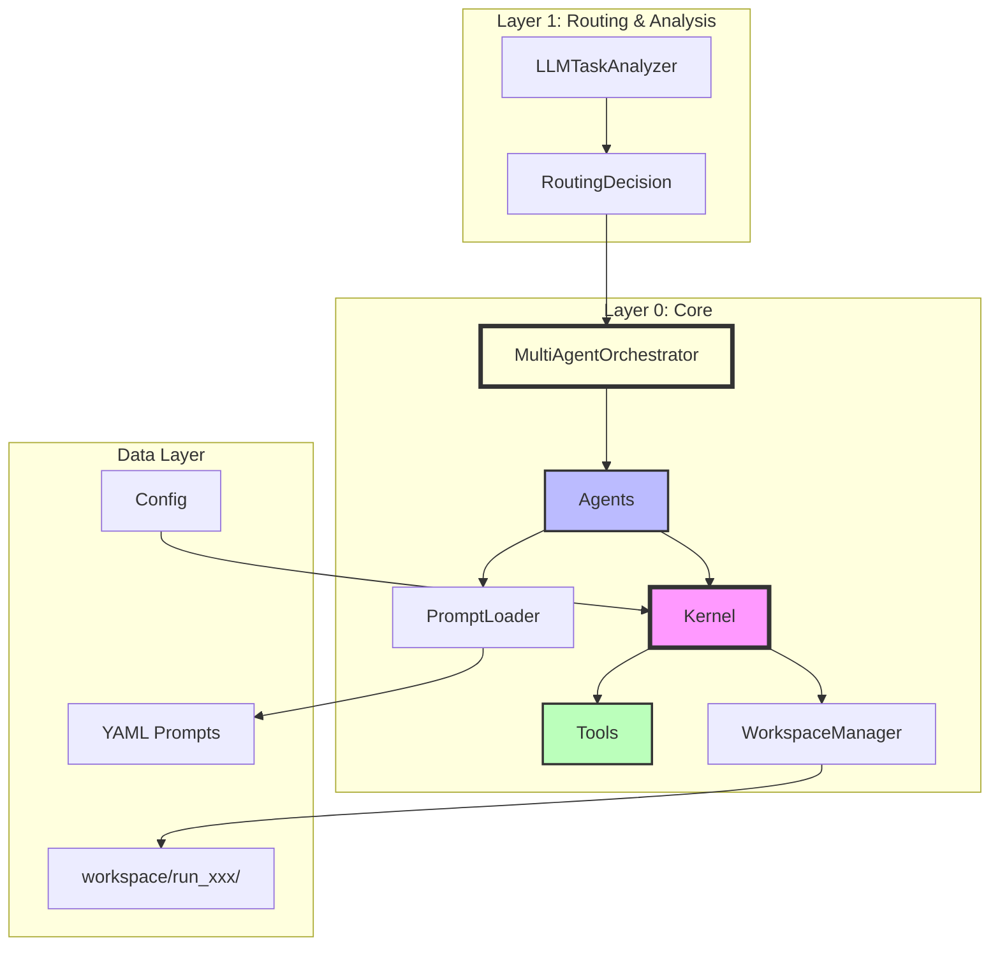

# 🏗️ Integration Architecture: Agents-Prompts-Tools

## Executive Summary

The Core Agentic Brain implements a **multi-layer integration** between Agents, Prompts, Tools, and Orchestration, following Linus Torvalds' design philosophy: **"Good defaults are better than options"** and **"Simplicity is prerequisite"**.

## Architecture Overview



## Component Details

### 1. Agents (`/agents`)

**Purpose**: Execute specialized tasks with specific expertise

**Key Components**:
- `BaseAgent`: Abstract base providing common functionality
- `PlannerAgent`: Decomposes complex tasks into steps
- `ExecutorAgent`: Executes tasks with ReAct loop support
- `ReviewerAgent`: Reviews and validates results

**Integration Points**:
```python
# Agents receive kernel reference for tool calling
class ExecutorAgent(BaseAgent):
    def __init__(self, llm_provider, kernel=None):
        self.kernel = kernel  # For ReAct tool calls

# Agents load prompts via Kernel
system_prompt = self.kernel.get_prompt("executor.system")

# Agents call tools through Kernel (workspace-aware)
result = await self.kernel.call_tool("python", params, context)
```

### 2. Orchestration (`/core/orchestration.py`)

**Purpose**: Coordinate multi-agent execution with different strategies

**Key Components**:
- `MultiAgentOrchestrator`: Base orchestrator with 4 strategies
- `ExecutionStrategy`: DIRECT, SEQUENTIAL, ORCHESTRATED, REACT

**Execution Strategies**:
```python
# DIRECT: Single agent execution
# SEQUENTIAL: Planner → Executor
# ORCHESTRATED: Planner → Executor → Reviewer
# REACT: Thought → Action → Observation loop
```

### 2. Prompts (`/prompts`)

**Purpose**: Centralized prompt management with hot-swappable templates

**Structure**:
```
prompts/
├── planner.yaml     # Planning prompts
├── executor.yaml    # Execution prompts
├── reviewer.yaml    # Review prompts
├── tools.yaml       # Tool-specific prompts
└── general.yaml     # Shared prompts
```

**Features**:
- Parameter substitution: `{user_query}`, `{history}`
- Hierarchical organization: `namespace.section.key`
- Language/variant support ready

### 3. Tools (`/tools`)

**Purpose**: Reusable capabilities (code execution, file ops, web search, etc.)

**Structure**:
```
tools/
├── base.py          # Tool base class (async execute)
├── pure_base.py     # PureTool base (sync/async hybrid)
├── builtin/         # Core tools
│   ├── python.py    # Python executor (workspace-aware)
│   ├── files.py     # File operations (workspace-aware)
│   ├── websearch.py # Web search (multi-engine)
│   └── terminate.py # Execution termination
└── custom/          # User-defined tools
```

**Integration**:
```python
# PureTool.handle() is now async and supports both sync/async execute
async def handle(self, message: Message) -> Any:
    result = self.execute(message.content, context)
    if asyncio.iscoroutine(result):
        return await result
    return result

# Tools are workspace-aware
def execute(self, parameters, context=None):
    workspace_path = context.workspace_path if context else None
    # Files written to workspace/run_xxx/output/
```

### 4. Workspace (`/core/workspace.py`)

**Purpose**: Structured artifact management with isolated run directories

**Structure**:
```
workspace/
└── run_abc123/      # Per-execution isolation
    ├── input/       # Input files
    ├── output/      # Generated outputs
    └── temp/        # Temporary files
```

**Integration**:
```python
# Kernel creates workspace for each run
workspace_path = self.workspace.create_run_context(run_id)
context = TaskContext(prompt=request, run_id=run_id, workspace_path=workspace_path)

# Tools operate within workspace
output_path = workspace_path / "output" / filename
```

## Data Flow

### 1. Task Processing Flow

```
User Input
    ↓
Kernel.execute()
    ↓
WorkspaceManager.create_run_context(run_id)
    ↓
LLMTaskAnalyzer (determines complexity & strategy)
    ↓
┌─────────────────────────────────────────┐
│ Strategy Decision                        │
├─────────────────────────────────────────┤
│ simple → DIRECT (Executor only)         │
│ moderate → SEQUENTIAL (Planner→Executor)│
│ complex → ORCHESTRATED (P→E→Reviewer)   │
│ iterative → REACT (Think→Act→Observe)   │
└─────────────────────────────────────────┘
    ↓
MultiAgentOrchestrator.orchestrate()
    ↓
Agent (with kernel reference)
    ↓
LLM (generates response/tool calls)
    ↓
Kernel.call_tool() (workspace-aware)
    ↓
Tool (operates in workspace/run_xxx/)
    ↓
ExecutionResult
```

### 2. ReAct Loop Flow (ExecutorAgent)

```
Initial Context
    ↓
┌─────────────────────────────────────────┐
│ ReAct Loop (max 10 iterations)          │
├─────────────────────────────────────────┤
│ 1. THINK: LLM decides next action       │
│ 2. ACT: Execute tool call               │
│ 3. OBSERVE: Process tool result         │
│ 4. Check: Task complete? Budget ok?     │
└─────────────────────────────────────────┘
    ↓
Final Summary Generation
    ↓
ExecutionResult
```

### 3. Prompt Loading Flow

```
Agent needs prompt
    ↓
Kernel.get_prompt("agent_name.section")
    ↓
PromptLoader.get(path)
    ↓
Load from YAML file
    ↓
Parameter substitution
    ↓
Return formatted prompt
```

## Key Design Decisions

### 1. Lazy Loading with Singleton
```python
_prompt_loader: Optional[PromptLoader] = None

def get_prompt_loader() -> PromptLoader:
    global _prompt_loader
    if _prompt_loader is None:
        _prompt_loader = PromptLoader()
    return _prompt_loader
```
**Rationale**: Single source of truth, efficient memory usage

### 2. Unified Tool Interface
```python
async def execute(self, parameters: Dict = None, **kwargs) -> Dict
```
**Rationale**: Consistent API, supports multiple calling conventions

### 3. Prompt Namespacing
```
planner.system
tools.python_tool.execution
```
**Rationale**: Avoid collisions, clear organization

## Configuration

### Environment Variables (`.env`)
```env
OPENAI_API_KEY=sk-xxx
ANTHROPIC_API_KEY=sk-ant-xxx
SERPER_API_KEY=xxx          # Optional: for web search
TAVILY_API_KEY=xxx          # Optional: for web search
LOG_LEVEL=INFO
```

### Application Config (`config.yaml`)
```yaml
core:
  llm:
    provider: openai
    model: gpt-4o-mini
  tools:
    enabled:
      - python
      - files
      - websearch
      - terminate

workspace:
  base_path: "workspace"
  max_runs: 100
  cleanup_policy: "keep_recent"

logging:
  level: INFO
  file_path: "logs/app.log"
  format: "json"
```

## Usage Examples

### 1. Kernel Execution (Recommended)
```python
from core.kernel import Kernel

kernel = Kernel()

# Simple task - auto-routes to DIRECT strategy
result = await kernel.execute("What is 2+2?")

# Complex task - auto-routes to ORCHESTRATED strategy
result = await kernel.execute("""
    Design a microservices architecture with:
    - API Gateway
    - Service Discovery
    - Load Balancing
""")

# Check execution metadata
print(result.metadata["routing"])  # complexity, strategy, reasoning
```

### 2. Direct Tool Usage (Workspace-Aware)
```python
from tools.builtin.python import Tool as PythonTool
from core.types import TaskContext

tool = PythonTool()
context = TaskContext(
    prompt="test",
    workspace_path="/workspace/run_abc123"
)
result = tool.execute({"code": "print('Hello')"}, context)
```

### 3. Web Search Tool
```python
from tools.builtin.websearch import Tool as WebSearchTool

tool = WebSearchTool()
result = await tool.execute({"query": "Python best practices", "num_results": 5})
# Auto-fallback: Serper → Tavily → DuckDuckGo
```

### 4. Custom Prompt Loading
```python
from core.kernel import Kernel

kernel = Kernel()
prompt = kernel.get_prompt("executor.system", task="Build API")
```

## Testing

### Unit Tests
- Test individual components in isolation
- Mock prompt loader and tools

### Integration Tests
```bash
python3 tests/integration/test_prompt_integration.py
```

### End-to-End Demo
```bash
python3 example_full_integration.py
```

## Benefits of This Architecture

1. **Separation of Concerns**
   - Logic (Agents) separated from content (Prompts)
   - Tools are independent, reusable units

2. **Maintainability**
   - Change prompts without touching code
   - Version control for prompt evolution
   - Easy A/B testing of prompts

3. **Scalability**
   - Add new agents by creating new YAML files
   - Tools can be added to `custom/` directory
   - Prompts support multiple languages/variants

4. **Testability**
   - Each component can be tested independently
   - Prompts can be mocked for deterministic tests
   - Tools have clear input/output contracts

## Future Enhancements

1. **Hot Reloading**
   - Watch YAML files for changes
   - Reload prompts without restart

2. **Prompt Versioning**
   - Track prompt versions
   - Rollback capability

3. **Multi-Language Support**
   ```yaml
   system:
     en: "You are a planning specialist..."
     zh: "您是規劃專家..."
   ```

4. **Prompt Analytics**
   - Track which prompts are used
   - Measure effectiveness

## Linus Philosophy Applied

1. **"Good Taste"**: No special cases, unified interfaces
2. **"Practicality"**: Works today, not theoretical
3. **"Simplicity"**: < 100 lines per component
4. **"No Breaking"**: Backward compatible with existing code

## Conclusion

The three-way integration creates a **flexible, maintainable, and scalable** system that follows best practices while remaining **simple and practical**.

---

*"Make it work, make it right, make it fast - in that order."* - Kent Beck

*"Talk is cheap. Show me the code."* - Linus Torvalds