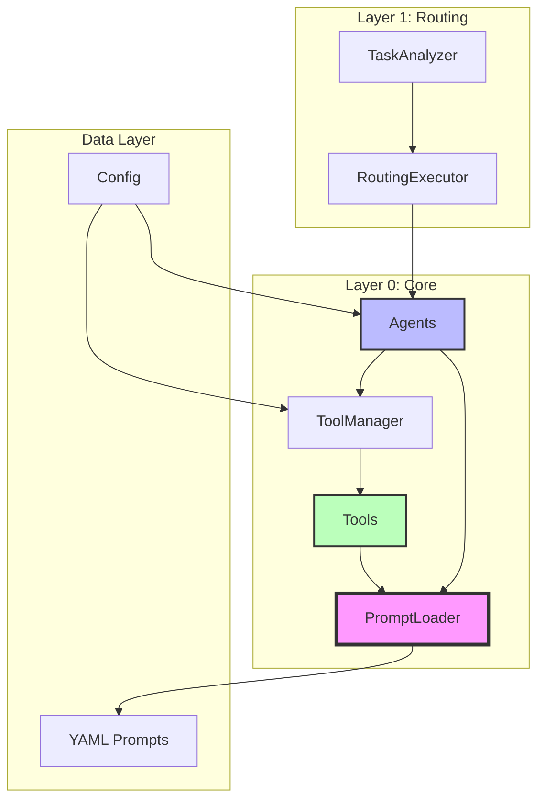

# 🏗️ Integration Architecture: Agents-Prompts-Tools

## Executive Summary

The Core Agentic Brain implements a **three-way integration** between Agents, Prompts, and Tools, following Linus Torvalds' design philosophy: **"Good defaults are better than options"** and **"Simplicity is prerequisite"**.

## Architecture Overview



## Component Details

### 1. Agents (`/agents`)

**Purpose**: Execute specialized tasks with specific expertise

**Key Components**:
- `BaseAgent`: Abstract base providing common functionality
- `PlannerAgent`: Decomposes complex tasks into steps
- `ExecutorAgent`: Executes tasks and tool calls
- `ReviewerAgent`: Reviews and validates results

**Integration Points**:
```python
# Agents load prompts from YAML
prompt_loader = get_prompt_loader()
system_prompt = prompt_loader.get("planner.system")

# Agents use tools through ToolManager
tool_result = await self.tool_manager.execute(tool_name, params)
```

### 2. Prompts (`/prompts`)

**Purpose**: Centralized prompt management with hot-swappable templates

**Structure**:
```
prompts/
├── planner.yaml     # Planning prompts
├── executor.yaml    # Execution prompts
├── reviewer.yaml    # Review prompts
├── tools.yaml       # Tool-specific prompts
└── general.yaml     # Shared prompts
```

**Features**:
- Parameter substitution: `{user_query}`, `{history}`
- Hierarchical organization: `namespace.section.key`
- Language/variant support ready

### 3. Tools (`/tools`)

**Purpose**: Reusable capabilities (code execution, file ops, etc.)

**Structure**:
```
tools/
├── base.py          # Tool base class
├── builtin/         # Core tools
│   ├── python.py    # Python executor
│   └── files.py     # File operations
└── custom/          # User-defined tools
```

**Integration**:
```python
# Tools load their prompts
self.prompt_loader = get_prompt_loader()
system_prompt = self.prompt_loader.get_tool_prompt("python", "system")
```

## Data Flow

### 1. Task Processing Flow

```
User Input
    ↓
TaskAnalyzer (determines routing)
    ↓
RoutingExecutor (selects agents)
    ↓
Agent (loads prompt from YAML)
    ↓
LLM (generates response/tool calls)
    ↓
ToolManager (if tools needed)
    ↓
Tool (executes with prompt guidance)
    ↓
Response
```

### 2. Prompt Loading Flow

```
Agent.get_system_prompt()
    ↓
PromptLoader.get("agent_name.system")
    ↓
Load from YAML file
    ↓
Parameter substitution
    ↓
Return formatted prompt
```

## Key Design Decisions

### 1. Lazy Loading with Singleton
```python
_prompt_loader: Optional[PromptLoader] = None

def get_prompt_loader() -> PromptLoader:
    global _prompt_loader
    if _prompt_loader is None:
        _prompt_loader = PromptLoader()
    return _prompt_loader
```
**Rationale**: Single source of truth, efficient memory usage

### 2. Unified Tool Interface
```python
async def execute(self, parameters: Dict = None, **kwargs) -> Dict
```
**Rationale**: Consistent API, supports multiple calling conventions

### 3. Prompt Namespacing
```
planner.system
tools.python_tool.execution
```
**Rationale**: Avoid collisions, clear organization

## Configuration

### Environment Variables (`.env`)
```env
OPENAI_API_KEY=sk-xxx
LOG_LEVEL=INFO
```

### Application Config (`config.yaml`)
```yaml
core:
  llm:
    provider: openai
    model: gpt-3.5-turbo
  tools:
    enabled:
      - python
      - files
```

## Usage Examples

### 1. Basic Agent Usage
```python
from agents.planner import PlannerAgent
from core.types import TaskContext

planner = PlannerAgent()
context = TaskContext(prompt="Build a web scraper")
result = await planner.execute(context)
```

### 2. Direct Tool Usage
```python
from tools.builtin.python import Tool as PythonTool

tool = PythonTool()
result = await tool.execute(code="print('Hello')")
```

### 3. Custom Prompt Loading
```python
from core.prompt_loader import get_prompt_loader

loader = get_prompt_loader()
prompt = loader.get("planner.planning_prompt",
                    user_query="Create API",
                    history="[]")
```

## Testing

### Unit Tests
- Test individual components in isolation
- Mock prompt loader and tools

### Integration Tests
```bash
python3 tests/integration/test_prompt_integration.py
```

### End-to-End Demo
```bash
python3 example_full_integration.py
```

## Benefits of This Architecture

1. **Separation of Concerns**
   - Logic (Agents) separated from content (Prompts)
   - Tools are independent, reusable units

2. **Maintainability**
   - Change prompts without touching code
   - Version control for prompt evolution
   - Easy A/B testing of prompts

3. **Scalability**
   - Add new agents by creating new YAML files
   - Tools can be added to `custom/` directory
   - Prompts support multiple languages/variants

4. **Testability**
   - Each component can be tested independently
   - Prompts can be mocked for deterministic tests
   - Tools have clear input/output contracts

## Future Enhancements

1. **Hot Reloading**
   - Watch YAML files for changes
   - Reload prompts without restart

2. **Prompt Versioning**
   - Track prompt versions
   - Rollback capability

3. **Multi-Language Support**
   ```yaml
   system:
     en: "You are a planning specialist..."
     zh: "您是規劃專家..."
   ```

4. **Prompt Analytics**
   - Track which prompts are used
   - Measure effectiveness

## Linus Philosophy Applied

1. **"Good Taste"**: No special cases, unified interfaces
2. **"Practicality"**: Works today, not theoretical
3. **"Simplicity"**: < 100 lines per component
4. **"No Breaking"**: Backward compatible with existing code

## Conclusion

The three-way integration creates a **flexible, maintainable, and scalable** system that follows best practices while remaining **simple and practical**.

---

*"Make it work, make it right, make it fast - in that order."* - Kent Beck

*"Talk is cheap. Show me the code."* - Linus Torvalds