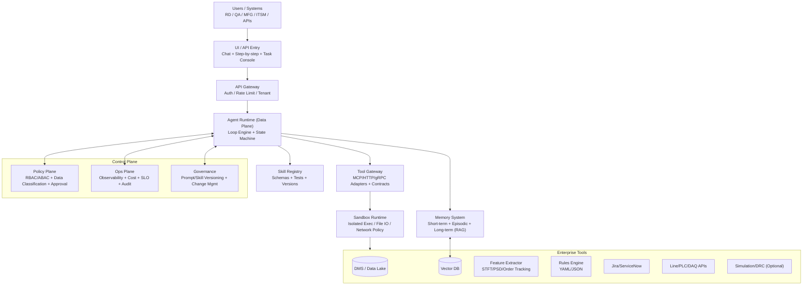

# 軟體架構設計文件：通用 Agentic 作業系統

| 版本 | 日期       | 作者         | 變更描述                                                |
| :--- | :--------- | :----------- | :------------------------------------------------------ |
| 1.0  | 2026-01-19 | AI Architect | 初始版本，基於 `docs/預期開發架構/system.md` 進行重構 |

---

## 1.0 總覽 (Overview)

### 1.1 文件目的

本文件旨在定義一個通用、可擴展、可控管的自主代理（Agentic）作業系統的技術架構。此系統旨在超越特定專案的需求，提供一個企業級的平台，用於開發、部署、監控和治理多個自主 Agent。

### 1.2 核心目標

我們的核心目標是將現有的 Agent 框架，從一個專案驅動的架構演進為一個**可插拔、可控管、可審計的 Agent OS**。這透過將執行（Data Plane）與治理（Control Plane）徹底分離來實現。

我們的核心設計口訣是：**「能做事、管得住、查得到。」**

- **能做事**：提供強大且靈活的 Agent Runtime 和技能（Skills）。
- **管得住**：透過策略、沙箱和審批流程確保 Agent 的行為符合規範。
- **查得到**：所有行為都可追蹤、可稽核、可計量。

## 2.0 架構原則與目標 (Architectural Principles & Goals)

### 2.1 指導原則

- **關注點分離 (Separation of Concerns)**：嚴格劃分負責執行的**數據平面 (Data Plane)** 與負責治理的**控制平面 (Control Plane)**。
- **可控性與安全性 (Controllability & Safety)**：Agent 的所有行為必須在預定義的策略和權限邊界內進行，高風險操作需經審批。
- **可觀測與可稽核性 (Observability & Auditability)**：系統中的每一次決策、每一次工具調用都必須是可追蹤、可測量、可稽核的。
- **可擴展與插件化 (Extensibility & Pluggability)**：系統核心應保持穩定，透過插件化的方式（如 Skills, Policies）適應不同業務領域。

### 2.2 非功能性需求 (Non-Functional Requirements)

- **安全性 (Security)**：系統需支援基於角色的存取控制（RBAC/ABAC），對工具和數據進行分級管理，並內建審批流以控管高風險操作。
- **可靠性 (Reliability)**：透過自動化的 `Verifier` (驗證器) 機制，確保任務產出品質。系統需定義服務等級目標（SLO），並具備重試、降級等容錯策略。
- **互操作性 (Interoperability)**：`Tool Gateway` 需作為統一入口，適配並管理不同協議（HTTP, gRPC, CLI）和數據格式的工具。
- **可稽核性 (Auditability)**：`Ops Plane` 必須提供完整的操作日誌，記錄每次任務的輸入、決策過程、影響、以及成本。

## 3.0 系統架構概覽 (System Architecture Overview)

### 3.1 高階架構圖

此架構將系統劃分為用戶/系統介面、API 閘道、控制平面和數據平面。

### 3.2 架構風格

本系統採用**分層式架構**，由**數據平面 (Data Plane)** 和**控制平面 (Control Plane)** 構成，確保了高度的模組化和關注點分離。

## 4.0 核心組件詳解 (Component Deep Dive)

### 4.1 數據平面 (Data Plane)

數據平面是 Agent 執行任務的場所，專注於「做事」。

#### 4.1.1 Agent Runtime

核心執行引擎，以**狀態機**形式管理 Agent 的生命週期。

- **Loop Engine**: 驅動 Plan -> Decide -> Act -> Observe -> Reflect 的循環。
- **State**: 管理任務的當前狀態，包括目標 (Goal)、進度 (Progress) 和產出物 (Artifacts)。
- **Memory System**: 提供短期工作記憶、長期知識庫（RAG）和事件記憶（Episodic）。
- **Skill Registry**: 技能的註冊與發現中心。所有工具被封裝成可測試、可版本化的 Skill。

#### 4.1.2 Tool Gateway & Sandbox

所有外部工具的統一介面。

- **Tool Contract**: 強制所有工具提供標準化的 JSON Schema（輸入、輸出、錯誤碼），建立清晰的「合約」。
- **Tool Adapter**: 將不同來源（HTTP, gRPC, DB, CLI）的工具適配為標準合約格式。
- **Sandbox**: 為需要執行程式碼、寫入檔案或存取網路的工具提供一個隔離且受控的執行環境。

### 4.2 控制平面 (Control Plane)

控制平面是系統的「大腦」和「管理者」，專注於「管事」。

#### 4.2.1 Policy Plane (策略平面)

負責安全、權限和合規性。

- **Identity & Scope**: 實現 RBAC/ABAC，定義 Agent 在不同場景下的操作範圍。
- **Action Risk Control**: 管理工具白名單、數據分級、外網訪問策略和 Prompt Injection 防護。
- **Approval Workflow**: 為高風險操作（如修改生產數據、部署服務）觸發人工審批流程。

#### 4.2.2 Ops Plane (維運平面)

確保系統的可觀測性、可控性和可稽核性。

- **Trace & Log**: 記錄每一次 Plan、Tool Call、Retry 的詳細軌跡 (span)。
- **Cost Management**: 追蹤和計算 Token 消耗、工具調用成本和時間成本。
- **Audit**: 生成稽核日誌，詳細記錄輸入、輸出、影響範圍和審批人。
- **SLO Management**: 監控並執行服務等級目標，如超時策略、重試次數和降級方案。

#### 4.2.3 Governance Plane (治理平面)

負責管理 Agent 核心資產的版本和生命週期，如 Prompt 版本控制、Skill 版本管理和變更流程。

## 5.0 核心概念與規格 (Core Concepts & Specifications)

### 5.1 任務規格 (Task Spec)

為了實現跨領域的通用性，所有交給 Agent 的任務都必須遵循一個標準化的 `Task Spec`。這是系統與 Agent 之間最重要的「合約」。

- **Goal**: 對任務目標的簡潔描述。
- **Constraints**: 定義 Agent 不能做什麼，或必須在什麼限制下工作。
- **Success Criteria**: 一組可被機器自動檢查的驗收條件，供 `Verifier` 使用。
- **Budget**: 任務的資源上限，如 Token 數量、執行時間或工具調用次數。
- **Outputs**: 定義任務最終產出物的形態，如報告（Report）、JSON 物件、工單（Ticket）或程式碼。

### 5.2 驗證與反思 (Verification & Reflection)

`Reflection` 階段被升級為一個正式的 `Verifier` (驗證器) 或 `Critic` (評論家) 角色。它不再是簡單的回顧，而是：

1. 根據 `Success Criteria` 產出一個**可機器判讀**的 `pass / fail` 結果。
2. 根據結果觸發自動化流程，如：重試 (Retry)、執行降級方案 (Fallback)、請求人工介入 (Human-in-the-loop) 或回滾 (Rollback)。

## 6.0 實施策略 (Implementation Strategy)

### 6.1 建議模組結構

為了將此架構落地，建議將程式碼庫組織為以下幾個核心模組：

- `agent_runtime/`: 包含 Loop 引擎、狀態機和 Verifier。
- `policy_engine/`: 實現 RBAC/ABAC 和審批流。
- `tool_gateway/`: 包含工具合約、適配器和 Sandbox 執行器。
- `observability/`: 負責日誌、追蹤和成本計算。

### 6.2 階段性實施

將現有的 NVH 業務場景作為第一個**插件**，遷移至新的架構中。這將驗證架構的可行性，並為後續接入客服、ITSM 等其他領域的 Agent 奠定基礎。
