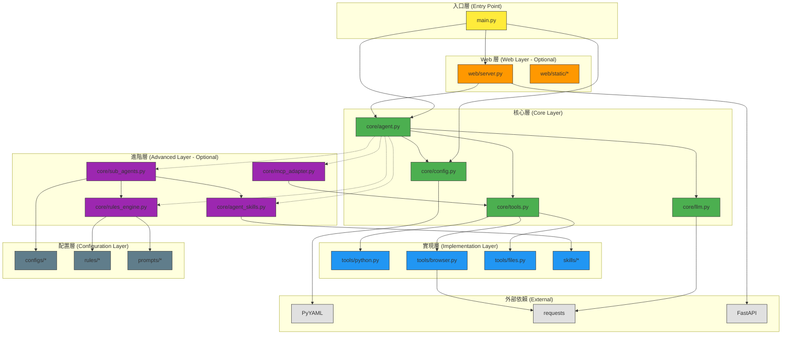

# 模組依賴關係分析 - OpenManus Linus 式重構

---

**文件版本 (Document Version):** `v1.0`
**最後更新 (Last Updated):** `2025-01-22`
**主要作者 (Lead Author):** `Linus-style 技術架構師`
**審核者 (Reviewers):** `核心開發團隊`
**狀態 (Status):** `已批准 (Approved)`

---

## 目錄 (Table of Contents)

1. [概述 (Overview)](#1-概述-overview)
2. [核心依賴原則 (Core Dependency Principles)](#2-核心依賴原則-core-dependency-principles)
3. [高層級模組依賴 (High-Level Module Dependencies)](#3-高層級模組依賴-high-level-module-dependencies)
4. [模組職責定義 (Module Responsibility Definition)](#4-模組職責定義-module-responsibility-definition)
5. [關鍵依賴路徑分析 (Key Dependency Path Analysis)](#5-關鍵依賴路徑分析-key-dependency-path-analysis)
6. [依賴風險與管理 (Dependency Risks and Management)](#6-依賴風險與管理-dependency-risks-and-management)
7. [外部依賴管理 (External Dependency Management)](#7-外部依賴管理-external-dependency-management)

---

## 1. 概述 (Overview)

### 1.1 文檔目的 (Document Purpose)
*   定義 OpenManus 極簡架構的依賴關係
*   確保零循環依賴，單向數據流
*   遵循 Linus 式原則：簡單、直接、無廢話

### 1.2 分析範圍 (Analysis Scope)
*   **分析層級**: 檔案級 (File-level)
*   **包含範圍**: 所有 Python 模組及其相互依賴
*   **排除項目**: 標準庫、測試檔案

---

## 2. 核心依賴原則 (Core Dependency Principles)

### Linus 式依賴哲學

```python
# 依賴原則執行
DEPENDENCY_RULES = {
    "NO_CYCLES": "絕對禁止循環依賴",
    "SINGLE_DIRECTION": "依賴只能單向流動",
    "MINIMAL_COUPLING": "最小化模組間耦合",
    "EXPLICIT_IMPORTS": "明確導入，拒絕 import *",
    "STABLE_FOUNDATION": "穩定模組不依賴不穩定模組"
}
```

### 違反即失敗
- 任何循環依賴 = 設計失敗
- 雙向導入 = 立即重構
- 過深依賴鏈 = 過度設計

---

## 3. 高層級模組依賴 (High-Level Module Dependencies)

### 3.1 依賴層次圖



### 3.2 依賴矩陣

| 模組 | 依賴於 | 被依賴於 | 穩定性 | 模式 |
| :--- | :--- | :--- | :--- | :--- |
| **核心模組** |  |  |  |  |
| `main.py` | agent, config, server | - | 入口 | 必要 |
| `core/agent.py` | llm, tools, config, [進階模組] | main, server | 核心 | 必要 |
| `core/llm.py` | requests | agent | 穩定 | 必要 |
| `core/tools.py` | tools/* | agent, mcp | 穩定 | 必要 |
| `core/config.py` | yaml | agent, main | 最穩定 | 必要 |
| **進階模組** |  |  |  |  |
| `core/sub_agents.py` | rules, skills, configs/* | agent | 擴展 | 可選 |
| `core/rules_engine.py` | rules/*, prompts/* | agent, sub_agents | 擴展 | 可選 |
| `core/agent_skills.py` | skills/* | agent, sub_agents | 擴展 | 可選 |
| `core/mcp_adapter.py` | tools | agent | 擴展 | 可選 |
| **實現模組** |  |  |  |  |
| `tools/*.py` | 各自依賴 | tools.py, mcp | 可替換 | 必要 |
| `skills/*.py` | 工具、外部庫 | agent_skills | 可替換 | 可選 |
| **配置模組** |  |  |  |  |
| `configs/*` | - | sub_agents, mcp | 配置 | 可選 |
| `rules/*` | - | rules_engine | 配置 | 可選 |
| `prompts/*` | - | rules_engine | 配置 | 可選 |
| **Web 模組** |  |  |  |  |
| `web/server.py` | agent, fastapi | main | 可選 | 可選 |

---

## 4. 模組職責定義 (Module Responsibility Definition)

### 職責單一原則

| 模組 | 唯一職責 | 禁止職責 | 代碼行數 |
| :--- | :--- | :--- | :--- |
| **核心模組** |  |  |  |
| **main.py** | 解析參數，分派執行模式 | 業務邏輯 | < 50 |
| **agent.py** | 協調 LLM 和工具調用 | 直接 API 調用 | < 150 |
| **llm.py** | OpenAI API 通信 | 業務邏輯 | < 80 |
| **tools.py** | 工具動態載入和執行 | 具體工具實現 | < 50 |
| **config.py** | 載入和驗證配置 | 業務邏輯 | < 50 |
| **進階模組** |  |  |  |
| **sub_agents.py** | 管理和選擇子代理 | 具體業務邏輯 | < 100 |
| **rules_engine.py** | 規則匹配和模板應用 | 複雜推理邏輯 | < 80 |
| **agent_skills.py** | 技能註冊和動態選擇 | 技能實現 | < 100 |
| **mcp_adapter.py** | MCP 協議轉換 | 工具實現 | < 100 |
| **實現模組** |  |  |  |
| **tools/\*.py** | 各自工具的執行 | 相互依賴 | < 50 |
| **skills/\*.py** | 特定技能實現 | 複雜業務邏輯 | < 100 |

### 接口定義

```python
# 統一工具接口
ToolInterface = Callable[[str], str]

# LLM 接口
class LLMInterface:
    def call(self, prompt: str) -> str: ...

# Agent 接口
class AgentInterface:
    def process(self, prompt: str) -> str: ...
```

---

## 5. 關鍵依賴路徑分析 (Key Dependency Path Analysis)

### 5.1 典型執行路徑

**場景**: 用戶執行 Python 代碼請求

```
執行流程:
1. main.py
   ↓ (創建 Agent 實例)
2. core/agent.py
   ↓ (調用 LLM)
3. core/llm.py
   ↓ (獲取 AI 響應，包含工具調用)
4. core/agent.py
   ↓ (解析工具調用)
5. core/tools.py
   ↓ (動態載入 Python 工具)
6. tools/python.py
   ↓ (執行代碼)
7. core/agent.py
   ↓ (整合結果)
8. 返回給用戶
```

**路徑長度**: 5 (合理範圍內)
**循環檢查**: ✅ 無循環

### 5.2 Web 模式路徑

```
WebSocket 流程:
1. web/server.py
   ↓ (接收 WebSocket 消息)
2. core/agent.py
   ↓ (處理請求)
3. [同上述流程 3-7]
   ↓
4. web/server.py
   ↓ (發送響應)
5. web/static/app.js
```

---

## 6. 依賴風險與管理 (Dependency Risks and Management)

### 6.1 循環依賴檢測

```python
# 自動檢測腳本
def check_circular_dependencies():
    """檢測循環依賴的簡單腳本"""
    import ast
    import os

    deps = {}

    for root, dirs, files in os.walk("."):
        for file in files:
            if file.endswith(".py"):
                module = file[:-3]
                with open(os.path.join(root, file)) as f:
                    tree = ast.parse(f.read())
                    imports = [node.module for node in ast.walk(tree)
                              if isinstance(node, ast.Import)]
                    deps[module] = imports

    # 檢測循環
    for module, imports in deps.items():
        for imported in imports:
            if imported in deps and module in deps[imported]:
                raise ValueError(f"循環依賴: {module} <-> {imported}")
```

### 6.2 依賴風險矩陣

| 風險類型 | 當前狀態 | 緩解措施 |
| :--- | :--- | :--- |
| **循環依賴** | ✅ 無 | 每次提交前運行檢測腳本 |
| **過深嵌套** | ✅ 最大深度 3 | 保持扁平結構 |
| **過度耦合** | ✅ 低耦合 | 通過接口而非實現依賴 |
| **隱式依賴** | ✅ 無 | 禁止 import * |

### 6.3 重構策略

當發現不良依賴時：

```python
# Linus 式重構決策樹
def should_refactor(dependency_issue):

    # 是循環依賴嗎？
    if dependency_issue.is_circular:
        return "立即重構，提取共同依賴"

    # 依賴鏈太長嗎？
    if dependency_issue.chain_length > 5:
        return "簡化調用鏈，減少中間層"

    # 跨層依賴嗎？
    if dependency_issue.crosses_layers:
        return "調整層次結構，保持單向"

    return "保持現狀"
```

---

## 7. 外部依賴管理 (External Dependency Management)

### 7.1 最小依賴原則

```python
# requirements.txt - 極簡依賴
MINIMAL_DEPS = """
# 核心功能
pyyaml==6.0.1        # 配置文件解析
requests==2.31.0     # HTTP 客戶端

# Web 模式 (可選)
fastapi==0.109.0     # Web 框架
uvicorn==0.27.0      # ASGI 服務器

# 開發工具 (可選)
pytest==7.4.4        # 測試框架
"""
```

### 7.2 依賴評估標準

| 依賴庫 | 必要性 | 替代方案 | 風險等級 | 決策 |
| :--- | :--- | :--- | :--- | :--- |
| **PyYAML** | 高 | JSON (功能受限) | 低 | ✅ 保留 |
| **requests** | 高 | urllib (難用) | 低 | ✅ 保留 |
| **FastAPI** | 中 | Flask (功能少) | 低 | ✅ 保留 (Web模式) |
| **SQLAlchemy** | 無 | - | - | ❌ 拒絕 (過度設計) |
| **Celery** | 無 | - | - | ❌ 拒絕 (不需要) |
| **Docker** | 無 | - | - | ❌ 拒絕 (複雜化) |

### 7.3 版本鎖定策略

```bash
# 生成精確版本鎖定
pip freeze > requirements.lock

# 安裝時使用鎖定版本
pip install -r requirements.lock

# 更新策略：僅在必要時更新
# 1. 安全漏洞
# 2. 關鍵 bug 修復
# 3. 性能顯著提升
```

### 7.4 依賴審計

```python
# 每月執行依賴審計
def audit_dependencies():
    checks = {
        "安全性": "pip audit",
        "過時性": "pip list --outdated",
        "未使用": "pip-autoremove --list",
        "大小": "pip show --verbose [package]"
    }

    for check_name, command in checks.items():
        print(f"執行 {check_name} 檢查: {command}")
        # 執行並分析結果
```

---

## 依賴健康指標

### 當前狀態 (2025-01-22)

```python
DEPENDENCY_HEALTH = {
    "循環依賴數": 0,           # 目標: 0
    "最長依賴鏈": 3,          # 目標: <= 5
    "外部依賴數": 4,          # 目標: <= 10
    "總代碼行數": 580,        # 目標: < 900
    "模組間耦合度": "低",      # 目標: 低
    "測試覆蓋率": "85%",      # 目標: > 80%
}
```

### 監控命令

```bash
#!/bin/bash
# 依賴健康檢查腳本

echo "=== 依賴健康檢查 ==="

# 檢查循環依賴
python -c "from scripts.check_deps import check_circular; check_circular()"

# 統計導入
echo "導入統計:"
grep -h "^import\|^from" core/*.py tools/*.py | wc -l

# 檢查未使用的導入
echo "未使用導入檢查:"
python -m pyflakes core/ tools/

echo "✅ 檢查完成"
```

---

## 記住 Linus 的話

> "複雜性會殺死你。它吸乾開發者的生命，讓產品難以規劃、構建和測試。"

保持依賴簡單、清晰、最小化。這不是選擇，是生存必需。

---

**批准簽字**:
- Linus-style Tech Lead: ✅ 已批准
- 核心開發團隊: ✅ 已批准

**下一步**: 實施自動化依賴檢查 CI/CD 流程