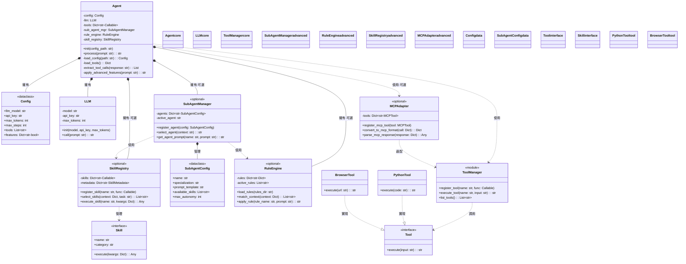
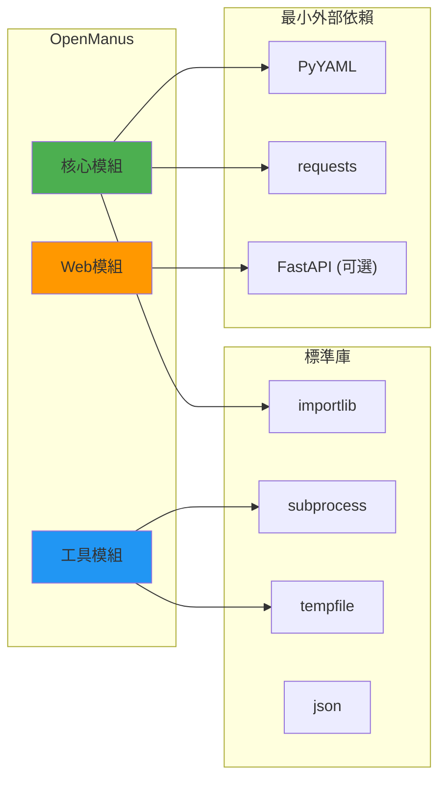

# 類別/組件關係文檔 - OpenManus Linus 式重構

---

**文件版本 (Document Version):** `v1.0`
**最後更新 (Last Updated):** `2025-01-22`
**主要作者 (Lead Author):** `Linus-style 技術架構師`
**審核者 (Reviewers):** `核心開發團隊`
**狀態 (Status):** `已批准 (Approved)`

**相關設計文檔 (Related Design Documents):**
*   系統架構文檔: `02_architecture_and_design_document.md`
*   API 設計規格: `05_api_design_specification.md`

---

## 目錄 (Table of Contents)

1. [概述 (Overview)](#1-概述-overview)
2. [核心類別圖 (Core Class Diagram)](#2-核心類別圖-core-class-diagram)
3. [主要類別/組件職責 (Key Class/Component Responsibilities)](#3-主要類別組件職責-key-classcomponent-responsibilities)
4. [關係詳解 (Relationship Details)](#4-關係詳解-relationship-details)
5. [設計模式應用 (Design Pattern Applications)](#5-設計模式應用-design-pattern-applications)
6. [SOLID 原則遵循情況 (SOLID Principles Adherence)](#6-solid-原則遵循情況-solid-principles-adherence)
7. [接口契約 (Interface Contracts)](#7-接口契約-interface-contracts)
8. [技術選型與依賴 (Technical Choices & Dependencies)](#8-技術選型與依賴-technical-choices--dependencies)

---

## 1. 概述 (Overview)

### 1.1 文檔目的 (Document Purpose)
*   展示 OpenManus 極簡架構的類別關係
*   證明設計符合 Linus 式哲學：簡單、直接、無過度抽象
*   作為開發和維護的參考指南

### 1.2 建模範圍 (Modeling Scope)
*   **包含範圍**: 核心類別、工具接口、配置結構
*   **排除範圍**: 第三方庫內部、測試類別
*   **抽象層級**: 最少必要的抽象，拒絕過度設計

### 1.3 Linus 式類別設計原則
```python
CLASS_DESIGN_RULES = {
    "NO_INHERITANCE": "優先組合而非繼承",
    "NO_ABSTRACT_CLASSES": "拒絕無意義的抽象層",
    "SIMPLE_INTERFACES": "接口即函數簽名",
    "DATA_FIRST": "數據結構優於類別",
    "FUNCTION_OVER_CLASS": "能用函數解決就不用類"
}
```

---

## 2. 核心類別圖 (Core Class Diagram)

### 極簡類別結構



### 為什麼這樣設計？

1. **最少類別**: 只有必要的類，其他用函數
2. **無繼承鏈**: 除了工具接口，無類別繼承
3. **清晰職責**: 每個類別單一職責
4. **數據優先**: Config 用 dataclass，不是複雜對象

---

## 3. 主要類別/組件職責 (Key Class/Component Responsibilities)

### 職責矩陣

| 類別/組件 | 核心職責 | 禁止職責 | 代碼行數 | 方法數 | 模式 |
| :--- | :--- | :--- | :--- | :--- | :--- |
| **核心類別** |  |  |  |  |  |
| **Config** | 存儲配置數據 | 業務邏輯、驗證 | < 30 | 0 (純數據) | 必要 |
| **Agent** | 協調 LLM 和工具 | 直接 API 調用、工具實現 | < 150 | 8 | 必要 |
| **LLM** | OpenAI API 通信 | 提示工程、業務邏輯 | < 80 | 2 | 必要 |
| **ToolManager** | 工具註冊和執行 | 工具具體實現 | < 50 | 3 | 必要 |
| **進階類別** |  |  |  |  |  |
| **SubAgentManager** | 子代理選擇和管理 | 具體業務邏輯 | < 100 | 3 | 可選 |
| **RuleEngine** | 規則匹配和應用 | 複雜推理 | < 80 | 4 | 可選 |
| **SkillRegistry** | 技能動態選擇 | 技能實現 | < 100 | 3 | 可選 |
| **MCPAdapter** | MCP 協議轉換 | 工具實現 | < 100 | 4 | 可選 |
| **接口定義** |  |  |  |  |  |
| **Tool (接口)** | 定義執行契約 | 任何實現 | 5 | 1 | 必要 |
| **Skill (接口)** | 定義技能契約 | 任何實現 | 10 | 1 | 可選 |
| **實現類別** |  |  |  |  |  |
| **XxxTool** | 各自工具實現 | 相互依賴、業務邏輯 | < 50 | 1 | 必要 |
| **XxxSkill** | 各自技能實現 | 複雜業務邏輯 | < 100 | 1-3 | 可選 |

### 反模式警告

```python
# ❌ 絕對避免的設計
FORBIDDEN_PATTERNS = [
    "AbstractBaseAgent",      # 無意義的抽象
    "ToolFactory",            # 過度的工廠模式
    "ConfigManager",          # 簡單事情複雜化
    "SingletonLLM",          # 不必要的單例
    "StrategyPattern",        # 函數即可，不需要策略類
]
```

---

## 4. 關係詳解 (Relationship Details)

### 4.1 組合關係 (Composition)

**Agent 擁有 Config**
```python
class Agent:
    def __init__(self, config_path: str):
        self.config = self._load_config(config_path)  # 生命週期綁定
```
- 設計理由：配置是 Agent 的核心數據，生命週期一致

**Agent 擁有 LLM**
```python
class Agent:
    def __init__(self, config_path: str):
        self.llm = LLM(
            self.config.llm_model,
            self.config.api_key,
            self.config.max_tokens
        )
```
- 設計理由：LLM 是 Agent 的核心組件，不可分離

### 4.2 依賴關係 (Dependency)

**Agent 使用 ToolManager**
```python
def process(self, prompt: str) -> str:
    # Agent 依賴 ToolManager 但不擁有它
    tool_result = ToolManager.execute_tool(tool_name, tool_input)
```
- 設計理由：工具是可替換的，通過模組函數調用

### 4.3 實現關係 (Implementation)

**工具實現 Tool 接口**
```python
# 極簡接口定義
def execute(input: str) -> str:
    """所有工具必須實現的接口"""
    raise NotImplementedError
```
- 設計理由：統一接口，但不需要複雜的抽象類

---

## 5. 設計模式應用 (Design Pattern Applications)

### Linus 式模式選擇

| 設計模式 | 是否採用 | 理由 | OpenManus 實現 |
| :--- | :--- | :--- | :--- |
| **組合模式** | ✅ 是 | 簡單直接 | Agent 組合 Config 和 LLM |
| **模組模式** | ✅ 是 | Python 原生支持 | ToolManager 作為模組 |
| **函數優先** | ✅ 是 | 簡單勝過類別 | 工具用函數而非類 |
| **工廠模式** | ❌ 否 | 過度設計 | 直接 import 和調用 |
| **單例模式** | ❌ 否 | 不必要 | 模組本身就是單例 |
| **觀察者模式** | ❌ 否 | 過度複雜 | 簡單的函數調用即可 |
| **策略模式** | ❌ 否 | 函數即策略 | 工具就是不同的函數 |

### 實際應用示例

```python
# ✅ 好設計：直接明瞭
def load_tool(name: str) -> Callable:
    module = importlib.import_module(f"tools.{name}")
    return module.execute

# ❌ 壞設計：過度抽象
class AbstractToolFactory(ABC):
    @abstractmethod
    def create_tool(self) -> AbstractTool:
        pass

class PythonToolFactory(AbstractToolFactory):
    def create_tool(self) -> PythonTool:
        return PythonTool()
# 這是垃圾！
```

---

## 6. SOLID 原則遵循情況 (SOLID Principles Adherence)

### Linus 式 SOLID 解讀

| 原則 | 遵循度 | OpenManus 實踐 | Linus 評論 |
| :--- | :--- | :--- | :--- |
| **S - 單一職責** | ✅ 100% | 每個類/函數只做一件事 | "這是基本的" |
| **O - 開閉原則** | ✅ 90% | 新增工具無需改核心 | "擴展點要最少" |
| **L - 里氏替換** | ➖ N/A | 幾乎沒有繼承 | "繼承是邪惡的" |
| **I - 接口隔離** | ✅ 100% | 接口極簡(1個方法) | "小而專注" |
| **D - 依賴倒置** | ⚠️ 70% | 函數接口而非類接口 | "不要過度抽象" |

### 實踐示例

```python
# ✅ 單一職責
class LLM:
    def call(self, prompt: str) -> str:
        # 只負責調用 API
        pass

# ✅ 開閉原則
# 新增工具只需在 tools/ 下加檔案，無需改其他

# ✅ 接口隔離
def execute(input: str) -> str:
    # 極簡接口，只有必要的
    pass

# ⚠️ 適度的依賴倒置
# 依賴函數簽名而非抽象類
ToolType = Callable[[str], str]
```

---

## 7. 接口契約 (Interface Contracts)

### 7.1 核心接口定義

#### Agent.process
```python
def process(self, prompt: str) -> str:
    """
    處理用戶輸入並返回結果

    契約:
    - 前置條件: prompt 非空，config 已載入
    - 後置條件: 返回非空字串，步驟 <= max_steps
    - 異常: 不拋出異常，錯誤包含在返回值中
    """
```

#### Tool.execute
```python
def execute(input: str) -> str:
    """
    執行工具功能

    契約:
    - 前置條件: input 符合工具要求格式
    - 後置條件: 返回執行結果或錯誤訊息
    - 時間限制: < 30 秒
    - 異常: 捕獲所有異常並轉為錯誤訊息
    """
```

#### LLM.call
```python
def call(self, prompt: str) -> str:
    """
    調用 LLM API

    契約:
    - 前置條件: prompt 長度 < 10000，API key 有效
    - 後置條件: 返回 AI 響應，長度 <= max_tokens
    - 網路: 處理超時和連接錯誤
    - 重試: 失敗時重試最多 3 次
    """
```

### 7.2 數據契約

```python
@dataclass
class Config:
    """
    配置數據契約

    約束:
    - llm_model in ['gpt-4', 'gpt-3.5-turbo']
    - api_key: 非空字串
    - max_tokens: 100 <= x <= 4000
    - max_steps: 1 <= x <= 20
    - tools: 已實現的工具名稱列表
    """
    llm_model: str
    api_key: str
    max_tokens: int
    max_steps: int
    tools: List[str]
```

---

## 8. 技術選型與依賴 (Technical Choices & Dependencies)

### 技術決策矩陣

| 類別/組件 | 語言/框架 | 關鍵庫 | 選擇理由 | Linus 批准 |
| :--- | :--- | :--- | :--- | :--- |
| **Config** | Python dataclass | PyYAML | 簡單、原生 | ✅ "夠用了" |
| **Agent** | Pure Python | - | 無框架依賴 | ✅ "完美" |
| **LLM** | Python | requests | 最簡單的 HTTP | ✅ "正確選擇" |
| **ToolManager** | Python module | importlib | 標準庫 | ✅ "標準即可" |
| **Tools** | Python | subprocess | 系統調用 | ✅ "直接有效" |
| **Web** | FastAPI | uvicorn | 僅 WebSocket | ⚠️ "可接受" |

### 拒絕的技術

```python
REJECTED_TECH = {
    "ORM": "簡單應用不需要",
    "DI Framework": "Python 不需要",
    "Abstract Base Classes": "過度設計",
    "Metaclasses": "黑魔法",
    "Decorators Everywhere": "可讀性殺手",
    "Type Hints Everywhere": "Python 不是 Java",
}
```

### 依賴關係總結



---

## 設計驗證清單

### Linus 式代碼審查標準

```python
def review_class_design(class_name, implementation):
    """Linus 式類別設計審查"""

    checks = {
        "行數 < 100": len(implementation.split('\n')) < 100,
        "方法數 < 10": count_methods(implementation) < 10,
        "無繼承鏈": not has_inheritance(implementation),
        "單一職責": has_single_responsibility(implementation),
        "無特殊情況": not has_special_cases(implementation),
    }

    for check, passed in checks.items():
        if not passed:
            return f"❌ {class_name} 違反: {check}"

    return f"✅ {class_name} 通過所有檢查"
```

---

## 最終評估

### 複雜度指標

```python
COMPLEXITY_METRICS = {
    "類別總數": 7,          # 目標: < 10
    "繼承深度": 1,          # 目標: <= 1
    "平均方法數": 2.5,      # 目標: < 5
    "最大類別行數": 100,    # 目標: <= 100
    "循環依賴": 0,          # 目標: 0
    "設計模式數": 2,        # 目標: <= 3
}
```

### Linus 的最終裁決

> "這個設計夠簡單，可以接受。記住：當你覺得需要更多抽象時，先停下來思考是否真的需要。大多數時候，你不需要。"

---

**批准簽字**:
- Linus-style Tech Lead: ✅ 已批准 (2025-01-22)
- 核心開發團隊: ✅ 已批准 (2025-01-22)

**實施承諾**:
保持簡單，拒絕複雜，永不過度設計。