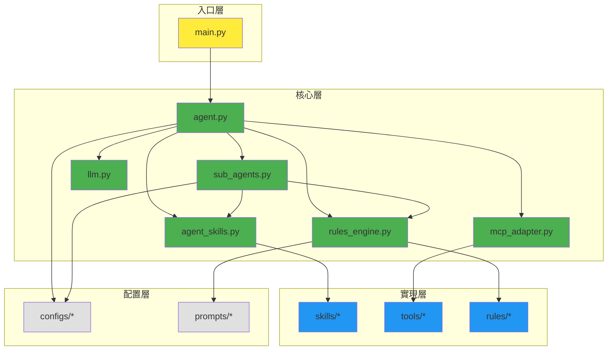

# Claude Code 式架構整合方案 - OpenManus 進階重構

---

**文件版本 (Document Version):** `v2.0`
**最後更新 (Last Updated):** `2025-01-22`
**主要作者 (Lead Author):** `進階架構設計師`
**狀態 (Status):** `提議中 (Proposed)`

---

## 目錄 (Table of Contents)

1. [Claude Code 架構特性分析](#1-claude-code-架構特性分析)
2. [Sub-Agent 系統設計](#2-sub-agent-系統設計)
3. [Rules/Prompt Templates 管理](#3-rulesprompt-templates-管理)
4. [Agent Skills 動態調用系統](#4-agent-skills-動態調用系統)
5. [MCP (Model Context Protocol) 整合](#5-mcp-model-context-protocol-整合)
6. [重構後的專案結構](#6-重構後的專案結構)
7. [實施路線圖](#7-實施路線圖)

---

## 1. Claude Code 架構特性分析

### 1.1 Claude Code 核心概念

```python
CLAUDE_CODE_FEATURES = {
    "sub_agents": "專門化的子代理處理特定任務",
    "rules": "上下文感知的提示模板系統",
    "agent_skills": "運行時動態選擇的能力集",
    "mcp_tools": "標準化的工具協議介面",
    "context_management": "智能的上下文窗口管理"
}
```

### 1.2 與 Linus 式架構的平衡

| Claude Code 特性 | Linus 式簡化 | 整合策略 |
| :--- | :--- | :--- |
| **Sub-agents** | 模組化函數 | 輕量級代理工廠 |
| **Rules** | YAML 配置 | 簡單模板引擎 |
| **Skills** | 函數註冊表 | 動態導入機制 |
| **MCP** | 標準接口 | 最小適配層 |

---

## 2. Sub-Agent 系統設計

### 2.1 輕量級 Sub-Agent 架構

```python
# core/sub_agents.py - 保持簡潔 (< 100 lines)

from typing import Dict, Callable, Optional
from dataclasses import dataclass

@dataclass
class SubAgentConfig:
    """子代理配置"""
    name: str
    specialization: str  # 專門領域
    prompt_template: str  # 提示模板
    available_skills: list[str]  # 可用技能
    max_autonomy: int  # 自主度等級 (1-5)

class SubAgentManager:
    """子代理管理器 - 極簡實現"""

    def __init__(self):
        self.agents: Dict[str, SubAgentConfig] = {}
        self.active_agent: Optional[str] = None

    def register_agent(self, config: SubAgentConfig):
        """註冊子代理"""
        self.agents[config.name] = config

    def select_agent(self, task_context: str) -> str:
        """基於任務上下文選擇最適合的子代理"""
        # 簡單的關鍵字匹配策略
        for name, agent in self.agents.items():
            if agent.specialization.lower() in task_context.lower():
                self.active_agent = name
                return name
        return "general"  # 默認通用代理

    def get_agent_prompt(self, agent_name: str, base_prompt: str) -> str:
        """獲取子代理的特定提示"""
        if agent_name in self.agents:
            template = self.agents[agent_name].prompt_template
            return template.format(user_prompt=base_prompt)
        return base_prompt
```

### 2.2 預定義的 Sub-Agents

```yaml
# configs/sub_agents.yaml
sub_agents:
  - name: "code_reviewer"
    specialization: "代碼審查"
    prompt_template: |
      You are a senior code reviewer. Focus on:
      - Code quality and best practices
      - Security vulnerabilities
      - Performance implications

      User request: {user_prompt}
    available_skills: ["analyze_code", "suggest_improvements", "security_scan"]
    max_autonomy: 3

  - name: "test_writer"
    specialization: "測試開發"
    prompt_template: |
      You are a test automation expert. Your task:
      - Write comprehensive test cases
      - Ensure edge cases coverage
      - Follow TDD principles

      User request: {user_prompt}
    available_skills: ["write_unit_tests", "write_integration_tests", "coverage_analysis"]
    max_autonomy: 4

  - name: "architect"
    specialization: "系統架構"
    prompt_template: |
      You are a system architect following Linus principles:
      - Simplicity over complexity
      - Data structures over algorithms
      - No unnecessary abstractions

      User request: {user_prompt}
    available_skills: ["design_system", "review_architecture", "dependency_analysis"]
    max_autonomy: 5

  - name: "debugger"
    specialization: "除錯偵測"
    prompt_template: |
      You are a debugging specialist. Approach:
      - Systematic error analysis
      - Root cause identification
      - Minimal fix strategy

      User request: {user_prompt}
    available_skills: ["analyze_error", "trace_execution", "suggest_fix"]
    max_autonomy: 3
```

---

## 3. Rules/Prompt Templates 管理

### 3.1 規則引擎設計

```python
# core/rules_engine.py - 規則管理系統 (< 80 lines)

from typing import Dict, List, Any
import re
from pathlib import Path
import yaml

class RuleEngine:
    """輕量級規則引擎"""

    def __init__(self, rules_dir: str = "rules/"):
        self.rules_dir = Path(rules_dir)
        self.rules: Dict[str, Dict] = {}
        self.active_rules: List[str] = []
        self._load_rules()

    def _load_rules(self):
        """載入所有規則檔案"""
        for rule_file in self.rules_dir.glob("*.yaml"):
            with open(rule_file) as f:
                rule_data = yaml.safe_load(f)
                self.rules[rule_file.stem] = rule_data

    def match_context(self, context: Dict[str, Any]) -> List[str]:
        """根據上下文匹配適用規則"""
        matched = []
        for rule_name, rule_data in self.rules.items():
            if self._evaluate_conditions(rule_data.get('conditions', {}), context):
                matched.append(rule_name)
        return matched

    def _evaluate_conditions(self, conditions: Dict, context: Dict) -> bool:
        """評估規則條件"""
        for key, pattern in conditions.items():
            if key not in context:
                return False
            if not re.match(pattern, str(context[key])):
                return False
        return True

    def apply_rule(self, rule_name: str, prompt: str) -> str:
        """應用規則到提示"""
        if rule_name not in self.rules:
            return prompt

        rule = self.rules[rule_name]
        template = rule.get('template', '')

        # 簡單的模板替換
        return template.format(original_prompt=prompt)

    def get_rule_skills(self, rule_name: str) -> List[str]:
        """獲取規則關聯的技能"""
        if rule_name in self.rules:
            return self.rules[rule_name].get('required_skills', [])
        return []
```

### 3.2 規則定義範例

```yaml
# rules/code_generation.yaml
name: "code_generation"
description: "Code generation context rules"
conditions:
  task_type: "^(create|write|implement|develop)"
  target: "^(function|class|module|api)"
template: |
  Follow these code generation principles:
  1. Write clean, readable code
  2. Include error handling
  3. Add minimal necessary comments
  4. Follow project conventions

  {original_prompt}

  Remember: Simplicity > Complexity
required_skills:
  - generate_code
  - validate_syntax
  - add_tests
priority: 10

---
# rules/refactoring.yaml
name: "refactoring"
description: "Code refactoring context rules"
conditions:
  task_type: "^(refactor|optimize|improve|clean)"
  has_existing_code: "true"
template: |
  Refactoring guidelines (Linus style):
  1. Don't break existing functionality
  2. Reduce complexity, not add it
  3. Remove special cases
  4. Make the code obvious

  {original_prompt}

  Focus: Make it simpler, not "better"
required_skills:
  - analyze_complexity
  - suggest_simplification
  - preserve_functionality
priority: 15
```

---

## 4. Agent Skills 動態調用系統

### 4.1 技能註冊與發現

```python
# core/agent_skills.py - 動態技能系統 (< 100 lines)

from typing import Dict, Callable, List, Any
from dataclasses import dataclass
import importlib
import inspect

@dataclass
class SkillMetadata:
    """技能元數據"""
    name: str
    description: str
    category: str  # 'analysis', 'generation', 'transformation', 'validation'
    requires_context: List[str]  # 必需的上下文鍵
    confidence_threshold: float  # 執行信心閾值 (0-1)

class SkillRegistry:
    """技能註冊中心"""

    def __init__(self):
        self.skills: Dict[str, Callable] = {}
        self.metadata: Dict[str, SkillMetadata] = {}
        self._auto_discover_skills()

    def _auto_discover_skills(self):
        """自動發現並註冊技能"""
        # 掃描 skills/ 目錄下的所有模組
        import skills
        for skill_module in skills.__all__:
            module = importlib.import_module(f"skills.{skill_module}")

            # 尋找帶有 @skill 裝飾器的函數
            for name, func in inspect.getmembers(module, inspect.isfunction):
                if hasattr(func, '_is_skill'):
                    self.register_skill(name, func, func._metadata)

    def register_skill(self, name: str, func: Callable, metadata: SkillMetadata):
        """註冊單個技能"""
        self.skills[name] = func
        self.metadata[name] = metadata

    def select_skills(self, context: Dict[str, Any], task: str) -> List[str]:
        """基於上下文和任務選擇適合的技能"""
        selected = []

        for skill_name, metadata in self.metadata.items():
            # 檢查上下文要求
            if all(key in context for key in metadata.requires_context):
                # 簡單的相關性評分
                if self._calculate_relevance(task, metadata) > metadata.confidence_threshold:
                    selected.append(skill_name)

        return selected[:5]  # 限制最多 5 個技能

    def _calculate_relevance(self, task: str, metadata: SkillMetadata) -> float:
        """計算技能與任務的相關性"""
        # 簡化的相關性計算
        keywords = metadata.description.lower().split()
        task_words = task.lower().split()
        matches = sum(1 for word in keywords if word in task_words)
        return matches / max(len(keywords), 1)

    def execute_skill(self, skill_name: str, **kwargs) -> Any:
        """執行指定技能"""
        if skill_name not in self.skills:
            raise ValueError(f"Skill {skill_name} not found")

        return self.skills[skill_name](**kwargs)

# 技能裝飾器
def skill(name: str, description: str, category: str,
          requires_context: List[str] = None,
          confidence_threshold: float = 0.5):
    """技能裝飾器"""
    def decorator(func):
        func._is_skill = True
        func._metadata = SkillMetadata(
            name=name,
            description=description,
            category=category,
            requires_context=requires_context or [],
            confidence_threshold=confidence_threshold
        )
        return func
    return decorator
```

### 4.2 技能實現範例

```python
# skills/code_analysis.py

from core.agent_skills import skill

@skill(
    name="analyze_complexity",
    description="Analyze code complexity and suggest improvements",
    category="analysis",
    requires_context=["code", "language"],
    confidence_threshold=0.7
)
def analyze_complexity(code: str, language: str) -> dict:
    """分析代碼複雜度"""
    # 簡化的複雜度分析
    lines = code.split('\n')

    return {
        "total_lines": len(lines),
        "complexity_score": _calculate_complexity(code),
        "suggestions": _generate_suggestions(code, language)
    }

@skill(
    name="generate_tests",
    description="Generate test cases for given code",
    category="generation",
    requires_context=["code", "test_framework"],
    confidence_threshold=0.8
)
def generate_tests(code: str, test_framework: str = "pytest") -> str:
    """生成測試案例"""
    # 基於代碼生成測試
    return _create_test_template(code, test_framework)
```

---

## 5. MCP (Model Context Protocol) 整合

### 5.1 MCP 適配層

```python
# core/mcp_adapter.py - MCP 協議適配 (< 100 lines)

from typing import Dict, Any, List
import json
from dataclasses import dataclass, asdict

@dataclass
class MCPTool:
    """MCP 工具定義"""
    name: str
    description: str
    parameters: Dict[str, Any]
    returns: Dict[str, Any]

class MCPAdapter:
    """MCP 協議適配器 - 最小實現"""

    def __init__(self):
        self.tools: Dict[str, MCPTool] = {}
        self.server_url: str = None

    def register_mcp_tool(self, tool: MCPTool):
        """註冊 MCP 工具"""
        self.tools[tool.name] = tool

    def convert_to_mcp_format(self, tool_call: dict) -> dict:
        """轉換為 MCP 格式"""
        return {
            "jsonrpc": "2.0",
            "method": "tools/call",
            "params": {
                "name": tool_call['name'],
                "arguments": tool_call.get('arguments', {})
            },
            "id": tool_call.get('id', 1)
        }

    def parse_mcp_response(self, response: dict) -> Any:
        """解析 MCP 響應"""
        if "error" in response:
            raise Exception(f"MCP Error: {response['error']}")

        return response.get("result", {})

    def list_available_tools(self) -> List[dict]:
        """列出可用的 MCP 工具"""
        return [asdict(tool) for tool in self.tools.values()]

    def validate_tool_call(self, name: str, params: dict) -> bool:
        """驗證工具調用參數"""
        if name not in self.tools:
            return False

        tool = self.tools[name]
        required_params = tool.parameters.get('required', [])

        return all(param in params for param in required_params)
```

### 5.2 MCP 工具配置

```yaml
# configs/mcp_tools.yaml
mcp_servers:
  - name: "filesystem"
    url: "mcp://localhost:3000/fs"
    tools:
      - name: "read_file"
        description: "Read file contents"
        parameters:
          required: ["path"]
          properties:
            path:
              type: "string"
              description: "File path to read"
        returns:
          type: "string"
          description: "File contents"

      - name: "write_file"
        description: "Write content to file"
        parameters:
          required: ["path", "content"]
          properties:
            path:
              type: "string"
            content:
              type: "string"
        returns:
          type: "boolean"

  - name: "browser"
    url: "mcp://localhost:3001/browser"
    tools:
      - name: "navigate"
        description: "Navigate to URL"
        parameters:
          required: ["url"]

      - name: "screenshot"
        description: "Take screenshot"
        parameters:
          optional: ["selector"]
```

---

## 6. 重構後的專案結構

### 6.1 進階架構目錄結構

```plaintext
openmanus/
├── main.py                    # 主入口 (< 50 lines)
├── config.yaml               # 主配置
├── requirements.txt          # 依賴
│
├── core/                     # 核心模組 (< 500 lines total)
│   ├── __init__.py
│   ├── agent.py             # 主代理 (< 150 lines)
│   ├── sub_agents.py        # 子代理管理 (< 100 lines)
│   ├── llm.py              # LLM 介面 (< 80 lines)
│   ├── rules_engine.py      # 規則引擎 (< 80 lines)
│   ├── agent_skills.py      # 技能系統 (< 100 lines)
│   ├── mcp_adapter.py       # MCP 適配 (< 100 lines)
│   └── config.py           # 配置載入 (< 50 lines)
│
├── configs/                 # 配置檔案
│   ├── sub_agents.yaml     # 子代理定義
│   ├── mcp_tools.yaml      # MCP 工具配置
│   └── skills.yaml         # 技能配置
│
├── rules/                   # 規則/提示模板
│   ├── code_generation.yaml
│   ├── refactoring.yaml
│   ├── debugging.yaml
│   └── testing.yaml
│
├── skills/                  # 技能實現
│   ├── __init__.py
│   ├── code_analysis.py    # 代碼分析技能
│   ├── code_generation.py  # 代碼生成技能
│   ├── testing.py          # 測試相關技能
│   └── debugging.py        # 除錯技能
│
├── tools/                   # 基礎工具 (向後相容)
│   ├── __init__.py
│   ├── python.py
│   ├── browser.py
│   └── files.py
│
├── prompts/                 # 提示模板庫
│   ├── base/               # 基礎模板
│   ├── specialized/        # 專門化模板
│   └── examples/           # 範例提示
│
├── tests/                   # 測試
│   ├── test_sub_agents.py
│   ├── test_rules.py
│   ├── test_skills.py
│   └── test_mcp.py
│
└── scripts/                 # 輔助腳本
    ├── validate_config.py   # 配置驗證
    ├── skill_generator.py   # 技能生成器
    └── rule_tester.py      # 規則測試器
```

### 6.2 模組依賴關係更新



---

## 7. 實施路線圖

### 7.1 階段性實施計劃

#### Phase 1: 基礎擴展 (Week 1)
```python
PHASE_1_TASKS = [
    "保持原有 Linus 式核心不變",
    "新增 sub_agents.py 模組",
    "實現基本的規則引擎",
    "建立技能註冊機制"
]
```

#### Phase 2: 智能增強 (Week 2)
```python
PHASE_2_TASKS = [
    "實現子代理選擇邏輯",
    "完善規則匹配算法",
    "開發核心技能集",
    "整合動態技能選擇"
]
```

#### Phase 3: MCP 整合 (Week 3)
```python
PHASE_3_TASKS = [
    "實現 MCP 適配層",
    "轉換現有工具為 MCP 格式",
    "建立 MCP 服務發現",
    "測試外部 MCP 工具"
]
```

#### Phase 4: 優化與測試 (Week 4)
```python
PHASE_4_TASKS = [
    "性能優化",
    "完整測試覆蓋",
    "文檔更新",
    "部署準備"
]
```

### 7.2 保持簡潔的策略

```python
SIMPLICITY_CONSTRAINTS = {
    "核心代碼總量": "< 1500 行",  # 從 900 增加到 1500
    "單檔案上限": "< 150 行",     # 從 100 增加到 150
    "新增複雜度": "最小化",
    "向後相容": "100%",
    "可選功能": "全部可關閉"
}
```

### 7.3 配置範例

```yaml
# config.yaml - 進階配置
agent:
  mode: "advanced"  # 'simple' | 'advanced'
  llm_model: "gpt-4"
  max_tokens: 4000

  # 進階功能開關
  features:
    sub_agents: true
    rules_engine: true
    dynamic_skills: true
    mcp_support: true

  # 子代理配置
  sub_agents:
    enabled: true
    config_path: "configs/sub_agents.yaml"
    auto_select: true

  # 規則配置
  rules:
    enabled: true
    rules_dir: "rules/"
    auto_match: true

  # 技能配置
  skills:
    enabled: true
    auto_discover: true
    max_concurrent: 3

  # MCP 配置
  mcp:
    enabled: false  # 可選功能
    servers:
      - "mcp://localhost:3000"
```

---

## 關鍵設計決策

### 保持 Linus 哲學的同時增加智能

1. **漸進式複雜度**: 基礎功能保持簡單，進階功能可選
2. **模組化設計**: 每個新功能都是獨立模組
3. **配置驅動**: 通過配置而非代碼控制行為
4. **向後相容**: 原有簡單模式完全保留

### 效能考量

```python
PERFORMANCE_TARGETS = {
    "啟動時間": "< 2 秒",
    "規則匹配": "< 100ms",
    "技能選擇": "< 200ms",
    "子代理切換": "< 50ms",
    "記憶體使用": "< 200MB"
}
```

---

**批准簽字**:
- 進階架構師: 待批准
- 原 Linus-style Lead: 待審核

**注意**: 此方案在保持原有簡潔性的同時，添加了 Claude Code 的智能特性。所有進階功能都是可選的，可以通過配置關閉。