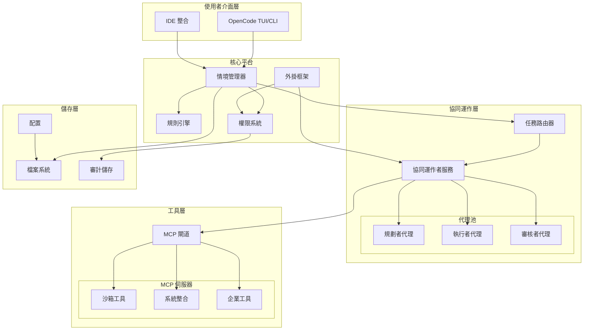
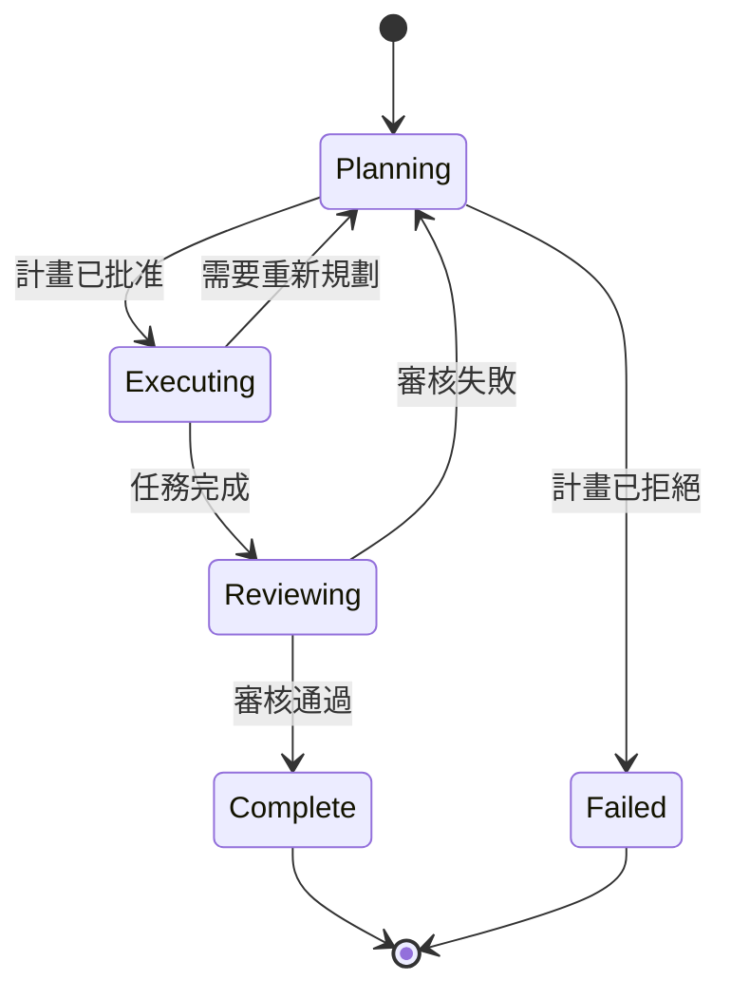
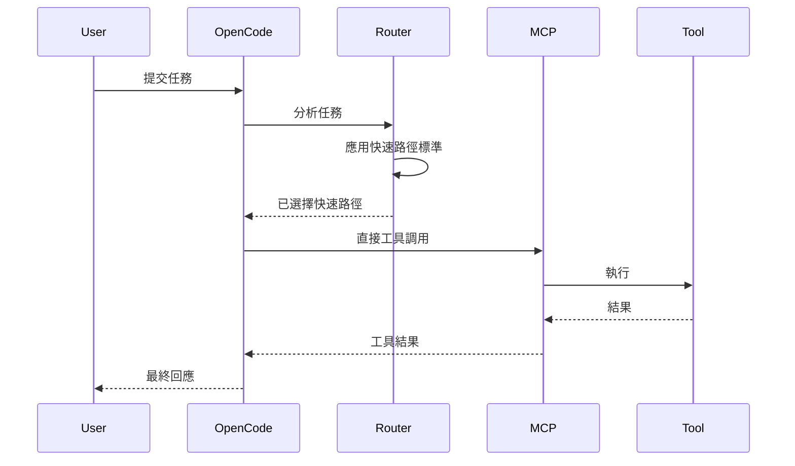
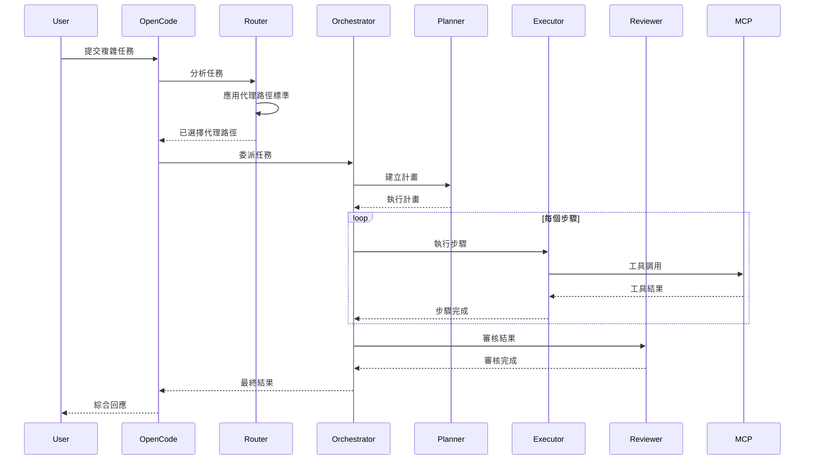
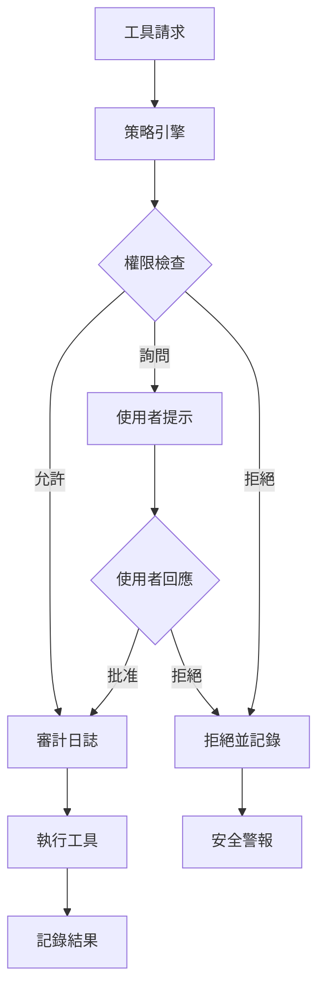

# OpenCode Agent 平台 - 系統設計文件 (SDD)

**文件版本:** 1.0
**日期:** 2026-01-22
**專案:** OpenCode 通用代理平台
**作者:** 系統架構團隊

---

## 1. 架構概覽

### 1.1 設計原則

遵循 **Linus Torvalds 的軟體設計哲學**：
- **小核心**: OpenCode 保持專注於情境管理和工具協同運作
- **穩定的介面**: 定義良好的 API 使得元件可以替換
- **模組化增長**: 透過外掛和外部服務增強能力

### 1.2 高階架構



---

## 2. 元件設計

### 2.1 核心平台元件

#### 2.1.1 情境管理器
**職責**: 管理儲存庫情境、規則繼承和使用者會話狀態

**介面**:
```typescript
interface ContextManager {
  loadRules(path: string): RuleSet
  getSkills(path: string): Skill[]
  getActiveSession(): Session
  updateContext(changes: ContextUpdate): void
}
```

**實作細節**:
- 從 `AGENTS.md`, `CLAUDE.md`, `OPENCODE.md` 遞迴載入規則
- 從 `.claude/skills/` 和 `.opencode/skills/` 發現技能
- 具備工作區隔離的會話狀態持久化

#### 2.1.2 任務路由器
**職責**: 在快速路徑和代理路徑執行之間進行智慧路由

**決策矩陣**:
```yaml
fast_path_criteria:
  - single_file_operations: true
  - tool_count: <= 1
  - no_external_dependencies: true
  - simple_context: < 1000_tokens

agent_path_triggers:
  - multi_system_integration: true
  - planning_required: true
  - complex_decision_chains: true
  - long_context_synthesis: true
```

**介面**:
```typescript
interface TaskRouter {
  analyzeTask(task: Task, context: Context): ExecutionPath
  routeExecution(path: ExecutionPath, task: Task): ExecutionResult
}

enum ExecutionPath {
  FAST_PATH = "fast",
  AGENT_PATH = "agent"
}
```

#### 2.1.3 權限系統
**職責**: 強制執行存取控制並審計所有操作

**權限模型**:
```yaml
permission_levels:
  allow: # 無需提示即可執行
  ask:   # 提示使用者確認
  deny:  # 阻止執行

scopes:
  - tool: "bash"
    action: "execute"
    pattern: "git *"
    level: "allow"

  - tool: "edit"
    action: "write"
    pattern: "/etc/**"
    level: "deny"

  - tool: "mcp"
    server: "enterprise-db"
    level: "ask"
```

### 2.2 協同運作層元件

#### 2.2.1 協同運作者服務
**職責**: 協調多步驟代理工作流程

**狀態機**:


**介面**:
```typescript
interface OrchestratorService {
  planTask(task: Task, context: Context): ExecutionPlan
  executeStep(step: PlanStep): StepResult
  reviewExecution(plan: ExecutionPlan, results: StepResult[]): ReviewResult
  handleFailure(step: PlanStep, error: Error): RecoveryAction
}
```

#### 2.2.2 代理池
**專業化子代理**:

**規劃者代理**:
- 角色: 將複雜任務分解為可執行的步驟
- 能力: 情境分析、依賴識別、資源估算
- 輸出: 帶有驗證檢查點的結構化執行計畫

**執行者代理**:
- 角色: 使用可用工具執行個別計畫步驟
- 能力: 工具調用、錯誤處理、進度報告
- 輸出: 帶有詳細結果的步驟完成狀態

**審核者代理**:
- 角色: 驗證執行品質和完整性
- 能力: 結果驗證、品質評估、建議生成
- 輸出: 帶有通過/失敗決策的審核報告

### 2.3 工具層架構

#### 2.3.1 MCP 閘道
**職責**: 管理 MCP 伺服器生命週期和工具調用

**配置綱要**:
```yaml
mcp_servers:
  - name: "sandbox"
    type: "local"
    command: ["python", "-m", "mcp_sandbox"]
    capabilities: ["bash", "python", "file_ops"]
    security:
      sandbox: true
      resource_limits:
        memory: "512MB"
        cpu: "50%"
        disk: "1GB"

  - name: "enterprise"
    type: "remote"
    url: "https://internal.company.com/mcp"
    auth:
      type: "oauth"
      client_id: "${ENTERPRISE_CLIENT_ID}"
    capabilities: ["jira", "confluence", "database"]
```

**介面**:
```typescript
interface MCPGateway {
  listServers(): MCPServer[]
  getServerCapabilities(serverName: string): Capability[]
  invokeTool(serverName: string, toolName: string, args: any): ToolResult
  healthCheck(serverName: string): HealthStatus
}
```

#### 2.3.2 工具類別

**沙箱工具** (本地 MCP 伺服器):
- 具備路徑限制的檔案系統操作
- 具備資源限制的程式碼執行
- 環境隔離和清理

**系統整合工具** (遠端 MCP 伺服器):
- Git 操作和儲存庫管理
- CI/CD 管線互動
- 建置和部署工具

**企業工具** (已認證的 MCP 伺服器):
- JIRA 問題管理
- Confluence 文件
- 內部資料庫存取
- 公司 API 整合

---

## 3. 資料流程設計

### 3.1 快速路徑執行流程



### 3.2 代理路徑執行流程



---

## 4. 安全架構

### 4.1 權限強制執行

**多層安全模型**:


### 4.2 工具沙箱

**隔離策略**:
- **容器隔離**: 工具在受限容器中執行
- **資源限制**: CPU、記憶體、磁碟和網路限制
- **路徑限制**: 檔案系統存取僅限於已批准的目錄
- **網路策略**: 受控的外部通訊

### 4.3 審計追蹤

**審計事件綱要**:
```json
{
  "timestamp": "2026-01-22T10:30:00Z",
  "session_id": "sess_abc123",
  "user_id": "user_xyz789",
  "event_type": "tool_execution",
  "tool_name": "bash",
  "command": "git status",
  "permission_result": "allowed",
  "execution_result": "success",
  "resource_usage": {
    "cpu_ms": 150,
    "memory_mb": 2.5,
    "network_bytes": 0
  },
  "risk_score": 0.1
}
```

---

## 5. 外掛系統設計

### 5.1 外掛架構

**掛鉤點**:
```typescript
interface PluginHooks {
  // 執行前掛鉤
  onTaskReceived(task: Task): TaskModification | null
  onPermissionCheck(request: PermissionRequest): PermissionOverride | null
  onToolInvocation(tool: string, args: any): ToolModification | null

  // 執行後掛鉤
  onToolResult(result: ToolResult): ResultModification | null
  onTaskComplete(task: Task, result: any): void
  onError(error: Error, context: ExecutionContext): ErrorHandling | null
}
```

### 5.2 外掛範例

**企業策略外掛**:
```typescript
class EnterprisePolicyPlugin implements Plugin {
  onPermissionCheck(request: PermissionRequest): PermissionOverride | null {
    if (request.tool === 'bash' && request.args.includes('rm -rf')) {
      return { action: 'deny', reason: '破壞性操作需要批准' }
    }
    return null
  }
}
```

**監控外掛**:
```typescript
class MonitoringPlugin implements Plugin {
  onToolResult(result: ToolResult): ResultModification | null {
    // 將指標傳送到監控系統
    this.metrics.increment('tool.execution', {
      tool: result.tool,
      success: result.success
    })
    return null
  }
}
```

---

## 6. 配置管理

### 6.1 配置層級

```
儲存庫層級:
├── .opencode/
│   ├── config.yaml          # 本地覆寫
│   ├── agents/              # 自訂代理
│   └── skills/              # 本地技能
├── AGENTS.md                # 儲存庫規則
└── .claude/
    └── skills/              # 共享技能

使用者層級:
├── ~/.opencode/
│   ├── config.yaml          # 使用者偏好
│   └── global_skills/       # 使用者技能

系統層級:
└── /etc/opencode/
    ├── config.yaml          # 系統預設
    └── enterprise_policy.yaml
```

### 6.2 配置綱要

```yaml
# .opencode/config.yaml
platform:
  version: "2.0"
  compatibility_mode: "claude_code"

routing:
  fast_path_threshold: 1000  # tokens
  agent_timeout: 300         # seconds
  max_planning_depth: 5

security:
  require_approval_for:
    - destructive_operations
    - external_network_access
    - sensitive_file_access

  audit:
    enabled: true
    retention_days: 90
    log_level: "info"

mcp_servers:
  sandbox:
    enabled: true
    auto_start: true
    resource_limits:
      memory: "512MB"
      cpu_percent: 50

agents:
  planner:
    model: "claude-3-5-sonnet"
    max_tokens: 4000
    temperature: 0.1

  executor:
    model: "claude-3-5-sonnet"
    max_tokens: 2000
    temperature: 0
```

---

## 7. 遷移策略

### 7.1 Claude Code 相容性

**遷移路徑**:
1. **階段 1**: 自動偵測現有的 `.claude/` 配置
2. **階段 2**: 用於規則和技能的轉換工具
3. **階段 3**: 過渡期間並行操作
4. **階段 4**: 完全啟用 OpenCode 代理平台

**相容層**:
```typescript
class ClaudeCodeCompatibility {
  convertRules(claudeConfig: ClaudeConfig): OpenCodeConfig {
    return {
      rules: claudeConfig.systemPrompt,
      skills: this.convertSkills(claudeConfig.skills),
      permissions: this.inferPermissions(claudeConfig.settings)
    }
  }

  convertSkills(skills: ClaudeSkill[]): OpenCodeSkill[] {
    return skills.map(skill => ({
      name: skill.name,
      description: skill.description,
      prompt: skill.content,
      permissions: this.extractPermissions(skill.content)
    }))
  }
}
```

### 7.2 逐步推出

**功能旗標**:
```yaml
features:
  agent_orchestration:
    enabled: true
    rollout_percentage: 25

  complex_routing:
    enabled: false
    beta_users: ["team_lead", "senior_dev"]

  enterprise_integration:
    enabled: true
    require_admin_approval: true
```

---

## 8. 性能考量

### 8.1 優化策略

**情境載入**:
- 技能和規則的延遲載入
- 經常存取配置的快取
- 規則變更的增量更新

**工具執行**:
- MCP 伺服器的連線池
- 在依賴關係允許的情況下並行執行
- 冪等操作的結果快取

**記憶體管理**:
- 大型檔案操作的串流處理
- 長對話的有限情境視窗
- 已完成任務的垃圾回收

### 8.2 監控與可觀測性

**關鍵指標**:
```yaml
performance_metrics:
  - task_routing_latency_ms
  - tool_execution_duration_ms
  - memory_usage_mb
  - concurrent_sessions_count
  - cache_hit_ratio

reliability_metrics:
  - uptime_percentage
  - error_rate_per_hour
  - recovery_time_seconds
  - mcp_server_health_status

user_experience_metrics:
  - task_completion_rate
  - user_satisfaction_score
  - migration_success_rate
  - feature_adoption_percentage
```

---

## 9. 測試策略

### 9.1 測試金字塔

**單元測試**:
- 元件隔離測試
- 模擬 MCP 伺服器互動
- 權限策略驗證

**整合測試**:
- 端到端工作流程測試
- MCP 伺服器整合
- 外掛相容性測試

**系統測試**:
- 性能基準測試
- 安全滲透測試
- 企業環境驗證

### 9.2 測試環境設定

```yaml
test_environments:
  unit:
    mcp_servers: "mocked"
    permissions: "permissive"

  integration:
    mcp_servers: "containerized"
    permissions: "realistic"

  staging:
    mcp_servers: "production_like"
    permissions: "enterprise_policy"
```

---

## 10. 部署架構

### 10.1 部署模型

**獨立模式**:
- 單一使用者安裝
- 僅本地 MCP 伺服器
- 基於檔案的配置

**團隊模式**:
- 共享配置儲存庫
- 中央化 MCP 伺服器
- 協作權限

**企業模式**:
- SSO 整合
- 中央化審計日誌
- 策略管理系統

### 10.2 擴展考量

**水平擴展**:
- 無狀態協同運作者服務
- MCP 閘道的負載平衡
- 分散式審計儲存

**垂直擴展**:
- 每位使用者的資源分配
- 動態 MCP 伺服器供應
- 自適應快取策略

---

## 11. 風險評估與緩解

### 11.1 技術風險

| 風險 | 影響 | 可能性 | 緩解措施 |
|------|--------|-------------|------------|
| MCP 伺服器故障 | 高 | 中 | 斷路器模式、備用工具 |
| 性能下降 | 中 | 中 | 監控警報、自動擴展 |
| 安全漏洞 | 高 | 低 | 定期審計、沙箱 |

### 11.2 業務風險

| 風險 | 影響 | 可能性 | 緩解措施 |
|------|--------|-------------|------------|
| 使用者遷移問題 | 高 | 中 | 全面測試、逐步推出 |
| 企業採用 | 中 | 低 | 試點專案、利益關係人參與 |
| 競爭壓力 | 低 | 高 | 快速迭代、社群建設 |

---

**文件控制:**
- 需審核: 資深架構師、安全團隊
- 實作審核: 2026-02-01
- 架構審核委員會: 2026-02-15
