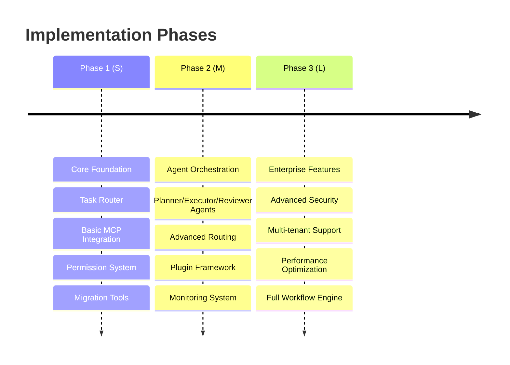

# OpenCode Agent Platform - Technical Implementation Guide

**Document Version:** 1.0
**Date:** 2026-01-22
**Project:** OpenCode Universal Agent Platform
**Author:** Engineering Team

---

## 1. Implementation Roadmap

### 1.1 Phase-based Delivery Strategy



### 1.2 Development Priorities

**Phase 1 (Small - 4-6 weeks)**:
- Minimal viable router
- Claude Code compatibility layer
- Basic MCP gateway
- File-based configuration

**Phase 2 (Medium - 8-10 weeks)**:
- Complete orchestration system
- Plugin architecture
- Advanced permissions
- Comprehensive testing

**Phase 3 (Large - 12-16 weeks)**:
- Enterprise integration
- Performance optimization
- Advanced workflow patterns
- Production hardening

---

## 2. Repository Structure

### 2.1 Project Organization

```
opencode-agent-platform/
├── core/                           # Core OpenCode integration
│   ├── context/                    # Context management
│   ├── router/                     # Task routing logic
│   └── permission/                 # Permission system
├── orchestration/                  # Agent orchestration layer
│   ├── agents/                     # Agent implementations
│   ├── planner/                    # Planning strategies
│   └── workflow/                   # Workflow engine
├── mcp/                           # MCP integration
│   ├── gateway/                    # MCP gateway service
│   ├── servers/                    # Reference MCP servers
│   └── tools/                      # Tool abstractions
├── plugins/                       # Plugin system
│   ├── framework/                  # Plugin infrastructure
│   └── examples/                   # Example plugins
├── migration/                     # Migration utilities
│   ├── claude-code/               # Claude Code migration
│   └── validation/                # Configuration validation
├── config/                        # Configuration schemas
│   ├── schemas/                   # JSON schemas
│   └── examples/                  # Example configurations
├── tests/                         # Test suites
│   ├── unit/
│   ├── integration/
│   └── e2e/
└── docs/                          # Documentation
    ├── api/                       # API documentation
    ├── guides/                    # Implementation guides
    └── examples/                  # Usage examples
```

### 2.2 Key Configuration Files

```
.opencode/
├── config.yaml                   # Main configuration
├── agents.yaml                   # Agent definitions
├── mcp-servers.yaml              # MCP server configuration
├── permissions.yaml              # Permission policies
└── plugins.yaml                  # Plugin configuration

# Compatibility layer
.claude/
├── skills/                       # Imported skills
└── settings.json                 # Legacy settings

# Repository-level rules
AGENTS.md                         # Repository agent rules
CLAUDE.md                         # Legacy compatibility
```

---

## 3. Component Implementation Details

### 3.1 Task Router Implementation

**File**: `core/router/task_router.py`

```python
from dataclasses import dataclass
from enum import Enum
from typing import Optional, Dict, Any, List
import re

class ExecutionPath(Enum):
    FAST_PATH = "fast"
    AGENT_PATH = "agent"

@dataclass
class TaskAnalysis:
    token_count: int
    tool_count: int
    complexity_score: float
    external_dependencies: List[str]
    requires_planning: bool

class TaskRouter:
    def __init__(self, config: RouterConfig):
        self.config = config
        self.fast_path_rules = self._load_fast_path_rules()
        self.complexity_analyzer = ComplexityAnalyzer()

    def analyze_task(self, task: str, context: Dict[str, Any]) -> TaskAnalysis:
        """Analyze task characteristics for routing decision"""
        return TaskAnalysis(
            token_count=len(task.split()),
            tool_count=self._count_tool_references(task),
            complexity_score=self.complexity_analyzer.score(task),
            external_dependencies=self._detect_external_deps(task),
            requires_planning=self._requires_planning(task, context)
        )

    def route_task(self, task: str, context: Dict[str, Any]) -> ExecutionPath:
        """Determine execution path for given task"""
        analysis = self.analyze_task(task, context)

        # Fast path criteria
        if (analysis.token_count <= self.config.fast_path_threshold and
            analysis.tool_count <= 1 and
            analysis.complexity_score < 0.3 and
            not analysis.requires_planning):
            return ExecutionPath.FAST_PATH

        return ExecutionPath.AGENT_PATH

    def _count_tool_references(self, task: str) -> int:
        """Count potential tool invocations in task"""
        tool_patterns = [
            r'\bedit\b', r'\bread\b', r'\bbash\b',
            r'\bpython\b', r'\bgit\b', r'\bnpm\b'
        ]
        count = 0
        for pattern in tool_patterns:
            count += len(re.findall(pattern, task, re.IGNORECASE))
        return count

    def _requires_planning(self, task: str, context: Dict[str, Any]) -> bool:
        """Detect if task requires multi-step planning"""
        planning_indicators = [
            'plan', 'strategy', 'implement', 'refactor',
            'multiple', 'complex', 'integrate', 'design'
        ]
        task_lower = task.lower()
        return any(indicator in task_lower for indicator in planning_indicators)
```

### 3.2 MCP Gateway Implementation

**File**: `mcp/gateway/mcp_gateway.py`

```python
import asyncio
import json
from typing import Dict, Any, List, Optional
from dataclasses import dataclass, asdict
import httpx
import subprocess

@dataclass
class MCPServer:
    name: str
    type: str  # 'local' or 'remote'
    url: Optional[str] = None
    command: Optional[List[str]] = None
    capabilities: List[str] = None
    auth: Optional[Dict[str, str]] = None
    health_check_url: Optional[str] = None

@dataclass
class ToolInvocation:
    server: str
    tool: str
    arguments: Dict[str, Any]
    timeout: int = 30

class MCPGateway:
    def __init__(self, config_path: str):
        self.servers = self._load_server_config(config_path)
        self.local_processes: Dict[str, subprocess.Popen] = {}
        self.http_clients: Dict[str, httpx.AsyncClient] = {}

    async def start_servers(self):
        """Start all configured MCP servers"""
        for name, server in self.servers.items():
            if server.type == 'local':
                await self._start_local_server(name, server)
            else:
                await self._init_remote_client(name, server)

    async def _start_local_server(self, name: str, server: MCPServer):
        """Start a local MCP server process"""
        try:
            process = subprocess.Popen(
                server.command,
                stdout=subprocess.PIPE,
                stderr=subprocess.PIPE,
                env=os.environ.copy()
            )
            self.local_processes[name] = process

            # Wait for server to be ready
            await self._wait_for_server_ready(name, server)

        except Exception as e:
            logger.error(f"Failed to start MCP server {name}: {e}")
            raise

    async def invoke_tool(self, invocation: ToolInvocation) -> Dict[str, Any]:
        """Invoke a tool on specified MCP server"""
        server = self.servers.get(invocation.server)
        if not server:
            raise ValueError(f"Unknown MCP server: {invocation.server}")

        if server.type == 'local':
            return await self._invoke_local_tool(invocation)
        else:
            return await self._invoke_remote_tool(invocation)

    async def _invoke_local_tool(self, invocation: ToolInvocation) -> Dict[str, Any]:
        """Invoke tool on local MCP server"""
        # Implementation for local tool invocation via stdio
        request = {
            "jsonrpc": "2.0",
            "id": f"req_{asyncio.get_event_loop().time()}",
            "method": "tools/call",
            "params": {
                "name": invocation.tool,
                "arguments": invocation.arguments
            }
        }

        process = self.local_processes[invocation.server]
        if not process or process.poll() is not None:
            raise RuntimeError(f"MCP server {invocation.server} is not running")

        # Send request via stdin
        process.stdin.write(json.dumps(request).encode() + b'\n')
        process.stdin.flush()

        # Read response from stdout
        response_line = process.stdout.readline().decode().strip()
        response = json.loads(response_line)

        if "error" in response:
            raise MCPError(response["error"])

        return response["result"]

    async def _invoke_remote_tool(self, invocation: ToolInvocation) -> Dict[str, Any]:
        """Invoke tool on remote MCP server"""
        client = self.http_clients[invocation.server]
        server = self.servers[invocation.server]

        request_payload = {
            "tool": invocation.tool,
            "arguments": invocation.arguments
        }

        try:
            response = await client.post(
                f"{server.url}/tools/invoke",
                json=request_payload,
                timeout=invocation.timeout
            )
            response.raise_for_status()
            return response.json()

        except httpx.TimeoutException:
            raise MCPError(f"Tool invocation timed out after {invocation.timeout}s")
        except httpx.RequestError as e:
            raise MCPError(f"Request failed: {e}")

class MCPError(Exception):
    """Exception raised for MCP-related errors"""
    pass
```

### 3.3 Permission System Implementation

**File**: `core/permission/permission_engine.py`

```python
from enum import Enum
from typing import Dict, Any, List, Optional, Union
from dataclasses import dataclass
import fnmatch
import yaml

class PermissionLevel(Enum):
    ALLOW = "allow"
    ASK = "ask"
    DENY = "deny"

@dataclass
class PermissionRule:
    scope: str          # tool, mcp_server, file_pattern
    action: str         # execute, read, write, delete
    pattern: str        # glob pattern or specific resource
    level: PermissionLevel
    reason: Optional[str] = None

@dataclass
class PermissionRequest:
    user_id: str
    tool: str
    action: str
    resource: str
    arguments: Dict[str, Any]
    context: Dict[str, Any]

@dataclass
class PermissionResult:
    decision: PermissionLevel
    rule_matched: Optional[PermissionRule]
    reason: str
    requires_audit: bool = True

class PermissionEngine:
    def __init__(self, config_path: str):
        self.rules = self._load_permission_rules(config_path)
        self.audit_logger = AuditLogger()

    def check_permission(self, request: PermissionRequest) -> PermissionResult:
        """Check if permission should be granted for request"""

        # Find matching rules (most specific first)
        matching_rules = self._find_matching_rules(request)

        if not matching_rules:
            # Default to ASK for unknown operations
            return PermissionResult(
                decision=PermissionLevel.ASK,
                rule_matched=None,
                reason="No explicit permission rule found"
            )

        # Use the most specific rule
        rule = matching_rules[0]

        result = PermissionResult(
            decision=rule.level,
            rule_matched=rule,
            reason=rule.reason or f"Matched rule: {rule.scope}:{rule.pattern}"
        )

        # Log the permission check
        self.audit_logger.log_permission_check(request, result)

        return result

    def _find_matching_rules(self, request: PermissionRequest) -> List[PermissionRule]:
        """Find all rules that match the request, ordered by specificity"""
        matching = []

        for rule in self.rules:
            if self._rule_matches_request(rule, request):
                matching.append(rule)

        # Sort by specificity (more specific patterns first)
        return sorted(matching, key=lambda r: self._calculate_specificity(r), reverse=True)

    def _rule_matches_request(self, rule: PermissionRule, request: PermissionRequest) -> bool:
        """Check if a rule matches a permission request"""

        # Check tool scope
        if rule.scope == 'tool' and rule.pattern != '*':
            if not fnmatch.fnmatch(request.tool, rule.pattern):
                return False

        # Check action
        if rule.action != '*' and rule.action != request.action:
            return False

        # Check resource pattern
        if rule.scope == 'file_pattern':
            return fnmatch.fnmatch(request.resource, rule.pattern)
        elif rule.scope == 'mcp_server':
            return request.tool == 'mcp' and request.arguments.get('server') == rule.pattern

        return True

    def _calculate_specificity(self, rule: PermissionRule) -> int:
        """Calculate rule specificity for ordering"""
        specificity = 0

        # More specific patterns get higher scores
        if '*' not in rule.pattern:
            specificity += 100
        if rule.action != '*':
            specificity += 50
        if rule.scope != 'tool':
            specificity += 25

        return specificity

class AuditLogger:
    """Audit logger for permission decisions and tool executions"""

    def log_permission_check(self, request: PermissionRequest, result: PermissionResult):
        """Log permission check event"""
        event = {
            "timestamp": datetime.utcnow().isoformat(),
            "event_type": "permission_check",
            "user_id": request.user_id,
            "tool": request.tool,
            "action": request.action,
            "resource": request.resource,
            "decision": result.decision.value,
            "rule_matched": result.rule_matched.pattern if result.rule_matched else None,
            "reason": result.reason
        }

        # Write to audit log file
        self._write_audit_event(event)

    def log_tool_execution(self, request: PermissionRequest, result: Any, success: bool):
        """Log tool execution event"""
        event = {
            "timestamp": datetime.utcnow().isoformat(),
            "event_type": "tool_execution",
            "user_id": request.user_id,
            "tool": request.tool,
            "action": request.action,
            "resource": request.resource,
            "success": success,
            "result_summary": self._summarize_result(result)
        }

        self._write_audit_event(event)
```

### 3.4 Agent Orchestration Implementation

**File**: `orchestration/agents/orchestrator.py`

```python
from abc import ABC, abstractmethod
from enum import Enum
from typing import List, Dict, Any, Optional
from dataclasses import dataclass
import asyncio

class TaskStatus(Enum):
    PENDING = "pending"
    PLANNING = "planning"
    EXECUTING = "executing"
    REVIEWING = "reviewing"
    COMPLETED = "completed"
    FAILED = "failed"

@dataclass
class PlanStep:
    id: str
    description: str
    tool: str
    arguments: Dict[str, Any]
    dependencies: List[str]
    estimated_time: int
    validation_criteria: List[str]

@dataclass
class ExecutionPlan:
    task_id: str
    steps: List[PlanStep]
    estimated_total_time: int
    risk_assessment: str
    success_criteria: List[str]

class Agent(ABC):
    def __init__(self, name: str, config: Dict[str, Any]):
        self.name = name
        self.config = config

    @abstractmethod
    async def execute(self, task: Any, context: Dict[str, Any]) -> Any:
        pass

class PlannerAgent(Agent):
    async def execute(self, task: str, context: Dict[str, Any]) -> ExecutionPlan:
        """Create execution plan for complex task"""

        # Analyze task requirements
        requirements = await self._analyze_requirements(task, context)

        # Decompose into steps
        steps = await self._decompose_task(requirements)

        # Estimate effort and risk
        total_time = sum(step.estimated_time for step in steps)
        risk_assessment = await self._assess_risk(steps)

        return ExecutionPlan(
            task_id=f"task_{asyncio.get_event_loop().time()}",
            steps=steps,
            estimated_total_time=total_time,
            risk_assessment=risk_assessment,
            success_criteria=await self._define_success_criteria(task)
        )

    async def _analyze_requirements(self, task: str, context: Dict[str, Any]) -> Dict[str, Any]:
        """Analyze task to understand requirements"""
        # Use LLM to analyze task requirements
        prompt = f"""
        Analyze this task and identify:
        1. Required tools and capabilities
        2. Input/output dependencies
        3. Potential risks or constraints
        4. Success criteria

        Task: {task}
        Context: {context}
        """

        # Call LLM service
        analysis = await self._call_llm(prompt)
        return analysis

class ExecutorAgent(Agent):
    def __init__(self, name: str, config: Dict[str, Any], mcp_gateway):
        super().__init__(name, config)
        self.mcp_gateway = mcp_gateway

    async def execute(self, plan: ExecutionPlan, context: Dict[str, Any]) -> Dict[str, Any]:
        """Execute a plan step by step"""
        results = {}

        for step in plan.steps:
            try:
                result = await self._execute_step(step, context, results)
                results[step.id] = result

                # Validate step completion
                if not await self._validate_step(step, result):
                    raise ExecutionError(f"Step {step.id} validation failed")

            except Exception as e:
                results[step.id] = {"error": str(e)}
                raise ExecutionError(f"Step {step.id} failed: {e}")

        return results

    async def _execute_step(self, step: PlanStep, context: Dict[str, Any], previous_results: Dict[str, Any]) -> Any:
        """Execute individual plan step"""

        # Resolve arguments with context and previous results
        resolved_args = await self._resolve_arguments(step.arguments, context, previous_results)

        # Invoke tool via MCP gateway
        invocation = ToolInvocation(
            server=self._determine_mcp_server(step.tool),
            tool=step.tool,
            arguments=resolved_args
        )

        return await self.mcp_gateway.invoke_tool(invocation)

class ReviewerAgent(Agent):
    async def execute(self, plan: ExecutionPlan, results: Dict[str, Any], context: Dict[str, Any]) -> Dict[str, Any]:
        """Review execution results for quality and completeness"""

        review_report = {
            "overall_success": True,
            "step_reviews": {},
            "recommendations": [],
            "quality_score": 0.0
        }

        for step in plan.steps:
            step_result = results.get(step.id)
            step_review = await self._review_step(step, step_result, context)
            review_report["step_reviews"][step.id] = step_review

            if not step_review["success"]:
                review_report["overall_success"] = False

        # Check success criteria
        success_score = await self._check_success_criteria(plan.success_criteria, results)
        review_report["quality_score"] = success_score

        if success_score < 0.8:
            review_report["overall_success"] = False
            review_report["recommendations"].append("Quality threshold not met")

        return review_report

class Orchestrator:
    def __init__(self, config: Dict[str, Any], mcp_gateway):
        self.config = config
        self.mcp_gateway = mcp_gateway

        # Initialize agents
        self.planner = PlannerAgent("planner", config.get("planner", {}))
        self.executor = ExecutorAgent("executor", config.get("executor", {}), mcp_gateway)
        self.reviewer = ReviewerAgent("reviewer", config.get("reviewer", {}))

        # Task tracking
        self.active_tasks: Dict[str, Dict[str, Any]] = {}

    async def process_task(self, task: str, context: Dict[str, Any]) -> Dict[str, Any]:
        """Process complex task through full orchestration pipeline"""

        try:
            # Planning phase
            plan = await self.planner.execute(task, context)

            # Execution phase
            results = await self.executor.execute(plan, context)

            # Review phase
            review = await self.reviewer.execute(plan, results, context)

            return {
                "task": task,
                "plan": plan,
                "results": results,
                "review": review,
                "status": TaskStatus.COMPLETED if review["overall_success"] else TaskStatus.FAILED
            }

        except Exception as e:
            return {
                "task": task,
                "error": str(e),
                "status": TaskStatus.FAILED
            }

class ExecutionError(Exception):
    """Exception raised during task execution"""
    pass
```

---

## 4. Configuration Management

### 4.1 Main Configuration Schema

**File**: `config/schemas/opencode-config.yaml`

```yaml
# .opencode/config.yaml
platform:
  version: "2.0"                           # Configuration version
  compatibility_mode: "claude_code"        # Enable Claude Code compatibility
  log_level: "info"                        # debug, info, warn, error

# Task routing configuration
routing:
  fast_path_threshold: 1000                # Token threshold for fast path
  complexity_threshold: 0.3                # Complexity score threshold
  agent_timeout: 300                       # Agent execution timeout (seconds)
  max_planning_depth: 5                    # Maximum planning recursion

  # Fast path criteria
  fast_path_rules:
    max_tokens: 1000
    max_tools: 1
    max_files: 3
    no_external_deps: true

# Security and permissions
security:
  default_permission: "ask"                # allow, ask, deny
  audit:
    enabled: true
    retention_days: 90
    log_file: ".opencode/audit.log"

  require_approval_for:
    - destructive_operations
    - external_network_access
    - sensitive_file_access
    - system_administration

# MCP server configuration
mcp_servers:
  sandbox:
    type: "local"
    command: ["python", "-m", "mcp_sandbox"]
    auto_start: true
    capabilities: ["bash", "python", "file_ops"]
    resource_limits:
      memory: "512MB"
      cpu_percent: 50
      disk: "1GB"
      network: false

  enterprise:
    type: "remote"
    url: "https://internal.company.com/mcp"
    auth:
      type: "oauth"
      client_id: "${ENTERPRISE_CLIENT_ID}"
    capabilities: ["jira", "confluence", "database"]
    timeout: 30

# Agent configuration
agents:
  planner:
    model: "claude-3-5-sonnet"
    max_tokens: 4000
    temperature: 0.1
    system_prompt_file: ".opencode/prompts/planner.md"

  executor:
    model: "claude-3-5-sonnet"
    max_tokens: 2000
    temperature: 0
    retry_attempts: 3

  reviewer:
    model: "claude-3-5-sonnet"
    max_tokens: 3000
    temperature: 0.2
    quality_threshold: 0.8

# Plugin configuration
plugins:
  enabled:
    - "enterprise_policy"
    - "monitoring"
    - "security_scanner"

  enterprise_policy:
    config_file: ".opencode/enterprise_policy.yaml"

  monitoring:
    endpoint: "https://monitoring.company.com/metrics"
    api_key: "${MONITORING_API_KEY}"
```

### 4.2 Permission Configuration

**File**: `config/schemas/permissions.yaml`

```yaml
# .opencode/permissions.yaml
permissions:
  # File system permissions
  - scope: "file_pattern"
    action: "read"
    pattern: "**/*.py"
    level: "allow"
    reason: "Python files are safe to read"

  - scope: "file_pattern"
    action: "write"
    pattern: "/etc/**"
    level: "deny"
    reason: "System configuration files are protected"

  - scope: "file_pattern"
    action: "delete"
    pattern: "**/*"
    level: "ask"
    reason: "Deletion requires confirmation"

  # Tool permissions
  - scope: "tool"
    action: "execute"
    pattern: "bash"
    level: "ask"
    reason: "Shell commands require approval"

  - scope: "tool"
    action: "execute"
    pattern: "git"
    level: "allow"
    reason: "Git operations are generally safe"

  # MCP server permissions
  - scope: "mcp_server"
    action: "invoke"
    pattern: "enterprise"
    level: "ask"
    reason: "Enterprise systems require approval"

  - scope: "mcp_server"
    action: "invoke"
    pattern: "sandbox"
    level: "allow"
    reason: "Sandbox tools are safe"

# Role-based permissions (future enhancement)
roles:
  developer:
    inherits: ["basic_user"]
    additional_permissions:
      - tool: "npm"
        level: "allow"
      - tool: "python"
        level: "allow"

  admin:
    inherits: ["developer"]
    additional_permissions:
      - pattern: "/etc/**"
        level: "allow"
      - tool: "systemctl"
        level: "allow"
```

---

## 5. Migration Implementation

### 5.1 Claude Code Migration Tool

**File**: `migration/claude-code/migrator.py`

```python
import json
import yaml
import os
from typing import Dict, Any, List
from pathlib import Path

class ClaudeCodeMigrator:
    def __init__(self, source_path: str, target_path: str):
        self.source_path = Path(source_path)
        self.target_path = Path(target_path)

    def migrate_configuration(self) -> Dict[str, Any]:
        """Migrate Claude Code configuration to OpenCode format"""

        migration_report = {
            "status": "success",
            "migrated_components": [],
            "warnings": [],
            "errors": []
        }

        try:
            # Migrate main configuration
            if self._has_claude_settings():
                self._migrate_settings()
                migration_report["migrated_components"].append("settings")

            # Migrate skills
            if self._has_claude_skills():
                self._migrate_skills()
                migration_report["migrated_components"].append("skills")

            # Migrate rules
            if self._has_claude_rules():
                self._migrate_rules()
                migration_report["migrated_components"].append("rules")

            # Migrate commands
            if self._has_claude_commands():
                self._migrate_commands()
                migration_report["migrated_components"].append("commands")

        except Exception as e:
            migration_report["status"] = "failed"
            migration_report["errors"].append(str(e))

        return migration_report

    def _migrate_settings(self):
        """Migrate .claude/settings.json to .opencode/config.yaml"""
        claude_settings = self._load_claude_settings()

        opencode_config = {
            "platform": {
                "version": "2.0",
                "compatibility_mode": "claude_code"
            },
            "routing": {
                "fast_path_threshold": 1000,
                "agent_timeout": 300
            },
            "security": {
                "default_permission": "ask",
                "audit": {"enabled": True}
            }
        }

        # Map Claude Code settings to OpenCode equivalents
        if "system_prompt" in claude_settings:
            # Create AGENTS.md from system prompt
            self._create_agents_md(claude_settings["system_prompt"])

        if "tools" in claude_settings:
            opencode_config["mcp_servers"] = self._convert_tools_to_mcp(claude_settings["tools"])

        if "permissions" in claude_settings:
            self._create_permissions_yaml(claude_settings["permissions"])

        # Write OpenCode configuration
        config_path = self.target_path / ".opencode" / "config.yaml"
        config_path.parent.mkdir(parents=True, exist_ok=True)

        with open(config_path, "w") as f:
            yaml.dump(opencode_config, f, default_flow_style=False)

    def _migrate_skills(self):
        """Migrate .claude/skills/*.md to .opencode/skills/*.md"""
        claude_skills_dir = self.source_path / ".claude" / "skills"
        opencode_skills_dir = self.target_path / ".opencode" / "skills"

        if not claude_skills_dir.exists():
            return

        opencode_skills_dir.mkdir(parents=True, exist_ok=True)

        for skill_file in claude_skills_dir.glob("*.md"):
            # Copy skill file (OpenCode is compatible with Claude Code skills)
            target_file = opencode_skills_dir / skill_file.name
            target_file.write_text(skill_file.read_text())

        # Create symbolic link for backward compatibility
        claude_link = self.target_path / ".claude" / "skills"
        if not claude_link.exists():
            claude_link.parent.mkdir(parents=True, exist_ok=True)
            claude_link.symlink_to("../.opencode/skills")

    def _migrate_rules(self):
        """Migrate CLAUDE.md to AGENTS.md format"""
        claude_md = self.source_path / "CLAUDE.md"

        if not claude_md.exists():
            return

        claude_content = claude_md.read_text()

        # Convert to OpenCode agents format
        agents_content = f"""# Repository Agent Configuration

## Compatibility Layer
This configuration was migrated from Claude Code format.

## Agent Rules

{claude_content}

## Migration Notes
- Original CLAUDE.md preserved for reference
- Enhanced with OpenCode-specific capabilities
"""

        agents_md = self.target_path / "AGENTS.md"
        agents_md.write_text(agents_content)

        # Keep original CLAUDE.md for compatibility
        if not (self.target_path / "CLAUDE.md").exists():
            (self.target_path / "CLAUDE.md").write_text(claude_content)

    def _convert_tools_to_mcp(self, tools_config: Dict[str, Any]) -> Dict[str, Any]:
        """Convert Claude Code tools configuration to MCP servers"""
        mcp_servers = {}

        for tool_name, tool_config in tools_config.items():
            if tool_name == "bash":
                mcp_servers["sandbox"] = {
                    "type": "local",
                    "command": ["python", "-m", "mcp_sandbox"],
                    "capabilities": ["bash", "file_ops"],
                    "resource_limits": {
                        "memory": "512MB",
                        "cpu_percent": 50
                    }
                }
            elif tool_name == "python":
                if "sandbox" not in mcp_servers:
                    mcp_servers["sandbox"] = {
                        "type": "local",
                        "command": ["python", "-m", "mcp_sandbox"],
                        "capabilities": ["python", "file_ops"]
                    }
                else:
                    mcp_servers["sandbox"]["capabilities"].append("python")

        return mcp_servers

    def validate_migration(self) -> Dict[str, Any]:
        """Validate the migrated configuration"""
        validation_report = {
            "valid": True,
            "warnings": [],
            "errors": []
        }

        # Check required files exist
        required_files = [
            ".opencode/config.yaml",
            "AGENTS.md"
        ]

        for file_path in required_files:
            full_path = self.target_path / file_path
            if not full_path.exists():
                validation_report["errors"].append(f"Missing required file: {file_path}")
                validation_report["valid"] = False

        # Validate configuration syntax
        try:
            config_path = self.target_path / ".opencode" / "config.yaml"
            if config_path.exists():
                with open(config_path) as f:
                    yaml.safe_load(f)
        except yaml.YAMLError as e:
            validation_report["errors"].append(f"Invalid YAML syntax: {e}")
            validation_report["valid"] = False

        return validation_report
```

---

## 6. Testing Implementation

### 6.1 Unit Test Framework

**File**: `tests/unit/test_task_router.py`

```python
import pytest
from unittest.mock import Mock, patch
from core.router.task_router import TaskRouter, ExecutionPath, TaskAnalysis

class TestTaskRouter:
    @pytest.fixture
    def router_config(self):
        return Mock(fast_path_threshold=1000)

    @pytest.fixture
    def task_router(self, router_config):
        return TaskRouter(router_config)

    def test_fast_path_simple_task(self, task_router):
        """Test that simple tasks are routed to fast path"""
        task = "Read the README file"
        context = {}

        path = task_router.route_task(task, context)
        assert path == ExecutionPath.FAST_PATH

    def test_agent_path_complex_task(self, task_router):
        """Test that complex tasks are routed to agent path"""
        task = """
        Analyze the codebase and create a comprehensive refactoring plan
        that improves performance, adds proper error handling, and
        implements a new authentication system.
        """
        context = {}

        path = task_router.route_task(task, context)
        assert path == ExecutionPath.AGENT_PATH

    def test_tool_count_analysis(self, task_router):
        """Test tool count analysis"""
        task = "Edit the file, run tests, and commit changes"
        context = {}

        analysis = task_router.analyze_task(task, context)
        assert analysis.tool_count >= 3  # edit, bash, git

    @patch('core.router.task_router.ComplexityAnalyzer')
    def test_complexity_analysis(self, mock_analyzer, task_router):
        """Test complexity scoring"""
        mock_analyzer.return_value.score.return_value = 0.8

        task = "Complex multi-step task"
        context = {}

        analysis = task_router.analyze_task(task, context)
        assert analysis.complexity_score == 0.8
```

### 6.2 Integration Test Framework

**File**: `tests/integration/test_mcp_integration.py`

```python
import pytest
import asyncio
from unittest.mock import AsyncMock
from mcp.gateway.mcp_gateway import MCPGateway, ToolInvocation

class TestMCPIntegration:
    @pytest.fixture
    async def mcp_gateway(self):
        """Create MCP gateway with test configuration"""
        gateway = MCPGateway("tests/fixtures/test_mcp_config.yaml")
        await gateway.start_servers()
        yield gateway
        await gateway.shutdown()

    @pytest.mark.asyncio
    async def test_local_tool_invocation(self, mcp_gateway):
        """Test invoking tool on local MCP server"""
        invocation = ToolInvocation(
            server="test_sandbox",
            tool="echo",
            arguments={"text": "Hello, World!"}
        )

        result = await mcp_gateway.invoke_tool(invocation)

        assert result["success"] is True
        assert "Hello, World!" in result["output"]

    @pytest.mark.asyncio
    async def test_remote_tool_invocation(self, mcp_gateway):
        """Test invoking tool on remote MCP server"""
        invocation = ToolInvocation(
            server="test_remote",
            tool="ping",
            arguments={"host": "localhost"}
        )

        result = await mcp_gateway.invoke_tool(invocation)

        assert result["success"] is True
        assert "reachable" in result["status"]

    @pytest.mark.asyncio
    async def test_server_failure_handling(self, mcp_gateway):
        """Test handling of server failures"""
        invocation = ToolInvocation(
            server="nonexistent_server",
            tool="test",
            arguments={}
        )

        with pytest.raises(ValueError, match="Unknown MCP server"):
            await mcp_gateway.invoke_tool(invocation)
```

### 6.3 End-to-End Test Framework

**File**: `tests/e2e/test_full_workflow.py`

```python
import pytest
import tempfile
import shutil
from pathlib import Path
from core.opencode_agent_platform import OpenCodeAgentPlatform

class TestFullWorkflow:
    @pytest.fixture
    def temp_workspace(self):
        """Create temporary workspace for testing"""
        temp_dir = tempfile.mkdtemp()
        workspace = Path(temp_dir)

        # Set up basic project structure
        (workspace / "src").mkdir()
        (workspace / "src" / "main.py").write_text("print('Hello, World!')")
        (workspace / "README.md").write_text("# Test Project")

        # Set up OpenCode configuration
        (workspace / ".opencode").mkdir()
        (workspace / ".opencode" / "config.yaml").write_text("""
platform:
  version: "2.0"
routing:
  fast_path_threshold: 1000
security:
  default_permission: "allow"
mcp_servers:
  sandbox:
    type: "local"
    command: ["python", "-m", "tests.mcp.mock_sandbox"]
""")

        yield workspace
        shutil.rmtree(temp_dir)

    @pytest.fixture
    async def platform(self, temp_workspace):
        """Initialize OpenCode Agent Platform"""
        platform = OpenCodeAgentPlatform(workspace=str(temp_workspace))
        await platform.initialize()
        yield platform
        await platform.shutdown()

    @pytest.mark.asyncio
    async def test_simple_file_read_fast_path(self, platform):
        """Test simple file reading goes through fast path"""
        task = "Read the README.md file"

        result = await platform.process_task(task)

        assert result["execution_path"] == "fast"
        assert "Test Project" in result["content"]
        assert result["success"] is True

    @pytest.mark.asyncio
    async def test_complex_refactoring_agent_path(self, platform):
        """Test complex refactoring goes through agent path"""
        task = """
        Analyze the Python code in src/ directory and:
        1. Add proper error handling
        2. Add type hints
        3. Create unit tests
        4. Update documentation
        """

        result = await platform.process_task(task)

        assert result["execution_path"] == "agent"
        assert "plan" in result
        assert len(result["plan"]["steps"]) > 1
        assert result["review"]["overall_success"] is True

    @pytest.mark.asyncio
    async def test_permission_enforcement(self, platform):
        """Test permission system enforcement"""
        # Configure strict permissions
        await platform.update_permissions({
            "tool": "bash",
            "action": "execute",
            "pattern": "rm *",
            "level": "deny"
        })

        task = "Delete all files in the current directory"

        result = await platform.process_task(task)

        assert result["success"] is False
        assert "permission denied" in result["error"].lower()

    @pytest.mark.asyncio
    async def test_claude_code_migration(self, platform, temp_workspace):
        """Test migration from Claude Code configuration"""
        # Set up Claude Code configuration
        claude_dir = temp_workspace / ".claude"
        claude_dir.mkdir()

        (claude_dir / "settings.json").write_text("""
{
  "system_prompt": "You are a helpful coding assistant",
  "tools": {
    "bash": {"enabled": true},
    "python": {"enabled": true}
  }
}
""")

        # Create a skill
        skills_dir = claude_dir / "skills"
        skills_dir.mkdir()
        (skills_dir / "test_skill.md").write_text("# Test Skill\nThis is a test skill.")

        # Run migration
        migration_result = await platform.migrate_from_claude_code()

        assert migration_result["status"] == "success"
        assert "settings" in migration_result["migrated_components"]
        assert "skills" in migration_result["migrated_components"]

        # Verify migrated configuration works
        task = "List all available skills"
        result = await platform.process_task(task)
        assert "test_skill" in str(result["content"])
```

---

## 7. Deployment and Operations

### 7.1 Docker Configuration

**File**: `docker/Dockerfile`

```dockerfile
FROM python:3.11-slim

# Install system dependencies
RUN apt-get update && apt-get install -y \
    git \
    curl \
    build-essential \
    && rm -rf /var/lib/apt/lists/*

# Set working directory
WORKDIR /app

# Copy requirements
COPY requirements.txt .
RUN pip install --no-cache-dir -r requirements.txt

# Copy application code
COPY . .

# Create directories for configuration and data
RUN mkdir -p /app/data /app/config

# Set environment variables
ENV OPENCODE_CONFIG_PATH=/app/config
ENV OPENCODE_DATA_PATH=/app/data
ENV PYTHONPATH=/app

# Expose ports
EXPOSE 8080

# Health check
HEALTHCHECK --interval=30s --timeout=10s --start-period=5s --retries=3 \
  CMD curl -f http://localhost:8080/health || exit 1

# Start application
CMD ["python", "-m", "opencode_agent_platform.main"]
```

### 7.2 Kubernetes Deployment

**File**: `k8s/deployment.yaml`

```yaml
apiVersion: apps/v1
kind: Deployment
metadata:
  name: opencode-agent-platform
  labels:
    app: opencode-agent-platform
spec:
  replicas: 3
  selector:
    matchLabels:
      app: opencode-agent-platform
  template:
    metadata:
      labels:
        app: opencode-agent-platform
    spec:
      containers:
      - name: opencode
        image: opencode/agent-platform:latest
        ports:
        - containerPort: 8080
        env:
        - name: OPENCODE_CONFIG_PATH
          value: "/config"
        - name: OPENCODE_DATA_PATH
          value: "/data"
        - name: LOG_LEVEL
          value: "info"
        volumeMounts:
        - name: config-volume
          mountPath: /config
        - name: data-volume
          mountPath: /data
        resources:
          limits:
            memory: "1Gi"
            cpu: "500m"
          requests:
            memory: "512Mi"
            cpu: "250m"
        livenessProbe:
          httpGet:
            path: /health
            port: 8080
          initialDelaySeconds: 30
          periodSeconds: 10
        readinessProbe:
          httpGet:
            path: /ready
            port: 8080
          initialDelaySeconds: 5
          periodSeconds: 5
      volumes:
      - name: config-volume
        configMap:
          name: opencode-config
      - name: data-volume
        persistentVolumeClaim:
          claimName: opencode-data-pvc

---
apiVersion: v1
kind: Service
metadata:
  name: opencode-agent-service
spec:
  selector:
    app: opencode-agent-platform
  ports:
    - protocol: TCP
      port: 80
      targetPort: 8080
  type: ClusterIP
```

### 7.3 Monitoring Configuration

**File**: `monitoring/prometheus.yaml`

```yaml
# Prometheus configuration for OpenCode Agent Platform
global:
  scrape_interval: 15s
  evaluation_interval: 15s

rule_files:
  - "opencode_rules.yml"

scrape_configs:
  - job_name: 'opencode-agent-platform'
    static_configs:
      - targets: ['localhost:8080']
    metrics_path: '/metrics'
    scrape_interval: 5s
    scrape_timeout: 5s

  - job_name: 'mcp-servers'
    static_configs:
      - targets: ['localhost:8081', 'localhost:8082']
    metrics_path: '/metrics'
    scrape_interval: 10s

alerting:
  alertmanagers:
    - static_configs:
        - targets:
          - localhost:9093

# Custom metrics for OpenCode
# File: monitoring/opencode_rules.yml
groups:
  - name: opencode.rules
    rules:
      - alert: HighTaskFailureRate
        expr: rate(opencode_task_failures_total[5m]) > 0.1
        for: 2m
        labels:
          severity: warning
        annotations:
          summary: High task failure rate detected
          description: "Task failure rate is {{ $value }} failures per second"

      - alert: MCPServerDown
        expr: opencode_mcp_server_up == 0
        for: 30s
        labels:
          severity: critical
        annotations:
          summary: MCP server is down
          description: "MCP server {{ $labels.server_name }} is unreachable"

      - alert: HighMemoryUsage
        expr: opencode_memory_usage_bytes / opencode_memory_limit_bytes > 0.9
        for: 5m
        labels:
          severity: warning
        annotations:
          summary: High memory usage
          description: "Memory usage is {{ $value | humanizePercentage }}"
```

---

## 8. Performance Optimization

### 8.1 Caching Strategy

**File**: `core/cache/cache_manager.py`

```python
import asyncio
import hashlib
import json
from typing import Any, Optional, Dict
from datetime import datetime, timedelta
import aioredis

class CacheManager:
    def __init__(self, redis_url: str = "redis://localhost:6379"):
        self.redis_url = redis_url
        self.redis: Optional[aioredis.Redis] = None
        self.local_cache: Dict[str, Any] = {}
        self.cache_ttl = {
            'rules': timedelta(minutes=5),
            'skills': timedelta(minutes=10),
            'tool_results': timedelta(minutes=1),
            'permissions': timedelta(seconds=30)
        }

    async def initialize(self):
        """Initialize Redis connection"""
        self.redis = await aioredis.from_url(self.redis_url)

    async def get(self, key: str, cache_type: str = 'default') -> Optional[Any]:
        """Get value from cache with fallback to local cache"""

        # Try Redis first
        if self.redis:
            try:
                cached_data = await self.redis.get(key)
                if cached_data:
                    return json.loads(cached_data)
            except Exception:
                pass  # Fallback to local cache

        # Fallback to local cache
        if key in self.local_cache:
            data, timestamp = self.local_cache[key]
            ttl = self.cache_ttl.get(cache_type, timedelta(minutes=5))

            if datetime.now() - timestamp < ttl:
                return data
            else:
                del self.local_cache[key]

        return None

    async def set(self, key: str, value: Any, cache_type: str = 'default'):
        """Set value in both Redis and local cache"""
        ttl = self.cache_ttl.get(cache_type, timedelta(minutes=5))

        # Store in Redis
        if self.redis:
            try:
                await self.redis.setex(
                    key,
                    int(ttl.total_seconds()),
                    json.dumps(value, default=str)
                )
            except Exception:
                pass  # Continue with local cache

        # Store in local cache
        self.local_cache[key] = (value, datetime.now())

    def generate_key(self, prefix: str, *args) -> str:
        """Generate cache key from prefix and arguments"""
        key_data = f"{prefix}:{'|'.join(str(arg) for arg in args)}"
        return hashlib.sha256(key_data.encode()).hexdigest()[:16]

# Usage in other components
class CachedRulesEngine:
    def __init__(self, cache_manager: CacheManager):
        self.cache = cache_manager

    async def load_rules(self, path: str) -> Dict[str, Any]:
        """Load rules with caching"""
        cache_key = self.cache.generate_key("rules", path)

        # Try cache first
        cached_rules = await self.cache.get(cache_key, 'rules')
        if cached_rules is not None:
            return cached_rules

        # Load from file system
        rules = self._load_rules_from_file(path)

        # Cache the result
        await self.cache.set(cache_key, rules, 'rules')

        return rules
```

### 8.2 Async Optimization

**File**: `core/async_utils.py`

```python
import asyncio
from typing import List, Callable, Any, Dict
from concurrent.futures import ThreadPoolExecutor
import functools

class AsyncTaskManager:
    def __init__(self, max_workers: int = 10):
        self.executor = ThreadPoolExecutor(max_workers=max_workers)
        self.semaphore = asyncio.Semaphore(max_workers)

    async def run_parallel(self, tasks: List[Callable], *args, **kwargs) -> List[Any]:
        """Run multiple tasks in parallel with concurrency control"""

        async def run_single_task(task):
            async with self.semaphore:
                if asyncio.iscoroutinefunction(task):
                    return await task(*args, **kwargs)
                else:
                    loop = asyncio.get_event_loop()
                    return await loop.run_in_executor(
                        self.executor,
                        functools.partial(task, *args, **kwargs)
                    )

        return await asyncio.gather(*[run_single_task(task) for task in tasks])

    async def run_with_timeout(self, coro, timeout: float) -> Any:
        """Run coroutine with timeout"""
        try:
            return await asyncio.wait_for(coro, timeout=timeout)
        except asyncio.TimeoutError:
            raise TimeoutError(f"Operation timed out after {timeout} seconds")

# Circuit breaker for MCP servers
class CircuitBreaker:
    def __init__(self, failure_threshold: int = 5, recovery_timeout: int = 60):
        self.failure_threshold = failure_threshold
        self.recovery_timeout = recovery_timeout
        self.failure_count = 0
        self.last_failure_time = None
        self.state = "closed"  # closed, open, half-open

    async def call(self, func, *args, **kwargs):
        """Call function with circuit breaker protection"""

        if self.state == "open":
            if self._should_attempt_reset():
                self.state = "half-open"
            else:
                raise CircuitBreakerError("Circuit breaker is open")

        try:
            result = await func(*args, **kwargs)
            self._on_success()
            return result

        except Exception as e:
            self._on_failure()
            raise e

    def _on_success(self):
        """Handle successful call"""
        self.failure_count = 0
        self.state = "closed"

    def _on_failure(self):
        """Handle failed call"""
        self.failure_count += 1
        self.last_failure_time = asyncio.get_event_loop().time()

        if self.failure_count >= self.failure_threshold:
            self.state = "open"

    def _should_attempt_reset(self) -> bool:
        """Check if we should attempt to reset the circuit breaker"""
        if self.last_failure_time is None:
            return False

        return (asyncio.get_event_loop().time() - self.last_failure_time) >= self.recovery_timeout

class CircuitBreakerError(Exception):
    pass
```

---

## 9. Security Implementation

### 9.1 Security Scanner Plugin

**File**: `plugins/security/security_scanner.py`

```python
import re
import ast
import hashlib
from typing import List, Dict, Any, Optional
from dataclasses import dataclass
from pathlib import Path

@dataclass
class SecurityFinding:
    severity: str  # critical, high, medium, low
    type: str      # code_injection, path_traversal, secret_exposure
    description: str
    file_path: str
    line_number: int
    recommendation: str

class SecurityScanner:
    def __init__(self, config: Dict[str, Any]):
        self.config = config
        self.patterns = self._load_security_patterns()
        self.whitelist = config.get('whitelist', [])

    def scan_code_execution(self, code: str, context: Dict[str, Any]) -> List[SecurityFinding]:
        """Scan code for security vulnerabilities before execution"""
        findings = []

        # Check for dangerous patterns
        findings.extend(self._check_code_injection(code))
        findings.extend(self._check_path_traversal(code))
        findings.extend(self._check_secret_exposure(code))
        findings.extend(self._check_privilege_escalation(code))

        # Filter out whitelisted patterns
        filtered_findings = self._filter_whitelisted(findings)

        return filtered_findings

    def _check_code_injection(self, code: str) -> List[SecurityFinding]:
        """Check for potential code injection vulnerabilities"""
        findings = []
        dangerous_patterns = [
            (r'eval\s*\(', 'Use of eval() function'),
            (r'exec\s*\(', 'Use of exec() function'),
            (r'subprocess\.\w+\([^)]*shell\s*=\s*True', 'Shell injection via subprocess'),
            (r'os\.system\s*\(', 'Command injection via os.system'),
            (r'__import__\s*\(', 'Dynamic import usage')
        ]

        for pattern, description in dangerous_patterns:
            matches = re.finditer(pattern, code, re.MULTILINE | re.IGNORECASE)
            for match in matches:
                line_number = code[:match.start()].count('\n') + 1
                findings.append(SecurityFinding(
                    severity="critical",
                    type="code_injection",
                    description=description,
                    file_path="<dynamic_code>",
                    line_number=line_number,
                    recommendation="Avoid dynamic code execution. Use safer alternatives."
                ))

        return findings

    def _check_path_traversal(self, code: str) -> List[SecurityFinding]:
        """Check for path traversal vulnerabilities"""
        findings = []
        path_patterns = [
            (r'\.\./', 'Potential path traversal with ../'),
            (r'\.\.\\', 'Potential path traversal with ..\\'),
            (r'/etc/passwd', 'Access to system password file'),
            (r'/etc/shadow', 'Access to system shadow file'),
            (r'~/.ssh/', 'Access to SSH configuration'),
            (r'~/.aws/', 'Access to AWS credentials')
        ]

        for pattern, description in path_patterns:
            matches = re.finditer(pattern, code, re.MULTILINE)
            for match in matches:
                line_number = code[:match.start()].count('\n') + 1
                findings.append(SecurityFinding(
                    severity="high",
                    type="path_traversal",
                    description=description,
                    file_path="<dynamic_code>",
                    line_number=line_number,
                    recommendation="Validate and sanitize file paths. Use absolute paths."
                ))

        return findings

    def _check_secret_exposure(self, code: str) -> List[SecurityFinding]:
        """Check for potential secret exposure"""
        findings = []
        secret_patterns = [
            (r'(?i)(password|passwd|pwd)\s*[=:]\s*["\'][^"\']+["\']', 'Hard-coded password'),
            (r'(?i)(api[_-]?key|apikey)\s*[=:]\s*["\'][^"\']+["\']', 'Hard-coded API key'),
            (r'(?i)(secret[_-]?key|secretkey)\s*[=:]\s*["\'][^"\']+["\']', 'Hard-coded secret key'),
            (r'(?i)(token)\s*[=:]\s*["\'][^"\']+["\']', 'Hard-coded token'),
            (r'(?i)-----BEGIN\s+(?:RSA\s+)?PRIVATE\s+KEY-----', 'Private key in code')
        ]

        for pattern, description in secret_patterns:
            matches = re.finditer(pattern, code, re.MULTILINE)
            for match in matches:
                line_number = code[:match.start()].count('\n') + 1
                findings.append(SecurityFinding(
                    severity="critical",
                    type="secret_exposure",
                    description=description,
                    file_path="<dynamic_code>",
                    line_number=line_number,
                    recommendation="Use environment variables or secure secret management."
                ))

        return findings

    def _filter_whitelisted(self, findings: List[SecurityFinding]) -> List[SecurityFinding]:
        """Filter out whitelisted security findings"""
        filtered = []
        for finding in findings:
            if not any(pattern in finding.description for pattern in self.whitelist):
                filtered.append(finding)
        return filtered

class SecurityPolicyEngine:
    """Enterprise security policy enforcement"""

    def __init__(self, policy_config: Dict[str, Any]):
        self.policy = policy_config
        self.scanner = SecurityScanner(policy_config.get('scanner', {}))

    def evaluate_tool_execution(self, tool: str, arguments: Dict[str, Any]) -> Dict[str, Any]:
        """Evaluate tool execution against security policy"""
        policy_result = {
            "allowed": True,
            "risk_score": 0.0,
            "findings": [],
            "mitigations": []
        }

        # Check tool-specific policies
        tool_policy = self.policy.get('tools', {}).get(tool, {})

        if tool_policy.get('require_approval', False):
            policy_result["allowed"] = False
            policy_result["mitigations"].append("Requires manual approval")

        # Scan code content if applicable
        if tool in ['bash', 'python'] and 'command' in arguments:
            findings = self.scanner.scan_code_execution(
                arguments['command'],
                {"tool": tool}
            )
            policy_result["findings"] = findings

            # Calculate risk score based on findings
            critical_count = len([f for f in findings if f.severity == 'critical'])
            high_count = len([f for f in findings if f.severity == 'high'])

            policy_result["risk_score"] = min(1.0, critical_count * 0.5 + high_count * 0.2)

            # Block execution for critical findings
            if critical_count > 0:
                policy_result["allowed"] = False
                policy_result["mitigations"].append("Critical security issues found")

        return policy_result
```

### 9.2 Audit System Implementation

**File**: `core/audit/audit_system.py`

```python
import json
import asyncio
from datetime import datetime, timezone
from typing import Dict, Any, List, Optional
from dataclasses import dataclass, asdict
from pathlib import Path
import aiofiles
from cryptography.fernet import Fernet

@dataclass
class AuditEvent:
    timestamp: str
    event_id: str
    event_type: str
    user_id: str
    session_id: str
    tool: str
    action: str
    resource: str
    arguments: Dict[str, Any]
    result: Optional[Dict[str, Any]]
    risk_score: float
    permission_decision: str
    execution_time_ms: int
    ip_address: Optional[str] = None
    user_agent: Optional[str] = None

class AuditSystem:
    def __init__(self, config: Dict[str, Any]):
        self.config = config
        self.log_file = Path(config.get('log_file', '.opencode/audit.log'))
        self.encryption_key = config.get('encryption_key')
        self.cipher = Fernet(self.encryption_key.encode()) if self.encryption_key else None
        self.retention_days = config.get('retention_days', 90)
        self.buffer = []
        self.buffer_size = config.get('buffer_size', 100)

    async def log_event(self, event: AuditEvent):
        """Log audit event with optional encryption"""
        try:
            # Add to buffer
            self.buffer.append(event)

            # Flush buffer if full
            if len(self.buffer) >= self.buffer_size:
                await self._flush_buffer()

        except Exception as e:
            # Fallback logging to ensure audit trail
            await self._emergency_log(event, error=str(e))

    async def _flush_buffer(self):
        """Flush audit buffer to persistent storage"""
        if not self.buffer:
            return

        try:
            # Ensure log directory exists
            self.log_file.parent.mkdir(parents=True, exist_ok=True)

            async with aiofiles.open(self.log_file, 'a') as f:
                for event in self.buffer:
                    event_json = json.dumps(asdict(event), default=str)

                    # Encrypt if configured
                    if self.cipher:
                        event_json = self.cipher.encrypt(event_json.encode()).decode()

                    await f.write(f"{event_json}\n")

            # Clear buffer after successful write
            self.buffer.clear()

        except Exception as e:
            # Emergency logging
            for event in self.buffer:
                await self._emergency_log(event, error=str(e))

    async def _emergency_log(self, event: AuditEvent, error: str):
        """Emergency logging when normal audit fails"""
        emergency_log = Path('.opencode/emergency_audit.log')
        try:
            emergency_log.parent.mkdir(parents=True, exist_ok=True)
            async with aiofiles.open(emergency_log, 'a') as f:
                await f.write(f"AUDIT_FAILURE: {error}\n")
                await f.write(f"EVENT: {json.dumps(asdict(event), default=str)}\n")
        except Exception:
            pass  # Last resort - silent failure

    async def search_events(
        self,
        start_time: datetime,
        end_time: datetime,
        filters: Optional[Dict[str, str]] = None
    ) -> List[AuditEvent]:
        """Search audit events with filtering"""

        events = []

        try:
            async with aiofiles.open(self.log_file, 'r') as f:
                async for line in f:
                    line = line.strip()
                    if not line:
                        continue

                    try:
                        # Decrypt if necessary
                        if self.cipher and not line.startswith('{'):
                            line = self.cipher.decrypt(line.encode()).decode()

                        event_data = json.loads(line)
                        event = AuditEvent(**event_data)

                        # Time filter
                        event_time = datetime.fromisoformat(event.timestamp.replace('Z', '+00:00'))
                        if not (start_time <= event_time <= end_time):
                            continue

                        # Apply additional filters
                        if filters:
                            match = True
                            for key, value in filters.items():
                                if getattr(event, key, None) != value:
                                    match = False
                                    break
                            if not match:
                                continue

                        events.append(event)

                    except Exception:
                        continue  # Skip malformed events

        except FileNotFoundError:
            pass  # No audit log exists yet

        return events

    async def cleanup_old_events(self):
        """Remove audit events older than retention period"""
        if not self.log_file.exists():
            return

        cutoff_time = datetime.now(timezone.utc) - timedelta(days=self.retention_days)
        temp_file = self.log_file.with_suffix('.tmp')

        try:
            kept_count = 0
            async with aiofiles.open(self.log_file, 'r') as infile:
                async with aiofiles.open(temp_file, 'w') as outfile:
                    async for line in infile:
                        line = line.strip()
                        if not line:
                            continue

                        try:
                            # Decrypt if necessary
                            if self.cipher and not line.startswith('{'):
                                decrypted_line = self.cipher.decrypt(line.encode()).decode()
                                event_data = json.loads(decrypted_line)
                            else:
                                event_data = json.loads(line)

                            event_time = datetime.fromisoformat(
                                event_data['timestamp'].replace('Z', '+00:00')
                            )

                            if event_time >= cutoff_time:
                                await outfile.write(f"{line}\n")
                                kept_count += 1

                        except Exception:
                            continue  # Skip malformed events

            # Replace original file
            temp_file.replace(self.log_file)

            return {"cleaned": True, "events_kept": kept_count}

        except Exception as e:
            # Clean up temp file on error
            if temp_file.exists():
                temp_file.unlink()
            return {"cleaned": False, "error": str(e)}

    async def generate_audit_report(
        self,
        start_time: datetime,
        end_time: datetime
    ) -> Dict[str, Any]:
        """Generate comprehensive audit report"""

        events = await self.search_events(start_time, end_time)

        report = {
            "period": {
                "start": start_time.isoformat(),
                "end": end_time.isoformat()
            },
            "summary": {
                "total_events": len(events),
                "unique_users": len(set(e.user_id for e in events)),
                "unique_tools": len(set(e.tool for e in events)),
                "high_risk_events": len([e for e in events if e.risk_score > 0.7])
            },
            "tool_usage": {},
            "user_activity": {},
            "security_incidents": [],
            "permission_decisions": {}
        }

        # Analyze tool usage
        for event in events:
            tool = event.tool
            if tool not in report["tool_usage"]:
                report["tool_usage"][tool] = {"count": 0, "success_rate": 0}

            report["tool_usage"][tool]["count"] += 1
            if event.result and event.result.get("success", True):
                report["tool_usage"][tool]["success_rate"] += 1

        # Calculate success rates
        for tool_stats in report["tool_usage"].values():
            if tool_stats["count"] > 0:
                tool_stats["success_rate"] = tool_stats["success_rate"] / tool_stats["count"]

        # Analyze user activity
        for event in events:
            user = event.user_id
            if user not in report["user_activity"]:
                report["user_activity"][user] = {"events": 0, "tools": set(), "risk_score": 0}

            report["user_activity"][user]["events"] += 1
            report["user_activity"][user]["tools"].add(event.tool)
            report["user_activity"][user]["risk_score"] = max(
                report["user_activity"][user]["risk_score"],
                event.risk_score
            )

        # Convert sets to lists for JSON serialization
        for user_stats in report["user_activity"].values():
            user_stats["tools"] = list(user_stats["tools"])

        # Identify security incidents
        for event in events:
            if event.risk_score > 0.7 or event.permission_decision == "deny":
                report["security_incidents"].append({
                    "timestamp": event.timestamp,
                    "user_id": event.user_id,
                    "tool": event.tool,
                    "action": event.action,
                    "risk_score": event.risk_score,
                    "permission_decision": event.permission_decision
                })

        return report
```

---

## 10. Monitoring and Observability

### 10.1 Metrics Collection System

**File**: `monitoring/metrics_collector.py`

```python
import time
import asyncio
from typing import Dict, Any, List, Optional
from dataclasses import dataclass, asdict
from collections import defaultdict, deque
import aiohttp
import json

@dataclass
class Metric:
    name: str
    value: float
    timestamp: float
    labels: Dict[str, str]
    metric_type: str  # counter, gauge, histogram, summary

class MetricsCollector:
    def __init__(self, config: Dict[str, Any]):
        self.config = config
        self.metrics_buffer = defaultdict(deque)
        self.counters = defaultdict(float)
        self.gauges = defaultdict(float)
        self.histograms = defaultdict(lambda: deque(maxlen=1000))

        # Export configuration
        self.export_interval = config.get('export_interval', 30)  # seconds
        self.export_url = config.get('export_url')
        self.max_buffer_size = config.get('max_buffer_size', 10000)

    async def start_collection(self):
        """Start metrics collection background task"""
        asyncio.create_task(self._export_loop())
        asyncio.create_task(self._cleanup_loop())

    def increment_counter(self, name: str, value: float = 1.0, labels: Dict[str, str] = None):
        """Increment a counter metric"""
        labels = labels or {}
        key = self._make_key(name, labels)
        self.counters[key] += value

        self._add_metric(Metric(
            name=name,
            value=value,
            timestamp=time.time(),
            labels=labels,
            metric_type="counter"
        ))

    def set_gauge(self, name: str, value: float, labels: Dict[str, str] = None):
        """Set a gauge metric value"""
        labels = labels or {}
        key = self._make_key(name, labels)
        self.gauges[key] = value

        self._add_metric(Metric(
            name=name,
            value=value,
            timestamp=time.time(),
            labels=labels,
            metric_type="gauge"
        ))

    def observe_histogram(self, name: str, value: float, labels: Dict[str, str] = None):
        """Observe a value for histogram metric"""
        labels = labels or {}
        key = self._make_key(name, labels)
        self.histograms[key].append(value)

        self._add_metric(Metric(
            name=name,
            value=value,
            timestamp=time.time(),
            labels=labels,
            metric_type="histogram"
        ))

    def _make_key(self, name: str, labels: Dict[str, str]) -> str:
        """Create a unique key for metric with labels"""
        sorted_labels = sorted(labels.items())
        label_str = ",".join(f"{k}={v}" for k, v in sorted_labels)
        return f"{name}{{{label_str}}}" if label_str else name

    def _add_metric(self, metric: Metric):
        """Add metric to buffer"""
        self.metrics_buffer[metric.name].append(metric)

        # Prevent buffer overflow
        if len(self.metrics_buffer[metric.name]) > self.max_buffer_size:
            self.metrics_buffer[metric.name].popleft()

    async def _export_loop(self):
        """Background task to export metrics"""
        while True:
            try:
                await asyncio.sleep(self.export_interval)
                await self._export_metrics()
            except Exception as e:
                print(f"Metrics export failed: {e}")

    async def _export_metrics(self):
        """Export metrics to configured endpoint"""
        if not self.export_url:
            return

        # Prepare metrics payload
        payload = {
            "timestamp": time.time(),
            "counters": dict(self.counters),
            "gauges": dict(self.gauges),
            "histograms": {
                key: {
                    "count": len(values),
                    "sum": sum(values),
                    "min": min(values) if values else 0,
                    "max": max(values) if values else 0,
                    "avg": sum(values) / len(values) if values else 0
                }
                for key, values in self.histograms.items()
            }
        }

        try:
            async with aiohttp.ClientSession() as session:
                async with session.post(
                    self.export_url,
                    json=payload,
                    timeout=aiohttp.ClientTimeout(total=10)
                ) as response:
                    if response.status == 200:
                        # Clear exported metrics
                        self.counters.clear()
                        # Keep gauges as they represent current state
                        # Clear histogram data after export
                        for histogram in self.histograms.values():
                            histogram.clear()
                    else:
                        print(f"Metrics export failed with status {response.status}")

        except Exception as e:
            print(f"Metrics export error: {e}")

    async def _cleanup_loop(self):
        """Background task to clean up old metrics"""
        while True:
            try:
                await asyncio.sleep(300)  # 5 minutes
                await self._cleanup_old_metrics()
            except Exception as e:
                print(f"Metrics cleanup failed: {e}")

    async def _cleanup_old_metrics(self):
        """Remove metrics older than retention period"""
        cutoff_time = time.time() - (24 * 3600)  # 24 hours

        for name, metrics in self.metrics_buffer.items():
            # Remove old metrics
            while metrics and metrics[0].timestamp < cutoff_time:
                metrics.popleft()

class PerformanceMonitor:
    """Monitor performance metrics for OpenCode operations"""

    def __init__(self, metrics_collector: MetricsCollector):
        self.metrics = metrics_collector
        self.active_operations = {}

    def start_operation(self, operation_id: str, operation_type: str, **labels):
        """Start monitoring an operation"""
        self.active_operations[operation_id] = {
            "start_time": time.time(),
            "operation_type": operation_type,
            "labels": labels
        }

    def end_operation(self, operation_id: str, success: bool = True, **additional_labels):
        """End monitoring an operation"""
        if operation_id not in self.active_operations:
            return

        operation = self.active_operations.pop(operation_id)
        duration = time.time() - operation["start_time"]

        # Combine labels
        labels = {**operation["labels"], **additional_labels}
        labels["operation_type"] = operation["operation_type"]
        labels["success"] = str(success)

        # Record metrics
        self.metrics.observe_histogram("operation_duration_seconds", duration, labels)
        self.metrics.increment_counter("operations_total", labels=labels)

        if not success:
            self.metrics.increment_counter("operation_failures_total", labels=labels)

    def record_resource_usage(self, resource_type: str, value: float, **labels):
        """Record resource usage metrics"""
        labels["resource_type"] = resource_type
        self.metrics.set_gauge("resource_usage", value, labels)

class HealthChecker:
    """Health check system for OpenCode components"""

    def __init__(self, metrics_collector: MetricsCollector):
        self.metrics = metrics_collector
        self.health_checks = {}

    def register_check(self, name: str, check_func, interval: int = 60):
        """Register a health check function"""
        self.health_checks[name] = {
            "func": check_func,
            "interval": interval,
            "last_check": 0,
            "status": "unknown"
        }

    async def run_health_checks(self):
        """Run all registered health checks"""
        current_time = time.time()

        for name, check in self.health_checks.items():
            if current_time - check["last_check"] >= check["interval"]:
                try:
                    status = await self._run_single_check(check["func"])
                    check["status"] = "healthy" if status else "unhealthy"
                    check["last_check"] = current_time

                    # Record health metric
                    self.metrics.set_gauge(
                        "component_health",
                        1.0 if status else 0.0,
                        {"component": name}
                    )

                except Exception as e:
                    check["status"] = "error"
                    check["last_check"] = current_time
                    self.metrics.set_gauge(
                        "component_health",
                        0.0,
                        {"component": name, "error": str(e)}
                    )

    async def _run_single_check(self, check_func) -> bool:
        """Run a single health check function"""
        if asyncio.iscoroutinefunction(check_func):
            return await check_func()
        else:
            return check_func()

    def get_health_status(self) -> Dict[str, Any]:
        """Get overall health status"""
        overall_healthy = all(
            check["status"] == "healthy"
            for check in self.health_checks.values()
        )

        return {
            "healthy": overall_healthy,
            "components": {
                name: check["status"]
                for name, check in self.health_checks.items()
            }
        }
```

### 10.2 Dashboard Configuration

**File**: `monitoring/dashboards/opencode_dashboard.json`

```json
{
  "dashboard": {
    "id": "opencode-agent-platform",
    "title": "OpenCode Agent Platform",
    "tags": ["opencode", "agent", "platform"],
    "timezone": "browser",
    "panels": [
      {
        "id": 1,
        "title": "Task Routing Overview",
        "type": "stat",
        "targets": [
          {
            "expr": "rate(opencode_operations_total[5m])",
            "legendFormat": "{{operation_type}}"
          }
        ],
        "fieldConfig": {
          "defaults": {
            "color": {
              "mode": "palette-classic"
            },
            "custom": {
              "displayMode": "list",
              "orientation": "horizontal"
            }
          }
        }
      },
      {
        "id": 2,
        "title": "Execution Path Distribution",
        "type": "piechart",
        "targets": [
          {
            "expr": "increase(opencode_task_routing_total[1h])",
            "legendFormat": "{{execution_path}}"
          }
        ]
      },
      {
        "id": 3,
        "title": "Operation Duration",
        "type": "graph",
        "targets": [
          {
            "expr": "histogram_quantile(0.95, rate(opencode_operation_duration_seconds_bucket[5m]))",
            "legendFormat": "95th percentile"
          },
          {
            "expr": "histogram_quantile(0.50, rate(opencode_operation_duration_seconds_bucket[5m]))",
            "legendFormat": "50th percentile"
          }
        ],
        "yAxes": [
          {
            "label": "Duration (seconds)",
            "min": 0
          }
        ]
      },
      {
        "id": 4,
        "title": "MCP Server Health",
        "type": "stat",
        "targets": [
          {
            "expr": "opencode_mcp_server_up",
            "legendFormat": "{{server_name}}"
          }
        ],
        "fieldConfig": {
          "defaults": {
            "thresholds": {
              "steps": [
                {"color": "red", "value": 0},
                {"color": "green", "value": 1}
              ]
            }
          }
        }
      },
      {
        "id": 5,
        "title": "Permission Decisions",
        "type": "graph",
        "targets": [
          {
            "expr": "increase(opencode_permission_decisions_total[5m])",
            "legendFormat": "{{decision}}"
          }
        ],
        "stack": true
      },
      {
        "id": 6,
        "title": "Security Risk Scores",
        "type": "heatmap",
        "targets": [
          {
            "expr": "opencode_security_risk_score",
            "legendFormat": "{{tool}}"
          }
        ]
      },
      {
        "id": 7,
        "title": "Resource Usage",
        "type": "graph",
        "targets": [
          {
            "expr": "opencode_resource_usage{resource_type=\"memory\"}",
            "legendFormat": "Memory Usage"
          },
          {
            "expr": "opencode_resource_usage{resource_type=\"cpu\"}",
            "legendFormat": "CPU Usage"
          }
        ]
      },
      {
        "id": 8,
        "title": "Recent Security Incidents",
        "type": "table",
        "targets": [
          {
            "expr": "opencode_security_incidents_total",
            "format": "table",
            "instant": true
          }
        ]
      }
    ],
    "time": {
      "from": "now-1h",
      "to": "now"
    },
    "refresh": "30s"
  }
}
```

---

## 11. Advanced Features

### 11.1 Workflow Engine Implementation

**File**: `orchestration/workflow/workflow_engine.py`

```python
import asyncio
import json
from typing import Dict, Any, List, Optional, Set
from dataclasses import dataclass, asdict
from enum import Enum
from datetime import datetime, timedelta
import yaml

class WorkflowStatus(Enum):
    PENDING = "pending"
    RUNNING = "running"
    PAUSED = "paused"
    COMPLETED = "completed"
    FAILED = "failed"
    CANCELLED = "cancelled"

class StepStatus(Enum):
    PENDING = "pending"
    RUNNING = "running"
    COMPLETED = "completed"
    FAILED = "failed"
    SKIPPED = "skipped"

@dataclass
class WorkflowStep:
    id: str
    name: str
    type: str  # tool, subworkflow, condition, loop
    config: Dict[str, Any]
    dependencies: List[str]
    timeout: int
    retry_count: int
    condition: Optional[str] = None  # Expression to evaluate
    status: StepStatus = StepStatus.PENDING
    result: Optional[Any] = None
    error: Optional[str] = None
    started_at: Optional[datetime] = None
    completed_at: Optional[datetime] = None

@dataclass
class Workflow:
    id: str
    name: str
    description: str
    steps: List[WorkflowStep]
    variables: Dict[str, Any]
    status: WorkflowStatus = WorkflowStatus.PENDING
    created_at: Optional[datetime] = None
    started_at: Optional[datetime] = None
    completed_at: Optional[datetime] = None
    error: Optional[str] = None

class WorkflowEngine:
    def __init__(self, mcp_gateway, orchestrator):
        self.mcp_gateway = mcp_gateway
        self.orchestrator = orchestrator
        self.active_workflows: Dict[str, Workflow] = {}
        self.step_handlers = {
            "tool": self._execute_tool_step,
            "subworkflow": self._execute_subworkflow_step,
            "condition": self._execute_condition_step,
            "loop": self._execute_loop_step
        }

    async def create_workflow_from_yaml(self, yaml_content: str) -> Workflow:
        """Create workflow from YAML definition"""
        config = yaml.safe_load(yaml_content)

        steps = []
        for step_config in config.get("steps", []):
            step = WorkflowStep(
                id=step_config["id"],
                name=step_config["name"],
                type=step_config["type"],
                config=step_config.get("config", {}),
                dependencies=step_config.get("dependencies", []),
                timeout=step_config.get("timeout", 300),
                retry_count=step_config.get("retry_count", 0),
                condition=step_config.get("condition")
            )
            steps.append(step)

        workflow = Workflow(
            id=config["id"],
            name=config["name"],
            description=config.get("description", ""),
            steps=steps,
            variables=config.get("variables", {}),
            created_at=datetime.now()
        )

        return workflow

    async def execute_workflow(self, workflow: Workflow) -> Dict[str, Any]:
        """Execute a complete workflow"""
        workflow.status = WorkflowStatus.RUNNING
        workflow.started_at = datetime.now()
        self.active_workflows[workflow.id] = workflow

        try:
            # Execute steps in dependency order
            execution_order = self._calculate_execution_order(workflow.steps)

            for step_batch in execution_order:
                # Execute steps in parallel where possible
                if len(step_batch) > 1:
                    tasks = [self._execute_step(workflow, step) for step in step_batch]
                    await asyncio.gather(*tasks)
                else:
                    await self._execute_step(workflow, step_batch[0])

                # Check if workflow should continue
                if not self._should_continue_workflow(workflow):
                    break

            # Determine final status
            if all(step.status == StepStatus.COMPLETED for step in workflow.steps):
                workflow.status = WorkflowStatus.COMPLETED
            elif any(step.status == StepStatus.FAILED for step in workflow.steps):
                workflow.status = WorkflowStatus.FAILED
            else:
                workflow.status = WorkflowStatus.COMPLETED  # Partial completion

            workflow.completed_at = datetime.now()

        except Exception as e:
            workflow.status = WorkflowStatus.FAILED
            workflow.error = str(e)
            workflow.completed_at = datetime.now()

        finally:
            if workflow.id in self.active_workflows:
                del self.active_workflows[workflow.id]

        return {
            "workflow_id": workflow.id,
            "status": workflow.status.value,
            "steps_completed": len([s for s in workflow.steps if s.status == StepStatus.COMPLETED]),
            "total_steps": len(workflow.steps),
            "execution_time": (workflow.completed_at - workflow.started_at).total_seconds() if workflow.started_at and workflow.completed_at else 0,
            "error": workflow.error
        }

    async def _execute_step(self, workflow: Workflow, step: WorkflowStep):
        """Execute a single workflow step"""
        # Check condition if specified
        if step.condition and not self._evaluate_condition(step.condition, workflow.variables):
            step.status = StepStatus.SKIPPED
            return

        step.status = StepStatus.RUNNING
        step.started_at = datetime.now()

        try:
            # Execute with retry logic
            for attempt in range(step.retry_count + 1):
                try:
                    # Set timeout
                    result = await asyncio.wait_for(
                        self._execute_step_implementation(workflow, step),
                        timeout=step.timeout
                    )

                    step.result = result
                    step.status = StepStatus.COMPLETED
                    step.completed_at = datetime.now()

                    # Update workflow variables with step result
                    if isinstance(result, dict) and "variables" in result:
                        workflow.variables.update(result["variables"])

                    break

                except asyncio.TimeoutError:
                    if attempt == step.retry_count:
                        step.error = f"Step timed out after {step.timeout} seconds"
                        step.status = StepStatus.FAILED
                    else:
                        await asyncio.sleep(2 ** attempt)  # Exponential backoff

                except Exception as e:
                    if attempt == step.retry_count:
                        step.error = str(e)
                        step.status = StepStatus.FAILED
                    else:
                        await asyncio.sleep(2 ** attempt)  # Exponential backoff

        except Exception as e:
            step.error = str(e)
            step.status = StepStatus.FAILED

        if step.status != StepStatus.COMPLETED:
            step.completed_at = datetime.now()

    async def _execute_step_implementation(self, workflow: Workflow, step: WorkflowStep) -> Any:
        """Execute step based on its type"""
        handler = self.step_handlers.get(step.type)
        if not handler:
            raise ValueError(f"Unknown step type: {step.type}")

        return await handler(workflow, step)

    async def _execute_tool_step(self, workflow: Workflow, step: WorkflowStep) -> Any:
        """Execute a tool step"""
        tool_config = step.config
        tool_name = tool_config["tool"]
        arguments = tool_config.get("arguments", {})

        # Resolve variables in arguments
        resolved_args = self._resolve_variables(arguments, workflow.variables)

        # Execute via MCP gateway
        invocation = ToolInvocation(
            server=tool_config.get("server", "default"),
            tool=tool_name,
            arguments=resolved_args
        )

        return await self.mcp_gateway.invoke_tool(invocation)

    def _calculate_execution_order(self, steps: List[WorkflowStep]) -> List[List[WorkflowStep]]:
        """Calculate execution order based on dependencies"""
        # Create dependency graph
        step_map = {step.id: step for step in steps}
        dependency_graph = {step.id: set(step.dependencies) for step in steps}

        # Topological sort with parallel execution support
        execution_order = []
        completed = set()

        while len(completed) < len(steps):
            # Find steps with no unmet dependencies
            ready_steps = []
            for step_id, deps in dependency_graph.items():
                if step_id not in completed and deps.issubset(completed):
                    ready_steps.append(step_map[step_id])

            if not ready_steps:
                raise ValueError("Circular dependency detected in workflow")

            execution_order.append(ready_steps)
            completed.update(step.id for step in ready_steps)

        return execution_order

    def _evaluate_condition(self, condition: str, variables: Dict[str, Any]) -> bool:
        """Safely evaluate a condition expression"""
        # Simple expression evaluator (in production, use a proper parser)
        try:
            # Replace variables in condition
            for var_name, var_value in variables.items():
                condition = condition.replace(f"${{{var_name}}}", str(var_value))

            # Evaluate simple comparisons
            if "==" in condition:
                left, right = condition.split("==")
                return left.strip() == right.strip()
            elif "!=" in condition:
                left, right = condition.split("!=")
                return left.strip() != right.strip()
            elif condition.lower() in ["true", "false"]:
                return condition.lower() == "true"
            else:
                return bool(condition)

        except Exception:
            return False

    def _resolve_variables(self, obj: Any, variables: Dict[str, Any]) -> Any:
        """Recursively resolve variables in configuration objects"""
        if isinstance(obj, dict):
            return {key: self._resolve_variables(value, variables) for key, value in obj.items()}
        elif isinstance(obj, list):
            return [self._resolve_variables(item, variables) for item in obj]
        elif isinstance(obj, str):
            # Replace ${variable_name} patterns
            for var_name, var_value in variables.items():
                obj = obj.replace(f"${{{var_name}}}", str(var_value))
            return obj
        else:
            return obj
```

### 11.2 Plugin Development Framework

**File**: `plugins/framework/plugin_manager.py`

```python
import importlib
import inspect
import asyncio
from typing import Dict, Any, List, Type, Callable, Optional
from dataclasses import dataclass
from abc import ABC, abstractmethod
from pathlib import Path
import yaml

@dataclass
class PluginMetadata:
    name: str
    version: str
    description: str
    author: str
    dependencies: List[str]
    permissions: List[str]
    hooks: List[str]

class PluginBase(ABC):
    """Base class for all OpenCode plugins"""

    def __init__(self, config: Dict[str, Any]):
        self.config = config
        self.enabled = config.get('enabled', True)

    @abstractmethod
    async def initialize(self) -> bool:
        """Initialize the plugin. Return True if successful."""
        pass

    @abstractmethod
    async def cleanup(self):
        """Cleanup plugin resources"""
        pass

    def get_metadata(self) -> PluginMetadata:
        """Get plugin metadata"""
        return getattr(self.__class__, '_metadata', None)

class HookRegistry:
    """Registry for plugin hooks"""

    def __init__(self):
        self.hooks: Dict[str, List[Callable]] = {}

    def register_hook(self, hook_name: str, callback: Callable, priority: int = 0):
        """Register a hook callback"""
        if hook_name not in self.hooks:
            self.hooks[hook_name] = []

        self.hooks[hook_name].append((priority, callback))
        # Sort by priority (higher priority first)
        self.hooks[hook_name].sort(key=lambda x: x[0], reverse=True)

    def unregister_hook(self, hook_name: str, callback: Callable):
        """Unregister a hook callback"""
        if hook_name in self.hooks:
            self.hooks[hook_name] = [
                (priority, cb) for priority, cb in self.hooks[hook_name]
                if cb != callback
            ]

    async def execute_hook(self, hook_name: str, *args, **kwargs) -> List[Any]:
        """Execute all callbacks for a hook"""
        results = []

        if hook_name not in self.hooks:
            return results

        for priority, callback in self.hooks[hook_name]:
            try:
                if asyncio.iscoroutinefunction(callback):
                    result = await callback(*args, **kwargs)
                else:
                    result = callback(*args, **kwargs)
                results.append(result)
            except Exception as e:
                print(f"Hook {hook_name} callback failed: {e}")
                results.append(None)

        return results

class PluginManager:
    """Manages OpenCode plugins"""

    def __init__(self, config: Dict[str, Any]):
        self.config = config
        self.plugins: Dict[str, PluginBase] = {}
        self.hook_registry = HookRegistry()
        self.plugin_paths = config.get('plugin_paths', ['.opencode/plugins'])

    async def load_plugins(self):
        """Load all configured plugins"""
        for plugin_name, plugin_config in self.config.get('plugins', {}).items():
            if plugin_config.get('enabled', True):
                try:
                    await self._load_plugin(plugin_name, plugin_config)
                except Exception as e:
                    print(f"Failed to load plugin {plugin_name}: {e}")

    async def _load_plugin(self, plugin_name: str, plugin_config: Dict[str, Any]):
        """Load a single plugin"""
        # Find plugin file
        plugin_file = self._find_plugin_file(plugin_name)
        if not plugin_file:
            raise FileNotFoundError(f"Plugin file not found for {plugin_name}")

        # Load plugin metadata
        metadata_file = plugin_file.parent / "metadata.yaml"
        if metadata_file.exists():
            with open(metadata_file) as f:
                metadata_dict = yaml.safe_load(f)
                metadata = PluginMetadata(**metadata_dict)
        else:
            metadata = PluginMetadata(
                name=plugin_name,
                version="unknown",
                description="",
                author="unknown",
                dependencies=[],
                permissions=[],
                hooks=[]
            )

        # Import plugin module
        spec = importlib.util.spec_from_file_location(plugin_name, plugin_file)
        module = importlib.util.module_from_spec(spec)
        spec.loader.exec_module(module)

        # Find plugin class
        plugin_class = None
        for name, obj in inspect.getmembers(module):
            if (inspect.isclass(obj) and
                issubclass(obj, PluginBase) and
                obj != PluginBase):
                plugin_class = obj
                break

        if not plugin_class:
            raise ValueError(f"No plugin class found in {plugin_file}")

        # Create plugin instance
        plugin_instance = plugin_class(plugin_config)
        plugin_instance._metadata = metadata

        # Initialize plugin
        if await plugin_instance.initialize():
            self.plugins[plugin_name] = plugin_instance

            # Register plugin hooks
            await self._register_plugin_hooks(plugin_instance)

            print(f"Loaded plugin: {plugin_name} v{metadata.version}")
        else:
            raise RuntimeError(f"Plugin {plugin_name} initialization failed")

    def _find_plugin_file(self, plugin_name: str) -> Optional[Path]:
        """Find plugin file in configured paths"""
        for plugin_path in self.plugin_paths:
            path = Path(plugin_path)

            # Look for plugin.py in plugin directory
            plugin_dir = path / plugin_name
            if plugin_dir.is_dir():
                plugin_file = plugin_dir / "plugin.py"
                if plugin_file.exists():
                    return plugin_file

            # Look for plugin_name.py directly
            plugin_file = path / f"{plugin_name}.py"
            if plugin_file.exists():
                return plugin_file

        return None

    async def _register_plugin_hooks(self, plugin: PluginBase):
        """Register hooks provided by a plugin"""
        for method_name in dir(plugin):
            method = getattr(plugin, method_name)
            if hasattr(method, '_hook_name'):
                hook_name = method._hook_name
                priority = getattr(method, '_hook_priority', 0)
                self.hook_registry.register_hook(hook_name, method, priority)

    async def unload_plugin(self, plugin_name: str):
        """Unload a plugin"""
        if plugin_name in self.plugins:
            plugin = self.plugins[plugin_name]

            # Cleanup plugin
            await plugin.cleanup()

            # Unregister hooks
            for method_name in dir(plugin):
                method = getattr(plugin, method_name)
                if hasattr(method, '_hook_name'):
                    hook_name = method._hook_name
                    self.hook_registry.unregister_hook(hook_name, method)

            del self.plugins[plugin_name]
            print(f"Unloaded plugin: {plugin_name}")

    async def execute_hook(self, hook_name: str, *args, **kwargs) -> List[Any]:
        """Execute a hook across all loaded plugins"""
        return await self.hook_registry.execute_hook(hook_name, *args, **kwargs)

    def get_plugin_info(self) -> Dict[str, Any]:
        """Get information about loaded plugins"""
        return {
            name: {
                "metadata": plugin.get_metadata(),
                "enabled": plugin.enabled,
                "config": plugin.config
            }
            for name, plugin in self.plugins.items()
        }

# Decorator for plugin hooks
def hook(name: str, priority: int = 0):
    """Decorator to mark methods as plugin hooks"""
    def decorator(func):
        func._hook_name = name
        func._hook_priority = priority
        return func
    return decorator

# Example plugin implementation
class ExamplePlugin(PluginBase):
    """Example plugin showing the plugin interface"""

    async def initialize(self) -> bool:
        """Initialize the example plugin"""
        print(f"Initializing {self.__class__.__name__}")
        return True

    async def cleanup(self):
        """Cleanup example plugin"""
        print(f"Cleaning up {self.__class__.__name__}")

    @hook("before_tool_execution", priority=10)
    async def before_tool_execution(self, tool: str, arguments: Dict[str, Any]):
        """Hook called before tool execution"""
        print(f"Example plugin: About to execute {tool} with {arguments}")
        return {"modified": False}

    @hook("after_tool_execution", priority=10)
    async def after_tool_execution(self, tool: str, result: Any):
        """Hook called after tool execution"""
        print(f"Example plugin: Tool {tool} completed with result type {type(result)}")
        return {"logged": True}
```

---

**Document Control:**
- Implementation Review: 2026-02-01
- Code Review Required: Senior Engineers
- Security Review: Security Team
- Performance Testing: QA Team
```

---

<function_calls>
<invoke name="TodoWrite">
<parameter name="todos">[{"content": "\u5206\u6790\u9700\u6c42\u6587\u6a94\u5167\u5bb9\u7d50\u69cb", "status": "completed", "activeForm": "\u5206\u6790\u9700\u6c42\u6587\u6a94\u5167\u5bb9\u7d50\u69cb"}, {"content": "\u5275\u5efa\u7cfb\u7d71\u9700\u6c42\u898f\u683c\u6587\u6a94 (SRS)", "status": "completed", "activeForm": "\u6b63\u5728\u5275\u5efa\u7cfb\u7d71\u9700\u6c42\u898f\u683c\u6587\u6a94 (SRS)"}, {"content": "\u5275\u5efa\u7cfb\u7d71\u8a2d\u8a08\u6587\u6a94 (SDD)", "status": "completed", "activeForm": "\u6b63\u5728\u5275\u5eba\u7cfb\u7d71\u8a2d\u8a08\u6587\u6a94 (SDD)"}, {"content": "\u5275\u5efa\u6280\u8853\u5be6\u4f5c\u6307\u5357", "status": "completed", "activeForm": "\u6b63\u5728\u5275\u5eba\u6280\u8853\u5be6\u4f5c\u6307\u5357"}]