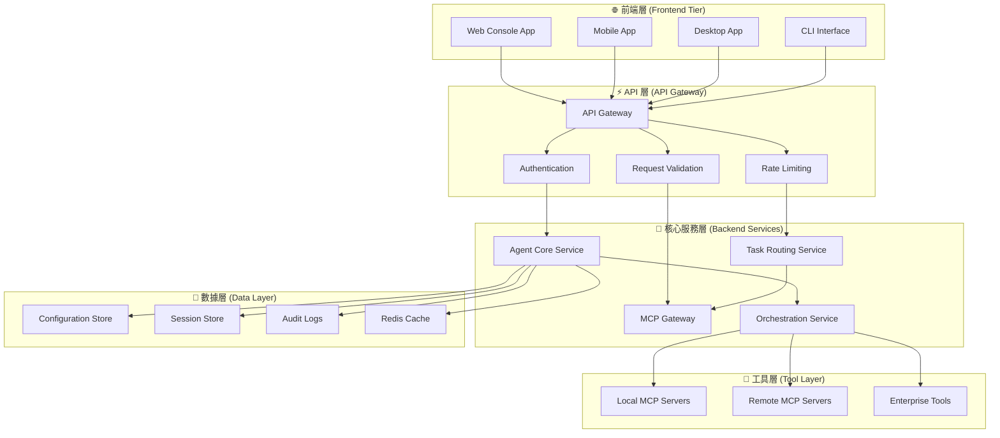
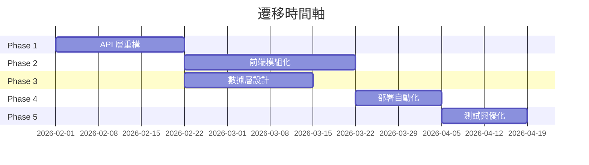

# OpenCode 前後端分離架構設計

**文檔版本:** 1.0
**日期:** 2026-01-22
**專案:** OpenCode Agent Platform - 前後端分離重構
**作者:** 系統架構團隊

---

## 🎯 架構概覽

### 現有架構分析

OpenCode 目前已經具備良好的基礎架構：

```yaml
現有技術棧:
  運行時: Bun + TypeScript
  前端: SolidJS + Astro + Vite
  後端: Hono (Web API) + MCP SDK
  架構: Monorepo (workspaces)
  安裝: curl -fsSL https://opencode.ai/install | bash
```

**現有包結構**:
```
packages/
├── opencode/           # 核心邏輯 (CLI + API Server)
├── console/app/        # Console Web UI (SolidJS)
├── web/               # 官方網站 (Astro)
├── ui/                # 共享 UI 組件
├── desktop/           # 桌面應用
└── sdk/js/            # JavaScript SDK
```

### 目標架構設計

**三層分離架構**:



---

## 📡 API 層設計

### RESTful API 結構

```typescript
// API 路由設計
interface OpenCodeAPI {
  // 會話管理
  '/api/v1/sessions': {
    GET: () => Session[]
    POST: (session: CreateSession) => Session
    DELETE: (id: string) => void
  }

  // 任務處理
  '/api/v1/tasks': {
    POST: (task: TaskRequest) => TaskResponse
    GET: (id: string) => TaskStatus
  }

  // Agent 管理
  '/api/v1/agents': {
    GET: () => Agent[]
    POST: (agent: CreateAgent) => Agent
    PUT: (id: string, agent: UpdateAgent) => Agent
  }

  // MCP 工具管理
  '/api/v1/tools': {
    GET: () => Tool[]
    POST: (tool: ToolRequest) => ToolResponse
  }

  // 配置管理
  '/api/v1/config': {
    GET: () => Configuration
    PUT: (config: Configuration) => Configuration
  }

  // WebSocket 即時通訊
  '/ws/v1/chat': WebSocketConnection
  '/ws/v1/tasks': WebSocketConnection
}
```

### WebSocket 即時通訊

```typescript
// WebSocket 事件設計
interface WebSocketEvents {
  // 客戶端 -> 服務端
  'task:submit': TaskSubmitEvent
  'task:cancel': TaskCancelEvent
  'chat:message': ChatMessageEvent
  'agent:switch': AgentSwitchEvent

  // 服務端 -> 客戶端
  'task:progress': TaskProgressEvent
  'task:complete': TaskCompleteEvent
  'task:error': TaskErrorEvent
  'chat:response': ChatResponseEvent
  'system:status': SystemStatusEvent
}

// 事件數據結構
interface TaskSubmitEvent {
  sessionId: string
  task: string
  context: Record<string, any>
  agent?: string
}

interface TaskProgressEvent {
  taskId: string
  status: 'planning' | 'executing' | 'reviewing'
  progress: number
  currentStep?: string
  estimatedCompletion?: number
}
```

---

## 🎨 前端架構設計

### 技術選型建議

**選項 A: 保持現有 SolidJS 棧**
```yaml
框架: SolidJS + SolidStart
狀態管理: Solid Store + Context
樣式: TailwindCSS
建構工具: Vite
包管理: Bun
優勢: 與現有架構一致、性能優異、學習成本低
```

**選項 B: 混合技術棧**
```yaml
主應用: SolidJS (保持一致)
移動端: React Native / Flutter
桌面端: Tauri + SolidJS
樣式: TailwindCSS + shadcn/ui
優勢: 跨平台能力強、生態系統豐富
```

### 前端應用架構

```typescript
// 前端應用結構
interface FrontendArchitecture {
  apps: {
    web: SolidJSApp          // Web Console
    mobile: CrossPlatformApp // React Native / Flutter
    desktop: TauriApp        // Tauri + SolidJS
  }

  shared: {
    ui: UIComponentLibrary    // @opencode-ai/ui
    sdk: OpenCodeSDK         // @opencode-ai/sdk
    types: TypeDefinitions   // @opencode-ai/types
    utils: UtilityFunctions  // @opencode-ai/utils
  }
}
```

### 狀態管理設計

```typescript
// 全局狀態管理
interface AppState {
  auth: {
    user: User | null
    isAuthenticated: boolean
    permissions: Permission[]
  }

  session: {
    current: Session | null
    history: Session[]
    settings: SessionSettings
  }

  tasks: {
    current: Task | null
    queue: Task[]
    history: TaskHistory[]
  }

  agents: {
    available: Agent[]
    active: Agent | null
    configurations: AgentConfig[]
  }

  ui: {
    theme: 'light' | 'dark' | 'auto'
    layout: LayoutPreferences
    notifications: Notification[]
  }
}

// 狀態管理 Store
class OpenCodeStore {
  // 使用 Solid Store 進行響應式狀態管理
  private store = createStore<AppState>(initialState)

  // Actions
  setUser = (user: User) => {}
  createSession = (config: SessionConfig) => {}
  submitTask = (task: TaskRequest) => {}
  switchAgent = (agentId: string) => {}
}
```

---

## 🔧 後端服務設計

### 微服務架構

```typescript
// 服務分層設計
interface BackendServices {
  gateway: {
    name: 'API Gateway'
    tech: 'Hono + Cloudflare Workers'
    responsibilities: ['路由', '認證', '限流', '日誌']
  }

  agentCore: {
    name: 'Agent Core Service'
    tech: 'Bun + TypeScript'
    responsibilities: ['Agent 管理', '會話管理', '任務路由']
  }

  orchestration: {
    name: 'Orchestration Service'
    tech: 'Bun + TypeScript + MCP SDK'
    responsibilities: ['工作流編排', '工具調用', '結果聚合']
  }

  mcpGateway: {
    name: 'MCP Gateway'
    tech: 'Bun + MCP Protocol'
    responsibilities: ['MCP 服務管理', '工具代理', '負載均衡']
  }
}
```

### 服務通信設計

```typescript
// 服務間通信
interface ServiceCommunication {
  internal: {
    protocol: 'HTTP + gRPC'
    discovery: 'Consul / etcd'
    loadBalancing: 'Round Robin'
    circuitBreaker: true
  }

  external: {
    apiGateway: 'Hono Router'
    rateLimit: 'Redis + Sliding Window'
    authentication: 'JWT + OpenAuth'
    monitoring: 'Prometheus + Grafana'
  }
}
```

### 數據持久化策略

```yaml
配置數據:
  存儲: 文件系統 (YAML/JSON)
  路徑: ~/.opencode/ 或 /etc/opencode/
  版本控制: Git 支援

會話數據:
  存儲: Redis / SQLite
  過期: 24小時自動清理
  持久化: 重要會話可保存

審計日誌:
  存儲: 文件 + 可選數據庫
  格式: JSON Lines
  加密: 可選 AES-256

緩存數據:
  存儲: Redis
  策略: LRU + TTL
  分布式: Redis Cluster
```

---

## 🚀 部署架構方案

### 開發環境部署

```yaml
# docker-compose.dev.yml
services:
  # 前端開發服務
  web-dev:
    build: ./packages/console/app
    ports: ["3000:3000"]
    volumes: ["./packages:/app/packages"]
    command: "bun dev"
    environment:
      VITE_API_URL: "http://localhost:4000"

  # 後端 API 服務
  api-dev:
    build: ./packages/opencode
    ports: ["4000:4000"]
    volumes: ["./packages:/app/packages"]
    command: "bun dev --host 0.0.0.0"
    environment:
      NODE_ENV: "development"

  # Redis 緩存
  redis:
    image: "redis:7-alpine"
    ports: ["6379:6379"]
```

### 生產環境部署

```yaml
# 雲端部署架構
production:
  frontend:
    platform: "Vercel / Netlify"
    cdn: "Cloudflare"
    domains:
      - "app.opencode.ai"
      - "console.opencode.ai"

  backend:
    platform: "Cloudflare Workers / Railway"
    database: "PlanetScale / Supabase"
    cache: "Upstash Redis"
    monitoring: "Axiom / LogTail"

  infrastructure:
    dns: "Cloudflare"
    ssl: "自動 Let's Encrypt"
    backup: "自動備份策略"
```

### 混合部署模式

```yaml
# 企業混合部署
hybrid:
  local_core:
    description: "核心 Agent 在本地運行"
    components: ["Agent Core", "MCP Gateway"]
    security: "企業防火牆內"

  cloud_frontend:
    description: "前端託管在雲端"
    components: ["Web UI", "Mobile App"]
    benefits: ["CDN 加速", "自動擴展"]

  bridge_api:
    description: "安全 API 橋接"
    components: ["API Gateway", "VPN Tunnel"]
    protocols: ["HTTPS", "WSS", "gRPC"]
```

---

## 💻 實施方案

### Phase 1: API 層重構 (2-3 週)

```typescript
// 步驟 1: 提取 API 層
mkdir packages/api
cd packages/api

// API Gateway 設計
// file: packages/api/src/routes/index.ts
import { Hono } from 'hono'
import { cors } from 'hono/cors'
import { logger } from 'hono/logger'

const app = new Hono()

app.use('*', cors())
app.use('*', logger())

// 路由模組
app.route('/api/v1/sessions', sessionRoutes)
app.route('/api/v1/tasks', taskRoutes)
app.route('/api/v1/agents', agentRoutes)
app.route('/api/v1/tools', toolRoutes)

// WebSocket 支援
app.get('/ws/chat', websocketHandler)

export default app
```

### Phase 2: 前端模組化 (3-4 週)

```bash
# 建立新的前端架構
mkdir packages/frontend
cd packages/frontend

# 建構配置
# file: packages/frontend/vite.config.ts
export default defineConfig({
  plugins: [solid()],
  build: {
    rollupOptions: {
      external: ['@opencode-ai/sdk']
    }
  },
  server: {
    proxy: {
      '/api': 'http://localhost:4000',
      '/ws': {
        target: 'ws://localhost:4000',
        ws: true
      }
    }
  }
})
```

### Phase 3: 數據層設計 (2-3 週)

```typescript
// 數據層抽象
// file: packages/data/src/stores/base.ts
export abstract class BaseStore {
  abstract get(key: string): Promise<any>
  abstract set(key: string, value: any): Promise<void>
  abstract delete(key: string): Promise<void>
}

// 實現類
export class FileStore extends BaseStore {
  // 文件系統存儲實現
}

export class RedisStore extends BaseStore {
  // Redis 存儲實現
}

// 配置數據倉庫
export class ConfigRepository {
  constructor(private store: BaseStore) {}

  async getAgentConfig(id: string): Promise<AgentConfig> {
    return this.store.get(`agent:${id}`)
  }

  async saveAgentConfig(config: AgentConfig): Promise<void> {
    await this.store.set(`agent:${config.id}`, config)
  }
}
```

### Phase 4: 部署自動化 (1-2 週)

```yaml
# CI/CD Pipeline
# file: .github/workflows/deploy.yml
name: Deploy OpenCode Platform

on:
  push:
    branches: [main]

jobs:
  frontend:
    runs-on: ubuntu-latest
    steps:
      - uses: actions/checkout@v4
      - uses: oven-sh/setup-bun@v1
      - run: bun install
      - run: bun run build --filter=@opencode-ai/frontend
      - uses: vercel/action@v1
        with:
          vercel-token: ${{ secrets.VERCEL_TOKEN }}

  backend:
    runs-on: ubuntu-latest
    steps:
      - uses: actions/checkout@v4
      - uses: oven-sh/setup-bun@v1
      - run: bun install
      - run: bun run build --filter=@opencode-ai/api
      - uses: cloudflare/wrangler-action@v3
        with:
          apiToken: ${{ secrets.CLOUDFLARE_API_TOKEN }}
```

---

## 🔍 技術決策建議

### 1. 保留現有優勢

**建議**: 基於現有 SolidJS + Bun + TypeScript 技術棧進行重構

**理由**:
- 與現有代碼庫高度兼容
- SolidJS 性能優異，適合實時應用
- Bun 提供出色的開發體驗
- TypeScript 確保類型安全

### 2. 漸進式遷移策略



### 3. 關鍵技術選型

| 層級 | 技術選擇 | 替代方案 | 決策理由 |
|------|----------|----------|-----------|
| 前端框架 | SolidJS | React/Vue | 性能 + 現有投資 |
| 後端框架 | Hono | Express/Fastify | 現代化 + 邊緣計算 |
| 數據庫 | SQLite + Redis | PostgreSQL | 簡單 + 性能 |
| 部署 | Cloudflare | Vercel/Railway | 全球分發 + 成本 |
| 監控 | Axiom | DataDog | 集成度 + 定價 |

---

## 📊 成本效益分析

### 開發成本

```yaml
人力成本:
  後端開發: 2人 × 6週 = 12人週
  前端開發: 2人 × 4週 = 8人週
  DevOps: 1人 × 2週 = 2人週
  測試: 1人 × 3週 = 3人週
  總計: 25人週

技術成本:
  雲端服務: $200/月 (開發期)
  工具許可: $100/月
  監控服務: $50/月
  總計: $350/月
```

### 收益預期

```yaml
技術收益:
  開發效率提升: 30-40%
  部署速度提升: 50-60%
  系統可維護性: 顯著改善

業務收益:
  用戶體驗改善: 更快響應、更好互動
  平台擴展性: 支援更多終端設備
  企業就緒度: 滿足企業級需求
```

---

## 🔒 安全考量

### API 安全

```typescript
// JWT 認證實現
interface SecurityConfig {
  jwt: {
    secret: string
    expiresIn: string
    issuer: string
  }

  rateLimit: {
    windowMs: number
    maxRequests: number
    skipSuccessfulRequests: boolean
  }

  cors: {
    origin: string[]
    credentials: boolean
    methods: string[]
  }
}

// 權限檢查中間件
const requirePermission = (permission: Permission) => {
  return async (c: Context, next: Next) => {
    const user = c.get('user')
    if (!hasPermission(user, permission)) {
      return c.json({ error: 'Insufficient permissions' }, 403)
    }
    await next()
  }
}
```

### 數據保護

```yaml
傳輸安全:
  協議: HTTPS + WSS
  證書: Let's Encrypt 自動更新
  HSTS: 強制 HTTPS

存儲安全:
  配置文件: 敏感數據加密
  會話數據: Redis AUTH + TLS
  審計日誌: AES-256 加密

訪問控制:
  API: JWT + RBAC
  資源: 細粒度權限
  操作: 審計追蹤
```

---

## 📈 監控與可觀測性

### 關鍵指標

```typescript
// 監控指標定義
interface MonitoringMetrics {
  performance: {
    apiLatency: Histogram
    taskDuration: Histogram
    memoryUsage: Gauge
    cpuUsage: Gauge
  }

  business: {
    activeUsers: Gauge
    tasksPerHour: Counter
    errorRate: Gauge
    successRate: Gauge
  }

  infrastructure: {
    uptime: Gauge
    diskUsage: Gauge
    networkIO: Counter
  }
}

// 告警規則
const alertRules = {
  highLatency: 'api_latency_p95 > 2000ms',
  highErrorRate: 'error_rate > 5%',
  lowSuccessRate: 'success_rate < 95%',
  highMemoryUsage: 'memory_usage > 80%'
}
```

### 日誌策略

```yaml
結構化日誌:
  格式: JSON
  欄位: timestamp, level, service, message, context

日誌等級:
  ERROR: 錯誤和異常
  WARN: 警告和性能問題
  INFO: 重要業務事件
  DEBUG: 詳細執行信息

聚合分析:
  工具: Loki + Grafana
  查詢: LogQL
  告警: Grafana Alerting
```

---

## 🎯 下一步行動

### 1. 立即可行動項

1. **創建 API 規格文檔**
   ```bash
   # 使用 OpenAPI 3.0 規格
   mkdir docs/api
   # 定義完整的 REST API 和 WebSocket 規格
   ```

2. **建立開發環境**
   ```bash
   # 配置 Docker Compose 開發環境
   docker-compose -f docker-compose.dev.yml up
   ```

3. **實施第一個 API 端點**
   ```typescript
   // 從會話管理 API 開始
   app.get('/api/v1/sessions', sessionController.list)
   ```

### 2. 週計劃

**Week 1-2**: API 層設計與實現
**Week 3-4**: 前端組件化重構
**Week 5-6**: 數據層整合
**Week 7-8**: 部署與測試

### 3. 成功標準

- [ ] API 響應時間 < 200ms
- [ ] 前端首屏載入 < 2s
- [ ] 99.9% 可用性
- [ ] 完整的測試覆蓋率 > 80%

---

**架構設計完成！** 🎉

這份設計文檔提供了完整的前後端分離重構方案，您可以基於現有 OpenCode 架構進行漸進式改造，同時保持系統的穩定性和可擴展性。