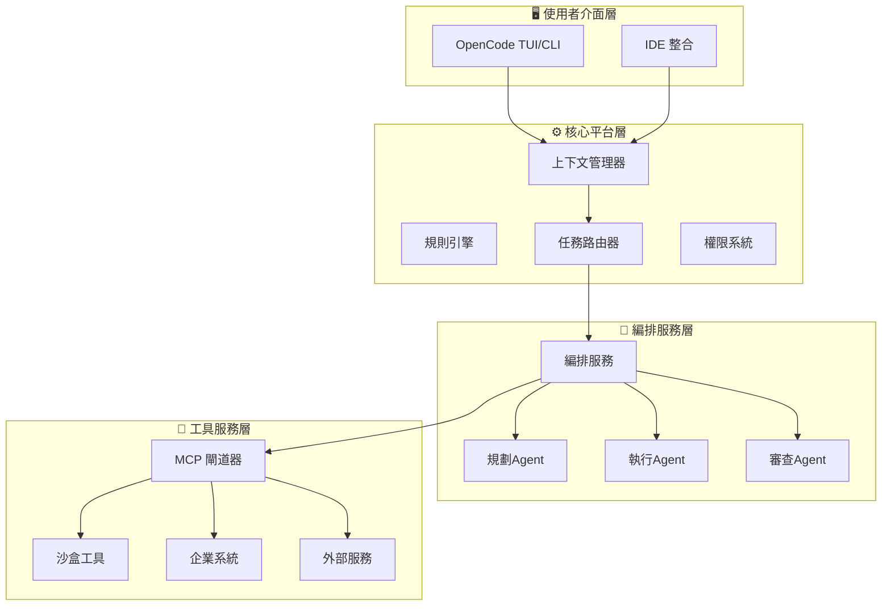

# OpenCode Agent Platform - 系統架構文檔

> **將 OpenCode 打造為通用型 AI Agent 平台的完整技術藍圖**

---

## 📋 文檔概覽

本文檔集基於原始需求分析，以軟體大廠標準撰寫，提供從需求到實作的完整技術指引。

### 🎯 專案目標

**核心願景**: 將 OpenCode 轉化為通用型 AI Agent 系統，結合簡單的上下文管理與強大的多步編排能力，成為企業級 AI 工作流的統一入口。

**設計哲學** (基於 Linus Torvalds 原則):
- **小核心**: OpenCode 專注於上下文管理，不做巨型框架
- **穩定介面**: MCP 協議與插件系統確保可替換性
- **模組化成長**: 功能通過外掛與服務延伸

---

## 📚 文檔結構

| 文檔 | 描述 | 目標讀者 | 狀態 |
|------|------|----------|------|
| **[01_系統需求規格文檔](./01_System_Requirements_Specification.md)** | 完整的功能需求、非功能需求與驗收條件 | PM、架構師、開發團隊 | ✅ 完成 |
| **[02_系統設計文檔](./02_System_Design_Document.md)** | 詳細的系統架構、組件設計與技術選型 | 架構師、資深開發者 | ✅ 完成 |
| **[03_技術實作指南](./03_Technical_Implementation_Guide.md)** | 代碼實現、配置管理與部署策略 | 開發工程師、DevOps | ✅ 完成 |
| **[04_快速入門指南](./04_Quick_Start_Guide.md)** | 安裝、配置與基本使用範例 | 所有使用者 | ✅ 完成 |

---

## 🏗️ 核心架構

### 三層架構設計



### 智能任務路由

| 執行路徑 | 觸發條件 | 範例任務 | 執行時間 |
|----------|----------|----------|----------|
| **Fast Path** | 單一工具、簡單操作 | 讀取文件、執行單一命令 | < 2 秒 |
| **Agent Path** | 多步驟、需要規劃 | 代碼重構、系統整合 | 2分鐘 - 30分鐘 |

**核心優勢**: 避免 ReAct 模式的「每次都思考」問題，簡單任務直接執行，複雜任務才進入編排流程。

---

## 🔑 關鍵特性

### ✨ Claude Code 兼容性

- **無縫遷移**: 支援現有 `CLAUDE.md`、`.claude/skills/` 配置
- **規則繼承**: 遞迴讀取多層規則配置
- **技能系統**: 完全兼容 Claude Code 技能格式

### 🔒 企業級安全

- **多層權限控制**: allow/ask/deny 策略
- **工具沙盒**: 資源限制與路徑隔離
- **完整審計**: 加密日誌與合規報告
- **安全掃描**: 代碼執行前的漏洞檢測

### 🔌 高度可擴展

- **MCP 協議**: 標準化工具整合介面
- **插件系統**: 事件驅動的擴展機制
- **工作流引擎**: YAML 定義的複雜流程
- **微服務架構**: 組件獨立部署與擴展

---

## 🚀 實施路線圖

### Phase 1: 基礎設施 (4-6 週)
- ✅ 任務路由器
- ✅ 基本 MCP 整合
- ✅ 權限系統
- ✅ Claude Code 遷移工具

### Phase 2: 編排系統 (8-10 週)
- 🔄 完整 Agent 編排
- 🔄 插件架構
- 🔄 監控系統
- 🔄 性能優化

### Phase 3: 企業功能 (12-16 週)
- ⏳ 高級安全特性
- ⏳ 多租戶支援
- ⏳ 工作流引擎
- ⏳ 生產環境強化

---

## 💼 企業級部署

### 部署模式

| 模式 | 描述 | 適用場景 |
|------|------|----------|
| **獨立模式** | 單用戶本地安裝 | 個人開發者 |
| **團隊模式** | 共享配置與 MCP 服務 | 小型開發團隊 |
| **企業模式** | SSO、集中審計、策略管理 | 大型企業 |

### 關鍵整合點

```yaml
# 企業整合範例
mcp_servers:
  jira:
    type: "remote"
    url: "https://company.atlassian.net/mcp"
    auth: { type: "oauth", client_id: "${JIRA_CLIENT_ID}" }

  database:
    type: "remote"
    url: "https://internal-db.company.com/mcp"
    auth: { type: "certificate", cert_path: "/certs/db.pem" }

  ci_cd:
    type: "remote"
    url: "https://jenkins.company.com/mcp"
    auth: { type: "api_key", key: "${CI_API_KEY}" }
```

---

## 📊 監控與可觀測性

### 關鍵指標

- **任務路由分布**: Fast Path vs Agent Path 比例
- **執行效能**: P50/P95 延遲時間
- **MCP 服務健康**: 各服務可用性狀態
- **權限決策**: 允許/詢問/拒絕統計
- **安全事件**: 高風險操作與阻止記錄

### Grafana Dashboard

提供開箱即用的監控面板，涵蓋：
- 系統概覽
- 效能指標
- 安全態勢
- 使用者活動
- 錯誤追蹤

---

## 🔧 開發與貢獻

### 快速開始

```bash
# 1. 克隆專案
git clone https://github.com/your-org/opencode-agent-platform.git

# 2. 安裝依賴
pip install -r requirements.txt

# 3. 基本配置
cp config/examples/basic-config.yaml .opencode/config.yaml

# 4. 啟動平台
python -m opencode_agent_platform.main
```

### 開發指南

- **代碼風格**: 遵循 Black + Flake8
- **測試覆蓋**: 單元測試 > 80%，整合測試覆蓋關鍵流程
- **文檔維護**: 所有 API 變更需更新文檔
- **安全審查**: 所有權限相關代碼需安全團隊審查

---

## 📋 路線圖與里程碑

### 近期目標 (Q1 2026)
- [x] 完成核心架構設計
- [ ] 實現基本任務路由
- [ ] 完成 Claude Code 遷移工具
- [ ] 發布 Alpha 版本

### 中期目標 (Q2 2026)
- [ ] 完整 Agent 編排系統
- [ ] 企業安全特性
- [ ] 監控與可觀測性
- [ ] 發布 Beta 版本

### 長期目標 (H2 2026)
- [ ] 生產環境部署
- [ ] 多語言 SDK 支援
- [ ] 雲端服務版本
- [ ] 開源社群建設

---

## 🤝 社群與支援

### 獲取幫助

- **技術文檔**: [docs.opencode-agent.com](https://docs.opencode-agent.com)
- **GitHub Issues**: [回報問題與功能請求](https://github.com/your-org/opencode-agent-platform/issues)
- **討論區**: [社群討論](https://github.com/your-org/opencode-agent-platform/discussions)
- **企業支援**: enterprise-support@opencode-agent.com

### 貢獻方式

1. **代碼貢獻**: 提交 PR 修復 bug 或新增功能
2. **文檔改進**: 完善使用指南與技術文檔
3. **測試與回饋**: 在不同環境測試並回饋問題
4. **插件開發**: 創建並分享有用的插件

---

## 📄 授權條款

本專案採用 [MIT License](LICENSE)，允許商業與非商業使用。

---

## 🔗 相關連結

- **OpenCode 官方**: [opencode.ai](https://opencode.ai)
- **Claude Code 文檔**: [docs.anthropic.com/claude-code](https://docs.anthropic.com/claude-code)
- **MCP 協議**: [modelcontextprotocol.io](https://modelcontextprotocol.io)
- **技術部落格**: [blog.opencode-agent.com](https://blog.opencode-agent.com)

---

<div align="center">

**🚀 讓我們一起將 OpenCode 打造成最強大的 AI Agent 平台！**

[快速開始](./04_Quick_Start_Guide.md) • [架構設計](./02_System_Design_Document.md) • [實作指南](./03_Technical_Implementation_Guide.md)

</div>